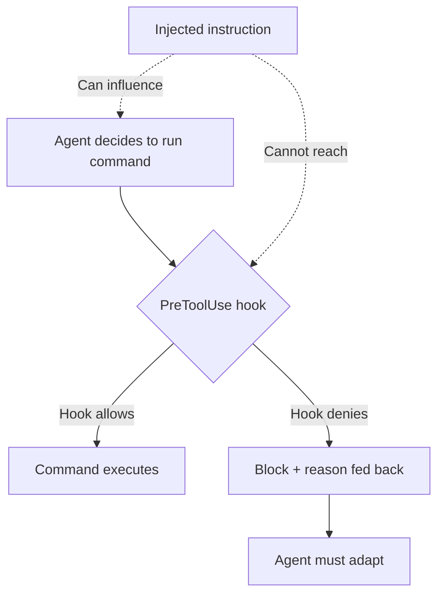

# Hooks for Enforcement vs Prompts for Guidance

> Prompts request behavior; hooks require it. Use prompts for judgment calls and context-dependent guidance; use hooks for rules that must not vary.

Learn it hands-on with the [Where Prompting Ends](https://learn.agentpatterns.ai/prompt-engineering/where-prompting-ends/) guided lesson and quizzes.

!!! note "Also known as"
    Enforcement vs Advisory, Hooks Beat Prompts.

## The core distinction

Prompt instructions are probabilistic. Under task pressure — context filling, attention diverted — compliance degrades toward the [instruction compliance ceiling](../instructions/instruction-compliance-ceiling.md) and the agent reverts to training defaults.

Hooks are deterministic. A pre-command hook runs outside the agent's context; the model cannot overrule it.

## The decision rule

Use hooks when all three apply:

1. Compliance is non-negotiable — failure has real cost
2. The rule is binary — a command either violates it or it does not
3. The behavior has a strong opposing prior in training data

Use prompts when any of these apply:

- Guidance is contextual ("prefer X when working in Y")
- The rule needs model judgment to apply
- Correct behavior depends on factors a hook cannot inspect
- False positives from over-blocking cost more than occasional non-compliance

## What hooks can enforce

Hooks intercept agent lifecycle events and can allow, block, or modify actions. They work well for:

- Package manager fidelity — block `npm install`, enforce `pnpm install`
- Destructive git operations — block `git reset --hard`, `git push --force`
- Branch protection — block direct push to main
- File restrictions — block writes to infrastructure or secrets files
- Tool allowlisting — permit only a defined set of shell commands

Each rule is absolute, binary, and opposed by a training prior. For example, the model reaches for `npm install` over `pnpm install` by default.

## What prompts do that hooks cannot

Hooks see observable actions, not intent, context, or trade-offs. Prompts handle:

- Architectural guidance — "prefer composition over inheritance when adding new features"
- Quality standards — "write a test for any change to business logic"
- Situational judgment — "raise a concern before modifying authentication code"
- Tone and style — communication conventions in output

These require context a hook cannot inspect mechanically.

## Injection resistance

Hooks give you a property prompts cannot: immunity to [prompt injection](../security/prompt-injection-threat-model.md). Injected instructions can influence what the agent tries to do, not what a hook allows.



Without a hook, injected instructions and `CLAUDE.md` compete in the reasoning loop, so the outcome is non-deterministic. With a hook, `PreToolUse` fires before execution, so the outcome is deterministic.

## Context cost

Prompt instructions occupy context and compete for attention — see the [instruction compliance ceiling](../instructions/instruction-compliance-ceiling.md). Hooks have zero context cost. Moving absolute rules to hooks improves reliability and frees context.

## Cross-tool applicability

The distinction is tool-agnostic. The mechanism varies:

| Tool | Hook mechanism |
|------|---------------|
| Claude Code | `PreToolUse` / `PostToolUse` hooks in `.claude/settings.json` ([docs](https://code.claude.com/docs/en/hooks)) |
| Git operations | Git hooks (`pre-commit`, `pre-push`) |
| CI/CD | GitHub Actions, pipeline gates |
| Editor | Extension rules, linters on save |

Git hooks and CI gates predate AI agents — a `pre-commit` hook enforces its rule regardless of origin (developer, agent, or script).

## When hooks cannot enforce

Hooks are deterministic at the tool-call boundary, not everywhere. Four failure modes narrow the rule ([Boucle, 190 Things Claude Code Hooks Cannot Enforce, 2026](https://dev.to/boucle2026/what-claude-code-hooks-can-and-cannot-enforce-148o); [Anthropic hooks reference](https://code.claude.com/docs/en/hooks)):

- Substitution. Block one tool call and the model finds another path. A matcher on `Bash(rm *)` misses `/bin/rm` or a `Write` that truncates the file. Each call is evaluated alone, so `mkdir` + `cd` + `rm -rf *` slips past.
- Intent-blindness. Hooks see parameters, not reasoning. They cannot tell a legitimate `sudo` from a suspect one, or a `git push --force` on a personal branch from one aimed at `main`.
- Execution-path gaps. Only the standard session path is hooked. Pipe mode, bare mode, some IDE integrations, and events between tool calls (prompt assembly, compaction) are unreachable. Rules that must hold everywhere also need CI or git-level [deterministic guardrails](../verification/deterministic-guardrails.md).
- Hook-source trust. A hook is only as trustworthy as the file that defines it. Project-scope hooks in `.claude/settings.json` from an untrusted repo can be weaponized. Check Point showed remote code execution and API-key exfiltration through malicious hooks firing on repo load ([CVE-2025-59536, 2026](https://research.checkpoint.com/2026/rce-and-api-token-exfiltration-through-claude-code-project-files-cve-2025-59536/)). The same determinism that makes a trusted hook reliable makes a malicious one unconditional, so review hook configs before opening unfamiliar repos.

Reach for a hook when the rule is absolute, binary, and expressible at the tool-call boundary. Use prompts, CI, or repo-level gates for anything else.

## Example

The package-manager rule goes into a hook (absolute, binary, strong training prior toward `npm`). The architectural guidance stays in the prompt (requires judgment, context-dependent).

Hook — deterministic enforcement in `.claude/settings.json`:

```json
{
  "hooks": {
    "PreToolUse": [
      {
        "matcher": "Bash",
        "hooks": [
          {
            "type": "command",
            "command": "bash -c 'if echo \"$CLAUDE_TOOL_INPUT_COMMAND\" | grep -qE \"^npm (install|i |ci )\"; then echo \"Use pnpm instead of npm\" >&2; exit 1; fi'"
          }
        ]
      }
    ]
  }
}
```

If the command starts with `npm install`, the hook exits with code 1 and the agent sees the error message. The rule runs outside the agent's context window, so it cannot be forgotten or overridden mid-task.

Prompt — contextual guidance in `CLAUDE.md`:

```markdown
## Architecture guidance

Prefer composition over inheritance when adding new features to the payment module.
If you are modifying authentication code, raise a concern in the chat before making changes —
authentication failures are hard to detect and expensive to recover from.
Write a unit test for any change to business logic in `src/domain/`.
```

These instructions require evaluating context a hook cannot inspect mechanically, so they belong in the prompt.

## Key Takeaways

- Prompts are probabilistic — compliance degrades under task pressure; hooks are deterministic at the tool-call boundary and run outside the agent's context.
- Reach for a hook only when the rule is non-negotiable, binary, and opposed by a training prior. Anything else stays in the prompt, where [instruction polarity](../instructions/instruction-polarity.md) governs phrasing.
- Hooks see parameters, not intent. Use prompts for architectural guidance, quality standards, and situational judgment.
- Hooks are injection-resistant — injected instructions from a [prompt-injection](../security/prompt-injection-threat-model.md) payload can influence what the agent *tries*, not what a hook *allows*.
- Hooks fail at four boundaries: substitution, intent-blindness, execution-path gaps, and hook-source trust. Pair them with CI and git-level gates for rules that must hold everywhere.

## Related

- [Hook Catalog: Guardrails, Sandboxing, and CLI Enforcement](../tool-engineering/hook-catalog.md)
- [The Instruction Compliance Ceiling](../instructions/instruction-compliance-ceiling.md)
- [Instruction Polarity: Positive Rules Over Negative](../instructions/instruction-polarity.md)
- [Prompt Injection: A First-Class Threat](../security/prompt-injection-threat-model.md)
- [Blast Radius Containment](../security/blast-radius-containment.md)
- [Deterministic Guardrails](../verification/deterministic-guardrails.md)
- [PostToolUse Hooks: Automatic Formatting and Linting After Every File Edit](../tools/claude/posttooluse-auto-formatting.md)
- [Hooks and Lifecycle Events](../tool-engineering/hooks-lifecycle-events.md) — the canonical home for the lifecycle model these enforcement choices build on
