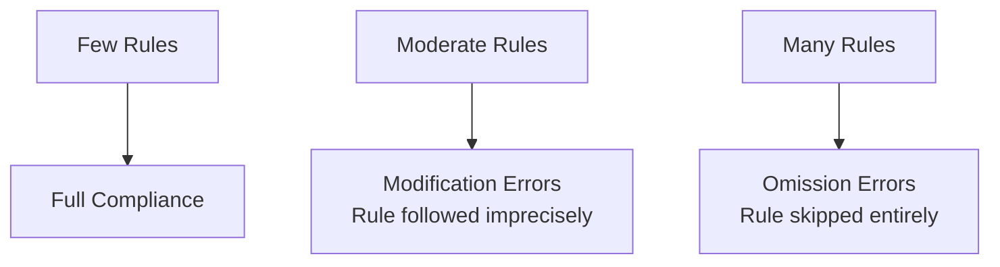

# The Instruction Compliance Ceiling

> Instruction compliance degrades as rule count grows — adding more rules past a threshold produces omission errors, not better behavior.

!!! info "Also known as"
    The Mega-Prompt Anti-Pattern, Instruction Overload, Compliance Degradation

## The Constraint

Instruction sets have a compliance ceiling. Below it, agents follow rules with reasonable precision. Above it, compliance degrades: first imprecisely (modification errors), then not at all (omission errors). Attention distribution — not agent choice — picks which rules get dropped; even frontier models reach only 68% accuracy at high instruction densities ([IFScale, 2025](https://arxiv.org/abs/2507.11538)).

Architect instruction sets to stay well below the ceiling. Stating a rule does not guarantee it is followed.

## Why It Works

Transformer models process instructions and task context through the same attention mechanism. As instruction length grows, each rule competes for attention weight at every output token. Research on multi-step agents confirms that monolithic prompts encoding entire decision structures are "prone to instruction-following degradation as prompt length increases" ([Arbor, 2026](https://arxiv.org/abs/2602.14643)).

Position compounds this: tokens near the beginning and end of a context window receive higher attention than those in the middle. Rules buried mid-prompt get less reliable attention regardless of stated importance.

## Failure Modes

Compliance degrades in a predictable sequence:

**Modification errors** appear first: the agent follows a rule's spirit but not its letter — wrong formatting, a constraint exceeded by 10%.

**Omission errors** appear later: the agent skips the rule entirely. A banned phrase appears. A scoped restriction is ignored. Adding more rules makes no difference — the set has exceeded reliable capacity.

## Primacy Bias

Position affects compliance independent of importance. Instructions near the top receive more reliable attention; primacy bias peaks at moderate densities (150–200 rules), and poor ordering makes low-position rules effectively optional ([IFScale, 2025](https://arxiv.org/abs/2507.11538)).

Place critical rules first. Do not rely on the agent finding an important rule at line 150.

## Model Variation

The compliance ceiling varies by model type. IFScale benchmarking across 20 frontier models identifies three degradation patterns ([IFScale, 2025](https://arxiv.org/abs/2507.11538)):

- Reasoning models (extended thinking): threshold-style — compliance holds until a point, then drops
- Standard models: roughly linear degradation as rule count grows
- Smaller models: steeper curves, earlier failure onset

An instruction set reliable with one model may fail with another; staying below the ceiling buffers against model changes.

## Architectural Response

The ceiling is a design constraint, not a writing problem. The fixes are structural:

**Modularize.** Move task-specific rules into skills loaded only when relevant — a docs task does not need Git workflow rules.

**Scope rules to tasks.** `AGENTS.md` should hold only conventions that apply to every task.

**Move enforcement to hooks.** Rules that must never fail belong in a linter, pre-commit hook, or CI gate — not an instruction file subject to attention degradation.

**Audit total rule count.** If `AGENTS.md` plus loaded skills plus system prompt total hundreds of rules, count and cut.

## In Practice: The Mega-Prompt

A monolithic file — a 1500-line `AGENTS.md` covering coding standards, Git conventions, deployment, and style — routinely exceeds the ceiling. Every failure appends another rule. The file grows; compliance shrinks. Rules silently conflict, and the agent resolves them unpredictably.

Decompose into layers:

| Layer | What belongs there |
|---|---|
| `AGENTS.md` | Project identity, stack, 5–10 conventions that apply to every task |
| Skills | Task-specific procedures, output templates — loaded on demand |
| Hooks | Anything that must be enforced deterministically |

If you cannot read your instruction file in under two minutes, it is too long.

## When This Backfires

Modularizing introduces its own failure modes:

- **Discovery gap.** On-demand skills are invisible to developers who don't know they exist; new team members reading only `AGENTS.md` miss task-specific conventions.
- **Skill loading gaps.** Loading the wrong skill removes task-specific rules entirely — a silent failure distinct from degradation.
- **Over-fragmentation.** Splitting tightly coupled rules across files forces partial contexts and creates boundary conflicts.
- **Audit difficulty.** A dozen skills under `.claude/skills/` needs tooling to review; governance overhead scales with fragment count.
- **Hook drift.** Rules moved to hooks stay deterministic only while hooks are current; a stale linter creates false confidence.
- **Model recalibration.** Thresholds shift between model versions; a set tuned for one model may degrade after an update.
- **Small-team cost.** For a solo developer, the overhead of layers may exceed the compliance gain — a 50-rule `AGENTS.md` below the ceiling needs no decomposition.

Decomposition is not the only fix. Reducing total rule count also raises headroom, and is often simpler.

## Example

**Monolithic (over the ceiling):** A single `AGENTS.md` with 200+ rules covering commit conventions, coding style, testing, deployment, output templates, and tool usage. Every incident adds another rule. The agent ignores the last third of the file.

**Layered (below the ceiling):** `AGENTS.md` holds 10 project-wide conventions. A `commit` skill loads commit rules on demand. A `test` skill loads testing requirements. Pre-commit hooks enforce formatting deterministically. Each context stays within reliable range.

## Key Takeaways

- Compliance degrades predictably as instruction count grows: imprecision first, omission later
- Primacy bias means instruction position affects compliance — place critical rules first
- The ceiling is a design constraint; architect instruction sets to stay below it
- Decompose into layers: `AGENTS.md` (always-on), skills (on-demand), hooks (deterministic)
- Large instruction files reduce compliance; they do not increase it

## Related

- [Negative Space Instructions: What NOT to Do](negative-space-instructions.md)
- [Instruction Polarity: Positive Rules Over Negative](instruction-polarity.md)
- [Guardrails Beat Guidance: Rule Design for Coding Agents](guardrails-beat-guidance-coding-agents.md) — the ~50-rule no-degradation window sits below this ceiling
- [Example-Driven vs Rule-Driven Instructions](example-driven-vs-rule-driven-instructions.md)
- [Layered Instruction Scopes](layered-instruction-scopes.md)
- [Critical Instruction Repetition](critical-instruction-repetition.md)
- [Hierarchical CLAUDE.md](hierarchical-claude-md.md)
- [Standards as Agent Instructions](standards-as-agent-instructions.md)
- [Project Instruction File Ecosystem: CLAUDE.md, copilot-instructions, AGENTS.md](instruction-file-ecosystem.md)
- [AGENTS.md Design Patterns: Commands, Boundaries, and Personas](agents-md-design-patterns.md)
- [System Prompt Altitude: Specific Without Being Brittle](system-prompt-altitude.md)
- [AGENTS.md as Table of Contents, Not Encyclopedia](agents-md-as-table-of-contents.md)
- [Convention Over Configuration](convention-over-configuration.md)
- [Content Exclusion Gap](content-exclusion-gap.md)
- [Event-Driven System Reminders](event-driven-system-reminders.md)
- [Production System Prompt Architecture](production-system-prompt-architecture.md)
- [Enforcing Agent Behavior with Hooks](enforcing-agent-behavior-with-hooks.md)
- [Constraint Encoding Does Not Fix Constraint Compliance](constraint-encoding-compliance-gap.md) — encoding form has no measurable effect on compliance; the compliance lever is constraint design, not format
- [Constraint Degradation in AI Code Generation](constraint-degradation-code-generation.md) — the same degradation mechanism applied to code generation constraints
- [Evaluating AGENTS.md: When Context Files Hurt More Than Help](evaluating-agents-md-context-files.md) — empirical data on when instruction files reduce compliance and increase cost
