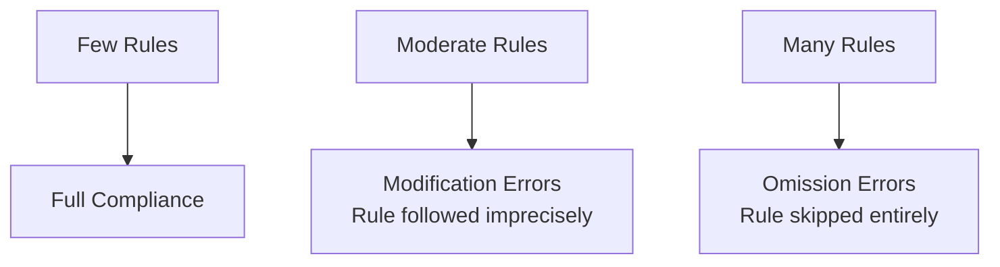

# The Instruction Compliance Ceiling

> Instruction compliance degrades as rule count grows — adding more rules past a threshold produces omission errors, not better behavior.

!!! info "Also known as"
    The Mega-Prompt Anti-Pattern, Instruction Overload, Compliance Degradation

## The Constraint

Instruction sets have a compliance ceiling. Below it, agents follow rules with reasonable precision. Above it, compliance degrades: first imprecisely (modification errors), then not at all (omission errors). Attention distribution — not agent choice — determines which rules get dropped [unverified].

Architect instruction sets to stay well below the ceiling. Clearly stating a rule does not guarantee it will be followed.

## Failure Modes

Compliance degrades in a predictable sequence:

**Modification errors** appear first: the agent follows a rule's spirit but not its letter — slightly wrong formatting, a constraint exceeded by 10%.

**Omission errors** appear later: the agent skips the rule entirely. A banned phrase appears. A scoped restriction is ignored. More rules make no difference — the instruction set has exceeded reliable capacity.

## Primacy Bias

Position within the instruction set affects compliance independent of importance. Instructions near the top receive more reliable attention than those toward the end [unverified] — poor ordering effectively makes low-position rules optional.

Place critical rules first. Do not rely on the agent finding important rules at line 150.

## Model Variation

The compliance ceiling varies by model type [unverified — thresholds not publicly benchmarked]:

- Reasoning models (extended thinking): threshold-style degradation — compliance holds until a point, then drops
- Standard models: roughly linear degradation as rule count grows
- Smaller models: steeper curves, earlier failure onset

An instruction set that works reliably with one model may fail with another. Staying below the ceiling buffers against model changes.

## Architectural Response

The ceiling is a design constraint, not a writing problem. The fixes are structural:

**Modularize.** Move task-specific rules into skills loaded only when relevant. A documentation task does not need Git workflow rules.

**Scope rules to tasks.** `AGENTS.md` should contain only conventions that apply to every task — not task-specific rules.

**Move enforcement to hooks.** Rules that must never fail belong in a linter, pre-commit hook, or CI gate — not an instruction file subject to attention degradation.

**Audit total rule count.** If `AGENTS.md` plus loaded skills plus system prompt total hundreds of rules, count and cut.

## In Practice: The Mega-Prompt

The ceiling is routinely exceeded by a monolithic instruction file that covers everything. A 1500-line `AGENTS.md` with coding standards, Git conventions, deployment procedures, and style guides. Every failure gets another rule appended. The file grows; compliance shrinks.

Contradictions are more likely in a mega-prompt. Rules silently conflict, and the agent resolves them unpredictably.

Decompose into layers:

| Layer | What belongs there |
|---|---|
| `AGENTS.md` | Project identity, stack, principles, 5–10 conventions that apply to every task |
| Skills | Task-specific procedures, output templates — loaded on demand |
| Hooks | Anything that must be enforced deterministically |

If you cannot read your instruction file in under two minutes, it is too long [unverified — rule of thumb, not a measured threshold].

## Example

**Monolithic (over the ceiling):** A single `AGENTS.md` with 200+ rules covering commit conventions, coding style, testing requirements, deployment steps, output templates, and tool usage. Every incident adds another rule. The agent ignores the last third of the file.

**Layered (below the ceiling):** `AGENTS.md` holds 10 project-wide conventions. A `commit` skill loads commit rules on demand. A `test` skill loads testing requirements. Pre-commit hooks enforce formatting deterministically. Each context is small enough to stay within reliable range.

## Key Takeaways

- Compliance degrades predictably as instruction count grows: imprecision first, omission later
- Primacy bias means instruction position affects compliance — place critical rules first
- The ceiling is a design constraint; architect instruction sets to stay below it
- Decompose into layers: `AGENTS.md` (always-on), skills (on-demand), hooks (deterministic)
- Large instruction files reduce compliance; they do not increase it

## Related

- [Negative Space Instructions: What NOT to Do](negative-space-instructions.md)
- [Instruction Polarity: Positive Rules Over Negative](instruction-polarity.md)
- [Example-Driven vs Rule-Driven Instructions](example-driven-vs-rule-driven-instructions.md)
- [Layered Instruction Scopes](layered-instruction-scopes.md)
- [Critical Instruction Repetition](critical-instruction-repetition.md)
- [Hierarchical CLAUDE.md](hierarchical-claude-md.md)
- [Standards as Agent Instructions](standards-as-agent-instructions.md)
- [Project Instruction File Ecosystem: CLAUDE.md, copilot-instructions, AGENTS.md](instruction-file-ecosystem.md)
- [AGENTS.md Design Patterns: Commands, Boundaries, and Personas](agents-md-design-patterns.md)
- [System Prompt Altitude: Specific Without Being Brittle](system-prompt-altitude.md)
- [AGENTS.md as Table of Contents, Not Encyclopedia](agents-md-as-table-of-contents.md)
- [Convention Over Configuration](convention-over-configuration.md)
- [Content Exclusion Gap](content-exclusion-gap.md)
- [Event-Driven System Reminders](event-driven-system-reminders.md)
- [Production System Prompt Architecture](production-system-prompt-architecture.md)
- [Enforcing Agent Behavior with Hooks](enforcing-agent-behavior-with-hooks.md)
- [Constraint Degradation in AI Code Generation](constraint-degradation-code-generation.md) — the same degradation mechanism applied to code generation constraints
