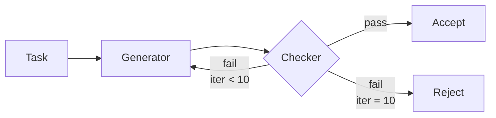

# Iterative Binary Feedback for Pattern Adherence

> Looping a capable model with yes/no pattern judgments from a deterministic checker beats verbose critique when the predicate space is small.

Iterative binary feedback is a prompting strategy where a generator LLM produces code, a deterministic checker returns a single pass/fail bit on pattern conformance, and the loop repeats with a fixed retry message — carrying no diagnostic detail — until conformance or a step cap. The strategy beat three richer alternatives (instructions, extensive feedback, extensive feedback + few-shot) for Singleton adherence across 13 LLMs on 164 Java HumanEval-X tasks ([Kjellberg et al., 2026](https://arxiv.org/abs/2605.26898)).

## When this applies

The Singleton result is narrow. The technique is the right default only when all three conditions hold:

| Condition | Why it matters |
|-----------|----------------|
| Capable instruction-following base model | Weaker code-specialized models cannot recover the missing predicate from a bare retry — Code Llama (70B) plateaued at 29.5% ([arxiv:2605.26898](https://arxiv.org/abs/2605.26898)) |
| Small predicate space (~3 boolean checks) | The Singleton checker validates three predicates: Private Constructor, Instance Method, Global Access Point. As the count grows, blind retries cannot localize the failure |
| Deterministic judge available | The paper's judge is a regex matcher; an LLM judge inherits its own brittleness ([Gaming the Judge, 2026](https://arxiv.org/pdf/2601.14691)) |

For general code repair the comparison reverses: detailed feedback wins by ~10 pp (mixed 63.6%, minimal 53.1%) on FeedbackEval ([Song et al., 2025](https://arxiv.org/abs/2504.06939)).

## The loop

The protocol is intentionally minimal ([Kjellberg et al., 2026](https://arxiv.org/abs/2605.26898)):

1. Generator produces code from the task description with no pattern instruction
2. Deterministic checker (regex on the predicate set) returns pass or fail
3. On fail, send a fixed retry: "The following code does not include a correctly formatted &lt;Pattern&gt; class: {response}. Please correct the code and return the complete code."
4. Loop up to 10 iterations; exit on pass or cap

The retry carries the full prior response and no other state — no failed-predicate list, no diff, no hint — so the generator re-derives the missing structure each iteration.

## Reported numbers

Singleton Score with iterative binary feedback (Experiment 2) ([Kjellberg et al., 2026](https://arxiv.org/abs/2605.26898)):

| Model | Singleton Score | Functional pass-rate change |
|-------|-----------------|------------------------------|
| Llama 3.3 | 0% → 100% | +28.7 pp |
| GPT-4o mini | 0% → 100% | +61.0 pp |
| Qwen3 (8B) | 0% → 99.2% | +17.7 pp |
| Code Llama (70B) | 0% → 29.5% | (plateaued) |
| DeepSeek Coder (16B) | improved | −9.8 pp |
| Gemma3 (4B) | improved | −21.3 pp |

Llama 3.3 also hit 100% Singleton compliance on the instruction-only strategy — binary feedback added no value in that condition.

## Why it works

Binary feedback collapses the supervision signal to its minimum while preserving the model's full self-correction pathway. Detailed feedback ("private constructor missing") biases weaker models to patch only that predicate, often at the cost of functional correctness: the paper documents models that "lost context implementing Singleton correctly but for wrong functionality" under richer feedback ([Kjellberg et al., 2026](https://arxiv.org/abs/2605.26898)). The bare retry instead forces a holistic regeneration on the same circuit that produced functional code initially. Self-Refine reports the same mechanism: iterative same-model feedback improved CODEX code generation by up to 13 pp absolute, with iteration, not signal richness, the active ingredient ([Madaan et al., 2023](https://arxiv.org/pdf/2303.17651)). Capable models probe a small predicate space by trial and error within the budget; richer specifications break this scaling.

## When this backfires

- Functionality-critical output — Pattern adherence and functional correctness can diverge. DeepSeek Coder lost 9.8 pp on functional tests while improving Singleton compliance; Gemma3 (4B) lost 21.3 pp ([Kjellberg et al., 2026](https://arxiv.org/abs/2605.26898)). Gate exits on test pass and pattern match
- Multi-predicate or interacting patterns — Three predicates fit a 10-iteration probe budget; ten do not. FeedbackEval points to structured feedback as the safer default for richer patterns ([Song et al., 2025](https://arxiv.org/abs/2504.06939))
- No deterministic judge — When the check requires semantic understanding (thread-safety, race conditions), an LLM judge replaces the regex and becomes the new failure surface, with reasoning-trace manipulation driving false positives above 80% ([Gaming the Judge, 2026](https://arxiv.org/pdf/2601.14691))
- Already-converged instructions — Llama 3.3 hit 100% on instructions alone; the feedback loop then spends tokens and latency for no lift
- General code repair — The result does not generalize to debugging or test-failure repair, where FeedbackEval shows detailed feedback wins by ~10 pp ([Song et al., 2025](https://arxiv.org/abs/2504.06939))

## Threats to validity

The authors flag three explicitly ([Kjellberg et al., 2026](https://arxiv.org/abs/2605.26898)):

- Internal — HumanEval-X test cases are not optimal for evaluating functional correctness
- External — 164 tasks, Java only, one pattern (Singleton); does not generalize to other languages or richer patterns
- Construct — One prompt was used across all 13 models, but LLMs are prompt-sensitive

## Key Takeaways

- Binary "yes/no, try again" feedback outperforms verbose critique for design-pattern adherence with capable models, small predicate sets, and a deterministic judge
- Iteration is the active ingredient — richer signals can degrade functional correctness in weaker models without improving structural conformance
- Cap iterations (the paper uses 10) and gate exits on both pattern match and functional tests
- The result inverts for code repair: structured feedback wins by ~10 pp on FeedbackEval — pick by task, not by general principle
- If instructions already land the pattern, the feedback loop is dead weight

## Related

- [Evaluator-Optimizer Pattern](../patterns/agent-design/evaluator-optimizer.md) — generalization: two-role generator/evaluator loop where the evaluator returns structured feedback. Binary feedback is the minimal-signal variant
- [Critic Agent Plan Review](../patterns/agent-design/critic-agent-plan-review.md) — adjacent pattern using a critic role; useful when the critic must give richer feedback than yes/no
- [Constraint Degradation in AI Code Generation](constraint-degradation-code-generation.md) — failure mode the binary loop sidesteps: detailed multi-constraint prompts degrade as constraint count grows
- [Prior Dominance over Feedback](../patterns/anti-patterns/prior-dominance-over-feedback.md) — anti-pattern where the model ignores feedback in favor of its prior; relevant when binary loops fail to converge
- [Example-Driven vs Rule-Driven Instructions](example-driven-vs-rule-driven-instructions.md) — choosing the right signal type when designing the retry prompt
