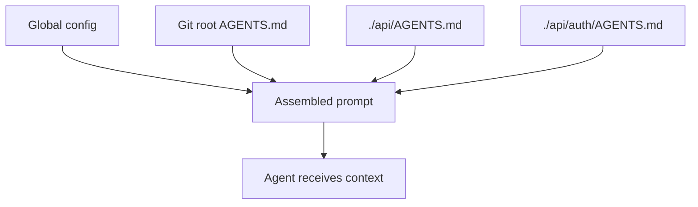

# Layer Agent Instructions by Specificity: Global, Project, and Directory Scopes

> Structure agent instructions in concentric layers — global defaults, project-level files, and directory overrides — so the most specific instruction always wins.

!!! info "Also known as"
    **Layered Instruction Scopes** · **Directory-Level Instruction Hierarchy** · **Hierarchical CLAUDE.md**

    For the Claude Code–specific implementation of this pattern, see [Hierarchical CLAUDE.md](hierarchical-claude-md.md).

## Why Flat Instruction Files Break at Scale

A single instruction file at the repository root works for small, uniform codebases. As projects grow — multiple services, distinct frontend and backend conventions, mixed toolchains — a single file either becomes an unmanageable list of conditional rules or fails to cover the cases that matter.

Layering by scope solves this. The agent receives instructions appropriate to where it is working, without requiring any manual switching.

## The Codex Harness Model

[OpenAI's Codex harness](https://openai.com/index/unlocking-the-codex-harness/) implements a three-scope hierarchy:

1. **Global config** (`$CODEX_HOME`): defaults and preferences that apply across all repositories
2. **Git root**: the project-wide AGENTS.md at the repository root
3. **Working directory**: AGENTS.md files in subdirectories, from git root down to the current directory

The harness traverses from global to working directory, concatenating AGENTS.md files in order of increasing specificity. More specific instructions appear later in the prompt and take priority over earlier, more general ones.



## Priority Rules

Later instructions take priority over earlier ones when they conflict. A directory-level file that specifies "use Bun, not npm" overrides a project-root file that specifies "use npm" for that directory and its children.

Priority is implicit in the concatenation order, not declared with explicit keywords: global config provides defaults, project root narrows them, subdirectory files override for their scope.

## AGENTS.override.md: Per-Directory Alternative to AGENTS.md

[Codex's harness](https://openai.com/index/unlocking-the-codex-harness/) supports `AGENTS.override.md`: when both files exist in the same directory, the harness selects `AGENTS.override.md` and ignores `AGENTS.md` for that directory. Parent directory files are still concatenated normally — the override only affects which file is chosen within its own directory.

Use override files when the directory has conventions that diverge enough to warrant a separate file. Override files do not suppress parent directory instructions — those are still included in the assembled prompt.

## Context Budget Limits

[Codex applies a 32 KiB default cap](https://openai.com/index/unlocking-the-codex-harness/) on assembled instruction content. Without a cap, deeply nested directories can consume the entire context budget before task work begins.

If your harness does not enforce a size limit, apply the same discipline manually:

- Keep each instruction file to 50–100 lines
- Prefer pointers to documentation over embedded content
- Audit the total assembled size for deeply nested directories

## Applying This Pattern Without Codex

Any [agent harness](../agent-design/agent-harness.md) that reads instruction files from the filesystem can implement this pattern:

1. Collect all AGENTS.md files from global config through the git root to the current working directory
2. Concatenate them in order of increasing specificity
3. Enforce a total size cap
4. Check for override files and prefer `AGENTS.override.md` over `AGENTS.md` within the same directory when both exist — parent directory files are still concatenated regardless

The [AGENTS.md standard](https://agents.md) describes the directory traversal convention. Tools that implement AGENTS.md support — including GitHub Copilot and Cursor — load these files automatically [unverified — the AGENTS.md standard lists compatible tools but automatic loading behavior is not confirmed in each tool's public docs].

## Example

A monorepo with a frontend and an API service uses three AGENTS.md files:

```
~/.codex/AGENTS.md          # global: preferred languages, editor settings
my-repo/AGENTS.md           # project: test command, commit style, PR conventions
my-repo/api/AGENTS.md       # directory: use uv not pip, never run migrations in tests
```

When an agent works in `my-repo/api/`, the harness assembles the prompt in this order:

1. `~/.codex/AGENTS.md` — global defaults
2. `my-repo/AGENTS.md` — project conventions
3. `my-repo/api/AGENTS.md` — directory overrides

The instruction "use uv not pip" from `api/AGENTS.md` appears last and takes priority over any package-manager guidance in the project root file. The `my-repo/frontend/` directory receives only the first two files — its working directory has no AGENTS.md of its own.

## Related

- [Hierarchical CLAUDE.md: Structuring Context Files at Multiple Levels](hierarchical-claude-md.md)
- [AGENTS.md: A README for AI Coding Agents](../standards/agents-md.md)
- [Encode Project Conventions in AGENTS.md Files](agents-md-distributed-conventions.md)
- [The Instruction Compliance Ceiling](instruction-compliance-ceiling.md)
- [AGENTS.md as Table of Contents](agents-md-as-table-of-contents.md)
- [AGENTS.md Design Patterns](agents-md-design-patterns.md)
- [Content Exclusion Gap in Agent Systems](content-exclusion-gap.md)
- [Instruction File Ecosystem](instruction-file-ecosystem.md)
- [Convention over Configuration in Agent Instructions](convention-over-configuration.md)
- [CLAUDE.md Convention](claude-md-convention.md)
- [Critical Instruction Repetition](critical-instruction-repetition.md)
- [Feature List Files](feature-list-files.md)
- [Frozen Spec File](frozen-spec-file.md)
- [@import Composition Pattern for Instruction Files](import-composition-pattern.md)
- [Evaluating AGENTS.md: When Context Files Hurt More Than Help](evaluating-agents-md-context-files.md)
- [Production System Prompt Architecture](production-system-prompt-architecture.md)
- [Standards as Agent Instructions](standards-as-agent-instructions.md)
- [System Prompt Altitude: Specific Without Being Brittle](system-prompt-altitude.md)
- [Prompt File Libraries](prompt-file-libraries.md)
