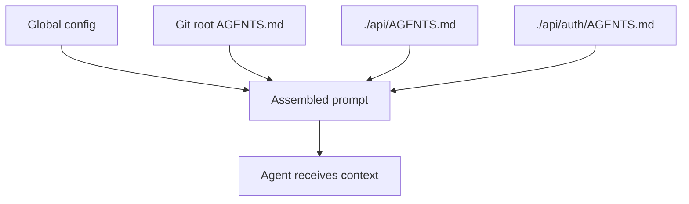

# Layer Agent Instructions by Specificity Across Scopes

> Structure agent instructions in concentric layers — global defaults, project-level files, and directory overrides — so the most specific instruction always wins.

Learn it hands-on: [The Most Specific Rule Wins](https://learn.agentpatterns.ai/prompt-engineering/most-specific-wins/) — guided lesson with quizzes.

!!! info "Also known as"
    Layered Instruction Scopes · Directory-Level Instruction Hierarchy · Hierarchical CLAUDE.md

    For the Claude Code–specific version of this pattern, see [Hierarchical CLAUDE.md](hierarchical-claude-md.md).

## Why flat instruction files break at scale

A single instruction file at the repository root works for small, uniform codebases. As projects grow — multiple services, distinct frontend and backend conventions, mixed toolchains — a single file either becomes an unmanageable list of conditional rules that hits the [instruction compliance ceiling](instruction-compliance-ceiling.md) or fails to cover the cases that matter.

Layering by scope solves this. The agent gets the instructions that fit where it is working, with no manual switching.

## The Codex harness model

[OpenAI's Codex harness](https://openai.com/index/unlocking-the-codex-harness/) uses a three-scope hierarchy:

1. Global config (`$CODEX_HOME`): defaults and preferences that apply across all repositories
2. Git root: the project-wide AGENTS.md at the repository root
3. Working directory: AGENTS.md files in subdirectories, from git root down to the current directory

The harness walks from global to working directory and concatenates AGENTS.md files in order of increasing specificity. More specific instructions appear later in the prompt and take priority over earlier, more general ones.


```mermaid
graph TD
    A[Global config] --> D[Assembled prompt]
    B[Git root AGENTS.md] --> D
    C[./api/AGENTS.md] --> D
    C2[./api/auth/AGENTS.md] --> D
    D --> E[Agent receives context]
```

## Priority rules

Later instructions take priority over earlier ones when they conflict. A directory-level file that says "use Bun, not npm" overrides a project-root file that says "use npm" for that directory and its children.

Priority comes from the concatenation order, not from explicit keywords. Global config provides defaults, the project root narrows them, and subdirectory files override for their scope.

## Why it works

LLMs show recency bias: instructions later in a prompt carry more weight when they conflict with earlier ones. By concatenating from general to specific, the harness uses this property to produce scoped behavior without making the model evaluate conditionals.

A flat file saying "if in `api/`, use uv; otherwise use pip" makes the model evaluate that condition correctly every time. A concatenated prompt replaces it with a later, unconditional "use uv" — the latter wins without conditional reasoning.

## AGENTS.override.md: per-directory alternative to AGENTS.md

[Codex's harness](https://openai.com/index/unlocking-the-codex-harness/) supports `AGENTS.override.md`: when both files exist in the same directory, the harness picks `AGENTS.override.md` and ignores `AGENTS.md` for that directory. Parent directory files still concatenate normally — the override only affects which file the harness picks within its own directory.

Use override files when the directory's conventions diverge enough to warrant a separate file. Override files do not suppress parent directory instructions — those are still included in the assembled prompt.

## Context budget limits

[Codex applies a 32 KiB default cap](https://openai.com/index/unlocking-the-codex-harness/) on assembled instruction content. Without a cap, deeply nested directories can use the entire context budget before task work begins.

If your harness does not enforce a size limit, apply the same discipline by hand:

- Keep each instruction file to 50–100 lines
- Prefer pointers to documentation over embedded content
- Check the total assembled size for deeply nested directories

## Applying this pattern without Codex

Any [agent harness](../patterns/agent-design/agent-harness.md) that reads instruction files from the filesystem can implement this pattern:

1. Collect all AGENTS.md files from global config through the git root to the current working directory
2. Concatenate them in order of increasing specificity
3. Enforce a total size cap
4. Check for override files and prefer `AGENTS.override.md` over `AGENTS.md` within the same directory when both exist — parent directory files are still concatenated regardless

The [AGENTS.md standard](https://agents.md) describes the directory traversal convention. Tools that implement AGENTS.md support — including [GitHub Copilot](https://github.blog/changelog/2025-08-28-copilot-coding-agent-now-supports-agents-md-custom-instructions/) and Cursor — load these files automatically when working within a repository.

## When this backfires

Layering works when scopes are independent. It degrades in several conditions:

- Conflicting rules without clear resolution: if a global file says "always use TypeScript" and a directory file says "use JavaScript", the directory file wins by position — but only if the agent respects concatenation order. Agents that weight by relevance rather than position may resolve the conflict unpredictably.
- Instruction bloat in deep hierarchies: a file six directories deep inherits instructions from every ancestor. A few verbose ancestor files fill the 32 KiB Codex default before task-specific content reaches the model.
- Inconsistent tool support: not all tools implement the full traversal spec. Some load only the root AGENTS.md; others support nesting but not `AGENTS.override.md`. Instructions written for full traversal may be silently ignored.

## Example

A monorepo with a frontend and an API service uses three AGENTS.md files:

```
~/.codex/AGENTS.md          # global: preferred languages, editor settings
my-repo/AGENTS.md           # project: test command, commit style, PR conventions
my-repo/api/AGENTS.md       # directory: use uv not pip, never run migrations in tests
```

When an agent works in `my-repo/api/`, the harness assembles the prompt in this order:

1. `~/.codex/AGENTS.md` — global defaults
2. `my-repo/AGENTS.md` — project conventions
3. `my-repo/api/AGENTS.md` — directory overrides

The instruction "use uv not pip" from `api/AGENTS.md` appears last and takes priority over any package-manager guidance in the project root file. The `my-repo/frontend/` directory receives only the first two files — its working directory has no AGENTS.md of its own.

## Key Takeaways

- Concatenate instruction files from general to specific — global config, then git root, then each directory down to the working directory — so the most specific rule appears last and wins.
- Priority is positional, not keyword-declared: later instructions override earlier ones because LLMs weight recent prompt content more heavily.
- `AGENTS.override.md` replaces `AGENTS.md` within a single directory while parent files still concatenate normally.
- Cap the assembled size (Codex defaults to 32 KiB) or enforce the discipline manually, since deep hierarchies can exhaust the context budget before task work begins.

## Related

- [Hierarchical CLAUDE.md: Structuring Context Files at Multiple Levels](hierarchical-claude-md.md)
- [AGENTS.md: A README for AI Coding Agents](../standards/agents-md.md)
- [Encode Project Conventions in AGENTS.md Files](agents-md-distributed-conventions.md)
- [The Instruction Compliance Ceiling](instruction-compliance-ceiling.md)
- [AGENTS.md as Table of Contents](agents-md-as-table-of-contents.md)
- [Instruction File Ecosystem](instruction-file-ecosystem.md)
- [Configuration File Structure Compliance Gap](configuration-file-structure-compliance-gap.md) — empirical null: scope layering aids comprehension, not compliance; an orthogonal finding to scope design here
- [@import Composition Pattern for Instruction Files](import-composition-pattern.md)
- [Evaluating AGENTS.md: When Context Files Hurt More Than Help](evaluating-agents-md-context-files.md)
