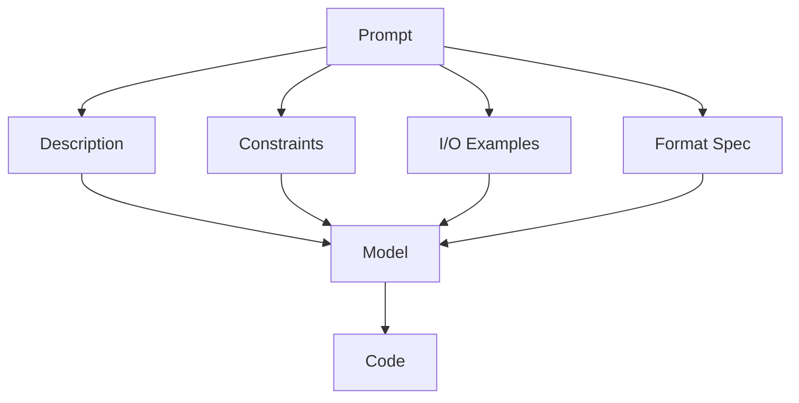

# Multi-Layer Specification Redundancy as a Robustness Budget

> Independent specification layers — description, constraints, examples, format — absorb prompt noise that would otherwise degrade code-generation correctness. Prose repetition of the same layer does not, and richer terminology can prime memorized-but-wrong solutions.

## What the Evidence Shows

Akli et al. evaluated 10 LLMs on HumanEval and LiveCodeBench under three prompt-mutation classes — Under-Specification (US), Lexical Vagueness (LV), Syntax/Formatting (SF). Pass@1 dropped 11.8% on HumanEval under US, but only 0.9% on LiveCodeBench. LV and SF showed the same pattern: HumanEval is brittle, LiveCodeBench is near-flat ([Akli et al., 2026](https://arxiv.org/abs/2604.24712)).

The two benchmarks differ structurally. HumanEval relies on a single docstring. LiveCodeBench layers four largely independent surfaces: natural-language description, an explicit constraints block, sample I/O pairs with explanations, and an input/output format spec. Their summary: "robustness is not a fixed property of LLMs but is highly dependent on prompt structure" ([Akli et al., 2026](https://arxiv.org/html/2604.24712)).

Model scale does not rescue brittleness. API reasoning models (GPT-5-mini, Claude Sonnet 4) lose ~9.7% on US — comparable to the smallest open-source models tested ([Akli et al., 2026](https://arxiv.org/html/2604.24712)).

## The Mechanism

Independent specification layers encode overlapping information across surfaces the model attends to separately. When one surface is degraded — a missing constraint, a vague verb, a malformed example — the others still carry the signal. The model has fallback evidence ([Akli et al., 2026](https://arxiv.org/html/2604.24712)).

Prose repetition does not satisfy this. Repeating the same constraint in three sentences of description provides one surface, not three. The robustness budget grows with surface independence, not paragraph count.



## When Redundancy Hurts

The same study identified 69 LiveCodeBench tasks where **removing** a constraint consistently improved Pass@1 across models. Three failure modes ([Akli et al., 2026](https://arxiv.org/html/2604.24712)):

| Mechanism | What happens |
|-----------|--------------|
| Constraint-triggered wrong parsing | A specific constraint line primes the model toward incompatible I/O handling |
| Constraint-anchored incorrect algorithm | A numeric bound activates a memorized shortcut (e.g., star-graph formula) misapplied to the actual problem |
| Retrieval-cue overfitting | Domain vocabulary ("currency exchange") anchors the model to a memorized but wrong template |

Specification richness is a budget, not a monotone good. Audit terminology and constraints for retrieval-cue traps — words that name a known problem family the actual task does not belong to.

## Applying the Pattern

Stack independent layers, not redundant prose:

1. **Description** — what the function does in plain language.
2. **Constraints** — explicit list of preconditions, bounds, ordering rules. Audit for vocabulary that could prime a wrong template.
3. **I/O examples** — at least one input/output pair with a one-line explanation. The explanation is its own surface.
4. **Format spec** — input parsing rules and output shape, separate from the description.

Each layer must be derivable independently. If two layers paraphrase the same sentence, they collapse into one and the budget shrinks.

This pattern composes with [Specification as Prompt](specification-as-prompt.md) — types, OpenAPI schemas, and test files act as additional independent layers when they exist. It also composes with [Example-Driven vs Rule-Driven Instructions](example-driven-vs-rule-driven-instructions.md) — examples and rules are independent surfaces for the same reason.

## Limits and Caveats

- HumanEval has documented training-data contamination (8–18% overlap acknowledged in the paper). Treat absolute deltas as direction-of-effect evidence, not point estimates ([Akli et al., 2026](https://arxiv.org/html/2604.24712)).
- The study is exploratory and Python-only with Pass@1 greedy decoding; sampling variance is masked.
- Mutations were generated by GPT-5-mini and may reflect generator tendencies rather than realistic developer errors ([Akli et al., 2026](https://arxiv.org/html/2604.24712)).
- Interactive agents recover much of the under-specification gap through clarification turns rather than upfront prompt richness ([Vijayvargiya et al., ICLR 2026](https://arxiv.org/abs/2502.13069)) — multi-layer redundancy is a non-interactive remedy, complementary to [interactive clarification](../agent-design/interactive-clarification-underspecified-tasks.md).
- Rich prompts cost tokens. For reasoning-heavy models on tight budgets, extra prompt structure can interact with [CoT fragility](../verification/cot-robustness-code-generation.md) ([Liu et al., 2026](https://arxiv.org/abs/2604.12214)).

## Example

A prompt with one layer (description only) is fragile under specification noise. The same prompt with four independent layers absorbs it.

**Single-layer (HumanEval-style):**

```
Implement a function that returns the median of a list of integers.
For even-length lists, return the average of the two middle values.
```

**Multi-layer (LiveCodeBench-style):**

```
Description:
  Compute the median of a list of integers. For even-length lists,
  return the average of the two middle values.

Constraints:
  - List length: 1 <= n <= 10000
  - Values: -10^9 <= x <= 10^9
  - Return a float for even n, an int for odd n

Input format:
  Line 1: integer n
  Line 2: n space-separated integers

Output format:
  A single number: the median.

Example:
  Input:
    4
    1 3 2 4
  Output:
    2.5
  (Sorted: [1,2,3,4]; middle two are 2 and 3; mean is 2.5)
```

If the constraints block is dropped or the description verb is swapped from "compute" to "find", the I/O example and format spec still constrain correctness. The single-layer version has no fallback surface — a vague verb or a missing bound becomes a coin flip ([Akli et al., 2026](https://arxiv.org/html/2604.24712)).

## Key Takeaways

- Robustness to prompt noise is a function of prompt structure, not model scale — API reasoning models degrade comparably to small open-source models on under-specified prompts.
- Stack independent specification layers — description, constraints, I/O examples, format — not paraphrased prose.
- Redundancy is a budget, not a monotone good. Richness in domain vocabulary or numeric bounds can anchor the model to memorized-but-wrong templates.
- Multi-layer specifications are a non-interactive remedy; interactive clarification handles the same gap when the agent can ask back.

## Related

- [The Specification as Prompt](specification-as-prompt.md) — Types, schemas, and tests as additional independent specification layers
- [Example-Driven vs Rule-Driven Instructions](example-driven-vs-rule-driven-instructions.md) — Examples and rules as independent surfaces for the same intent
- [Constraint Degradation in AI Code Generation](constraint-degradation-code-generation.md) — Failure mode at the other end: too many simultaneous constraints, not too few layers
- [Interactive Clarification for Underspecified Tasks](../agent-design/interactive-clarification-underspecified-tasks.md) — The interactive complement when the agent can ask
- [CoT Robustness in Code Generation](../verification/cot-robustness-code-generation.md) — How prompt perturbation interacts with reasoning at structural anchors
- [The Task Framing Irrelevance Fallacy](../fallacies/task-framing-irrelevance-fallacy.md) — Why surface framing is not noise the model filters out
