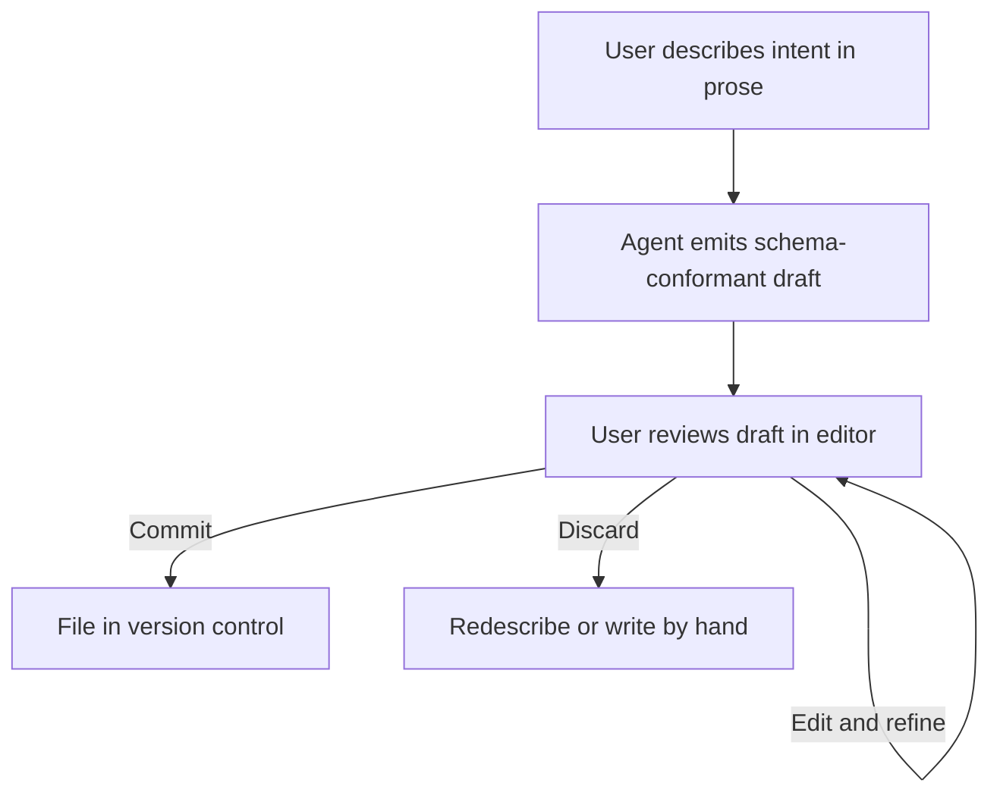

# Natural-Language Customization Bootstrap

> Describe the customization you want in plain language; the agent produces the instruction file, skill, subagent, or hook in its tool-specific format; you review the draft and commit.

## The Pattern

AI coding tools accumulate customization surfaces — CLAUDE.md, AGENTS.md, `.github/copilot-instructions.md`, skill files, subagent definitions, hook configurations. Each carries syntax and convention cost: frontmatter keys, directory placement, validation rules, tool scopes. For users who would benefit from customizing but have not read the spec, authoring cost is the activation barrier.

The bootstrap inverts the usual flow. Instead of the user writing scaffolding the agent consumes, the user describes intent in prose and the agent emits scaffolding the user reviews. The agent already knows the target schema — it is the consumer — so it can also produce conformant files from a description.

## How Tools Expose It

**VS Code 1.116** added a "Customize Your Agent" input on the Chat Customizations welcome page: "you can now use the **Customize Your Agent** input on the welcome page to let VS Code draft customizations like agents, skills, and instructions based on a natural language description." ([VS Code 1.116 release notes](https://code.visualstudio.com/updates/v1_116)) Per-surface slash commands — `/create-prompt`, `/create-instruction`, `/create-skill`, `/create-agent`, `/create-hook` — generate individual file types from the same prose input. Drafts land under `.github/instructions/`, `.github/prompts/`, `.github/agents/` where the Chat Customizations editor provides syntax highlighting and validation. ([VS Code — Agent Customization overview](https://code.visualstudio.com/docs/copilot/customization/overview))

**Claude Code** exposes the same pattern via `/agents`. Selecting "Generate with Claude" prompts for a description; "Claude generates the identifier, description, and system prompt for you" as a Markdown file with YAML frontmatter under `.claude/agents/` or `~/.claude/agents/`. ([Claude Code — Create custom subagents](https://code.claude.com/docs/en/sub-agents))

## Why It Works

The agent encodes the schema because it is the consumer at runtime. The same model that validates frontmatter fields, resolves tool scopes, and interprets system prompts produces those structures from a description. The user contributes the only part the agent cannot infer — intent — and inherits schema compliance for free.

The review gate is load-bearing. Drafts are scaffolding, not commits. The user reads, edits, commits — the file in the repository is the file the user approved, not the file the agent emitted.

## When To Use It Over Templates

| | Template | Natural-language bootstrap |
|---|---|---|
| Determinism | Same input, same output | Same description, different output |
| Invariant enforcement | Strong — structure baked in | Weak — draft quality depends on schema fidelity |
| Adaptivity | Low — fixed set | High — follows the described shape |
| Activation energy | Medium — pick the right template | Low — describe intent |

Bootstrap fits when intent varies or the user does not know which template to pick. Templates fit when conformance rules must hold across every file (compliance headers, tool allowlists, audit tags). VS Code ships both: per-surface slash commands and the welcome-page bootstrap sit inside the Chat Customizations editor, so the draft enters a validated authoring context. ([VS Code — Agent Customization overview](https://code.visualstudio.com/docs/copilot/customization/overview))

## Distinct From Introspective Skill Generation

[Introspective Skill Generation](../workflows/introspective-skill-generation.md) mines session transcripts to *propose* skills the user did not know were needed. Natural-language bootstrap starts from a skill the user has already decided to create and lowers the authoring cost. The former answers "which skill should exist"; the latter answers "how do I write the file I already know I want".

## When It Backfires

**No review gate.** A drafted file committed without reading it becomes an auto-generated context file. Auto-generated context files reduce task success rates where human-written ones improve them ([Evaluating AGENTS.md](evaluating-agents-md-context-files.md)). The bootstrap is a scaffold, not an output; skipping review turns a productivity pattern into a compliance hazard.

**Conformance-heavy organizations.** Where every file must carry specific headers, tool allowlists, or compliance tags, free-form draft output drifts from the required form. Wrap the bootstrap in a validator or prefer per-surface slash commands that tooling can constrain.

**Schema drift across versions.** The agent drafts against the schema version it was trained on. If the target tool changes frontmatter keys, renames directories, or tightens validation, a bootstrap relying on stale knowledge produces files that parse but misbehave. Gate the draft through the tool's own validator — both the Chat Customizations editor and `/agents` validate before writing.

## Key Takeaways

- The agent encoding the target schema can also emit files that conform to it — intent from the user, structure from the model, review from the commit gate
- Two shipped implementations exist today: VS Code 1.116's "Customize Your Agent" welcome page and Claude Code's `/agents` "Generate with Claude" flow
- Draft-then-review is the invariant — skipping review collapses this pattern into the auto-generated context file failure mode
- Prefer templates where conformance is enforced mechanically; prefer the bootstrap where intent varies and activation energy dominates

## Related

- [Introspective Skill Generation](../workflows/introspective-skill-generation.md)
- [Evaluating AGENTS.md: When Context Files Hurt More Than Help](evaluating-agents-md-context-files.md)
- [CLAUDE.md Convention](claude-md-convention.md)
- [Project Instruction File Ecosystem](instruction-file-ecosystem.md)
- [Prompt File Libraries](prompt-file-libraries.md)
