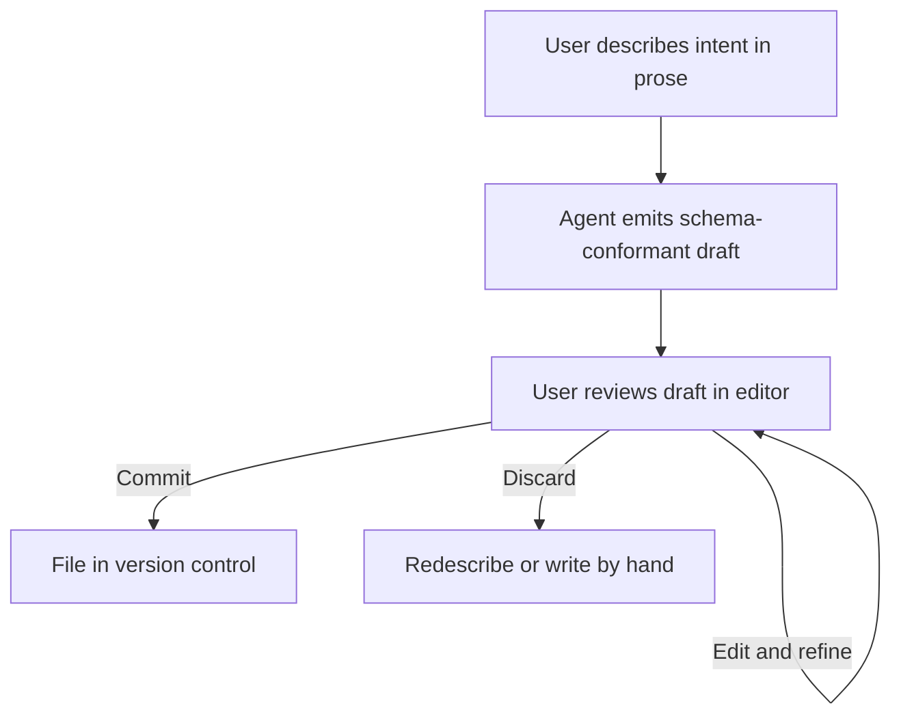

# Natural-Language Customization Bootstrap

> Describe a customization in plain language; the agent drafts the instruction file, skill, subagent, or hook in tool-specific format for you to review and commit.

## The pattern

AI coding tools accumulate customization surfaces — CLAUDE.md, AGENTS.md, `.github/copilot-instructions.md`, skill files, subagent definitions, hook configurations. Each one carries syntax and convention cost: frontmatter keys, directory placement, validation rules, tool scopes. Authoring cost is the activation barrier for users who would benefit from customizing but have not read the spec.

The bootstrap inverts the usual flow. Instead of hand-authoring the files of the [instruction-file ecosystem](instruction-file-ecosystem.md) the agent consumes, you describe intent in prose and the agent emits scaffolding for you to review. The agent already knows the target schema — it is the consumer — so it can also produce conformant files from a description.

## How tools expose it

VS Code 1.116 added a "Customize Your Agent" input on the Chat Customizations welcome page: "you can now use the **Customize Your Agent** input on the welcome page to let VS Code draft customizations like agents, skills, and instructions based on a natural language description." ([VS Code 1.116 release notes](https://code.visualstudio.com/updates/v1_116)) Per-surface slash commands — `/create-prompt`, `/create-instruction`, `/create-skill`, `/create-agent`, `/create-hook` — generate individual file types from the same prose input. Drafts land under `.github/instructions/`, `.github/prompts/`, `.github/agents/`, where the Chat Customizations editor provides syntax highlighting and validation. ([VS Code — Agent Customization overview](https://code.visualstudio.com/docs/copilot/customization/overview))

Claude Code exposes the same pattern via `/agents`. Selecting "Generate with Claude" prompts for a description, and "Claude generates the identifier, description, and system prompt for you" as a Markdown file with YAML frontmatter under `.claude/agents/` or `~/.claude/agents/`. ([Claude Code — Create custom subagents](https://code.claude.com/docs/en/sub-agents))


```mermaid
graph TD
    A[User describes intent in prose] --> B[Agent emits schema-conformant draft]
    B --> C[User reviews draft in editor]
    C -->|Edit and refine| C
    C -->|Commit| D[File in version control]
    C -->|Discard| E[Redescribe or write by hand]
```

## Example

Invoking Claude Code's `/agents` command and selecting "Generate with Claude" opens a description prompt. A prose input like:

> An agent that reviews a pull request diff, flags missing tests for changed functions, and leaves inline comments on the PR.

produces a draft file under `.claude/agents/` along the lines of:

```markdown
---
name: test-coverage-reviewer
description: Reviews PR diffs for functions that lack accompanying tests and posts inline review comments.
tools: Bash, Read, Grep, Glob
---

You are a pull-request reviewer focused on test coverage...
```

The frontmatter keys (`name`, `description`, `tools`), the file location, and the system-prompt skeleton come from the agent's knowledge of the subagent schema. ([Claude Code — Create custom subagents](https://code.claude.com/docs/en/sub-agents)) You review the draft, tighten the description, edit the system prompt, then commit — the file in the repo is the one you approved.

## Why it works

The agent encodes the schema because it is the consumer at runtime. The same model that validates frontmatter fields, resolves tool scopes, and interprets system prompts produces those structures from a description. You contribute the only part the agent cannot infer — intent — and inherit schema compliance for free.

The review gate matters. A draft committed unread becomes an [auto-generated context file](evaluating-agents-md-context-files.md), the failure mode this pattern depends on avoiding. Drafts are scaffolding, not commits. You read, edit, then commit — the file in the repository is the one you approved, not the one the agent emitted.

## When to use it over templates

| | Template | Natural-language bootstrap |
|---|---|---|
| Determinism | Same input, same output | Same description, different output |
| Invariant enforcement | Strong — structure baked in | Weak — draft quality depends on schema fidelity |
| Adaptivity | Low — fixed set | High — follows the described shape |
| Activation energy | Medium — pick the right template | Low — describe intent |

Bootstrap fits when intent varies or you do not know which template to pick. Templates fit when conformance rules must hold across every file (compliance headers, tool allowlists, audit tags). VS Code ships both: per-surface slash commands and the welcome-page bootstrap sit inside the Chat Customizations editor, so the draft enters a validated authoring context. ([VS Code — Agent Customization overview](https://code.visualstudio.com/docs/copilot/customization/overview))

## Distinct from Introspective Skill Generation

[Introspective Skill Generation](../workflows/introspective-skill-generation.md) mines session transcripts to propose skills you did not know were needed. Natural-language bootstrap starts from a skill you have already decided to create and lowers the authoring cost. The former answers "which skill should exist". The latter answers "how do I write the file I already know I want".

## When it backfires

Skipping the review gate is the first failure. A drafted file committed without reading it becomes an auto-generated context file. Auto-generated context files reduce task success rates where human-written ones improve them ([Evaluating AGENTS.md](evaluating-agents-md-context-files.md)). The bootstrap is a scaffold, not an output. Skipping review turns a productivity pattern into a compliance hazard.

Conformance-heavy organizations are the second risk. Where every file must carry specific headers, [tool allowlists](../patterns/multi-agent/subagent-schema-level-tool-filtering.md), or compliance tags, free-form draft output drifts from the required form. Wrap the bootstrap in a validator, or prefer per-surface slash commands that tooling can constrain.

Schema drift across versions is the third. The agent drafts against the schema version it was trained on. If the target tool changes frontmatter keys, renames directories, or tightens validation, a bootstrap relying on stale knowledge produces files that parse but misbehave. Gate the draft through the tool's own validator — both the Chat Customizations editor and `/agents` validate before writing.

## Key Takeaways

- The agent encoding the target schema can also emit files that conform to it — intent from the user, structure from the model, review from the commit gate
- Two shipped implementations exist today: VS Code 1.116's "Customize Your Agent" welcome page and Claude Code's `/agents` "Generate with Claude" flow
- Draft-then-review is the invariant — skipping review collapses this pattern into the auto-generated context file failure mode
- Prefer templates where conformance is enforced mechanically; prefer the bootstrap where intent varies and activation energy dominates

## Related

- [Introspective Skill Generation](../workflows/introspective-skill-generation.md)
- [Evaluating AGENTS.md: When Context Files Hurt More Than Help](evaluating-agents-md-context-files.md)
- [CLAUDE.md Convention](claude-md-convention.md)
- [Project Instruction File Ecosystem](instruction-file-ecosystem.md)
- [Prompt File Libraries](prompt-file-libraries.md)
