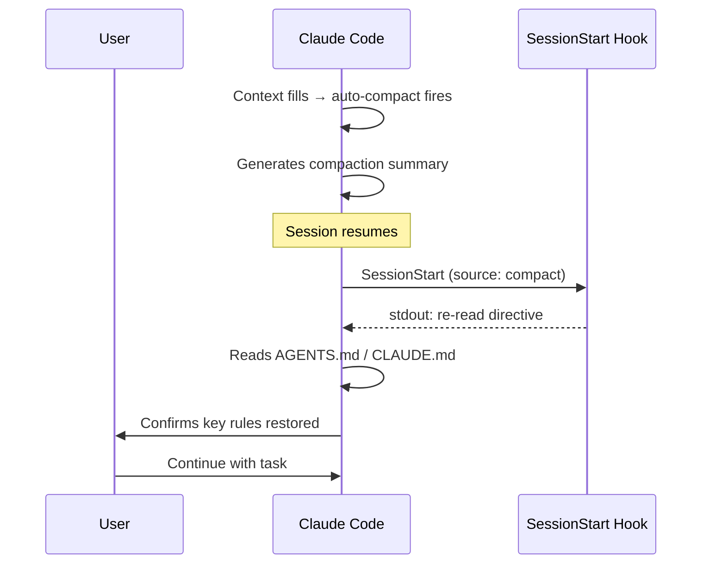

# Post-Compaction Re-read Protocol

> Compaction summarises conversation history but discards the soft operational knowledge agents accumulate by reading instruction files early in a session. A targeted re-read restores that knowledge.

## Overview

When Claude Code [compacts](../context-engineering/context-compression-strategies.md) a long session, it summarises older turns to free context space. The summary preserves task state — what was done, what remains — but paraphrases instruction file references, losing precision. The agent continues working with degraded rule fidelity rather than any visible error signal.

Users document Claude following rules perfectly before compaction and violating them 100% of the time after — not because CLAUDE.md was removed, but because the paraphrased summary no longer carries the full constraint set. `[unverified]`

Claude Code does reload CLAUDE.md after compaction (the `InstructionsLoaded` hook fires with `load_reason: "compact"`), but reload alone does not reliably restore behavioral compliance. The re-read protocol makes the refresh explicit and confirms it took effect.

## How It Works

There are two implementation forms:

**Manual (prompt-based):**

After any compaction event, issue a targeted prompt before resuming task work:

```
Reread AGENTS.md so it's still fresh in your mind.
```

For higher compliance, add a confirmation requirement:

```
Reread AGENTS.md and confirm the key rules you found before continuing.
```

**Automated (SessionStart hook with compact matcher):**

`SessionStart` hooks fire when a session resumes — including after compaction. Filtering on `matcher: "compact"` restricts the hook to compaction events only. Stdout from `SessionStart` hooks is injected into Claude's context.

Configure in `.claude/settings.json`:

```json
{
  "hooks": {
    "SessionStart": [
      {
        "matcher": "compact",
        "hooks": [
          {
            "type": "command",
            "command": "$HOME/.local/bin/claude-post-compact-reminder"
          }
        ]
      }
    ]
  }
}
```

The hook script outputs a directive prompt to stdout, which Claude receives as context:

```bash
#!/usr/bin/env bash
INPUT=$(cat)
SOURCE=$(echo "$INPUT" | jq -r '.source // empty')

# Only fire on compact events (belt-and-suspenders with the matcher)
[ "$SOURCE" = "compact" ] || exit 0

cat <<'EOF'
IMPORTANT: Context was just compacted. STOP. You MUST:
1. Read AGENTS.md NOW
2. Confirm by briefly stating the key rules you found.
Do not proceed with any task until you have done this.
EOF
```

The mandatory language and confirmation requirement are intentional — a polite suggestion is treated as optional; an explicit stop-and-confirm prompt is not.

Note: `PostCompact` (added in v2.1.76) fires after compaction but has no decision control and cannot inject prompts into Claude's context. It is appropriate for observability tasks (logging, external updates) rather than re-read injection.

## Trade-offs

| Approach | Pros | Cons |
|----------|------|------|
| Manual prompt | No setup; works in any tool | Requires user to remember after every compaction |
| SessionStart hook (`compact` matcher) | Deterministic; stdout injected into context | Claude Code only; fires on session resume, not mid-session auto-compact |
| Marker-based (PreCompact + UserPromptSubmit) | Fires mid-session for auto-compact; more granular control | More complex wiring; two hooks instead of one |

## Diagram



## Key Takeaways

- Compaction discards soft operational knowledge even when CLAUDE.md survives in context — behavioral drift follows silently.
- The `InstructionsLoaded` hook with `load_reason: "compact"` confirms Claude Code reloads instruction files, but reload does not guarantee compliance is restored.
- Use `SessionStart` with `matcher: "compact"` (not `PostCompact`) to inject a re-read directive — `PostCompact` has no context injection capability.
- Confirmation requirements ("state the key rules you found") improve compliance versus directive-only prompts.
- For multi-agent sessions, each subagent's context can compact independently — the re-read must be applied per-agent, not just at the orchestrator.

## Unverified Claims

- "Appears in 80%+ of production sessions as the most cost-effective single-prompt intervention" — no primary source found; characterisation based on agent-flywheel.com session archives `[unverified]`
- ~95% skill compliance improvement with marker-based hook approach vs ~60-70% baseline — reported by a single community contributor in a GitHub issue, not a controlled study `[unverified]`

## Related

- [Manual Compaction as Dumb Zone Mitigation](../context-engineering/manual-compaction-dumb-zone-mitigation.md)
- [Context Window Dumb Zone](../context-engineering/context-window-dumb-zone.md)
- [Event-Driven System Reminders](event-driven-system-reminders.md)
- [Critical Instruction Repetition](critical-instruction-repetition.md)
- [Claude Code Hooks](../tools/claude/hooks-lifecycle.md)
- [Instruction Compliance Ceiling](instruction-compliance-ceiling.md) — compaction degrades compliance; understanding the ceiling informs re-read protocol design
- [Frozen Spec File](frozen-spec-file.md) — pairs with this protocol: the frozen spec survives compaction on disk; this protocol ensures the agent re-reads it
- [Enforcing Agent Behavior with Hooks](enforcing-agent-behavior-with-hooks.md) — broader hook patterns for behavioral enforcement, including SessionStart hooks used here
- [CLAUDE.md Convention](claude-md-convention.md) — the instruction file that this protocol ensures is re-read after compaction
