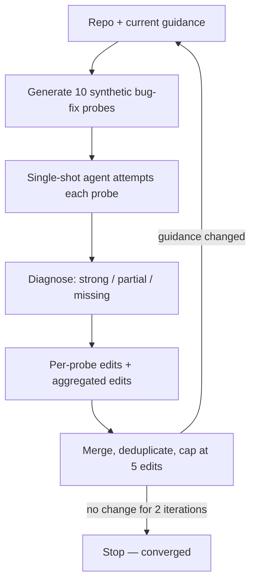

# Probe-and-Refine Tuning of Repository Guidance for Coding Agents

> Tune repository guidance by probing the agent with synthetic bug-fix tasks and refining the file on diagnosed failures — the artifact is model-specific calibration.

## When to reach for it

Reach for probe-and-refine only when the model you ship with is fixed and the repo's code is relatively stable. The technique's largest documented gain on SWE-bench Verified is a 33.0% resolve rate, against 28.3% for static human-written guidance and 25.5% with no guidance file at all (p<0.001). That gain comes with a counterpart finding: guidance tuned on one base model collapses performance on a different one — Qwen-tuned guidance applied to Nemotron drops resolve rate from 27.0% to 13.2% ([Shepard & Albrecht, 2026](https://arxiv.org/abs/2606.20512)). Multi-model teams and fast-changing codebases get worse outcomes from a tuned artifact than from the manual practitioner loop in [Anthropic's skill-authoring guide](https://www.anthropic.com/engineering/equipping-agents-for-the-real-world-with-agent-skills).

This page is the how-to. The complementary [Evaluating AGENTS.md](evaluating-agents-md-context-files.md) page answers whether a context file helps at all; probe-and-refine is the only published method shown to produce one that beats the unguided baseline.

## The loop

Each iteration runs four single-shot LLM calls per probe — no agent loops, no tool use — and produces at most five edits to the guidance file:



The published configuration generates probes at temperature 0.9 to cover diverse subsystems, runs up to five iterations, and stops early when two consecutive iterations leave the guidance unchanged ([Shepard & Albrecht, 2026 §3](https://arxiv.org/html/2606.20512)). Per repository the loop costs roughly 22 single-shot calls per iteration at ~8k input + 2k output tokens per call — a one-time cost that amortizes over every future issue against that artifact.

## Why it works

Probe-and-refine does not write what is true about the repo — that information duplicates the documentation the agent will read anyway, the failure mode behind the ~20% cost overhead Gloaguen et al. measured for auto-generated context files ([Gloaguen et al., 2026](https://arxiv.org/abs/2602.11988)). It writes what the current agent fails at on this repo. The diagnostic call inspects the candidate patch against expected behavior and emits guidance edits that are, by construction, behaviorally load-bearing on the model that produced them.

The mechanism shows in where the gain comes from: coverage rose by 14.5 percentage points (more probes produce evaluable patches at all), while per-patch precision held constant at ~59% (p=0.119) — the refined guidance teaches the agent to reach the right code, not to fix it better ([Shepard & Albrecht, 2026 §5](https://arxiv.org/abs/2606.20512)). The 56% prompt-token overhead is roughly matched by a 29% gain in resolved instances, so the cost-per-success ratio is close to flat.

The content composition reinforces the mechanism: refined artifacts averaged 47% procedural guardrails (debugging workflows), 30% structural references (file/module relationships), and 23% quality-gate rules (output validation) — material an LLM cannot infer from the source tree but that the agent visibly failed without ([Shepard & Albrecht, 2026, html](https://arxiv.org/html/2606.20512)).

## When this backfires

- Cross-model deployment. The strongest counter-evidence is in the paper itself: Qwen-tuned guidance applied to Nemotron drops resolve rate from 27.0% to 13.2% — the artifact is "model-specific behavioral calibration," not transferable repository knowledge ([Shepard & Albrecht, 2026 §7](https://arxiv.org/html/2606.20512)). A team that runs Claude Code, Copilot, and Codex against the same repo cannot share one tuned artifact; the per-model retune cost is multiplicative.
- Codebases under active refactor. The paper does not address how often to re-run probe-and-refine after code changes; the artifact is described only as "reusable across all future issues" ([Shepard & Albrecht, 2026 §9](https://arxiv.org/html/2606.20512)). A repo whose module layout or testing conventions shift weekly decays the structural-reference content (~30% of the file) without a built-in trigger to re-tune.
- Repos where the agent already succeeds. Probe-and-refine adds material — 47% debugging guardrails, 30% structural references, 23% quality gates. On a repo where the unguided baseline is already near ceiling, padding the guidance with synthesized guardrails reproduces the Gloaguen et al. failure mode: instruction over-compliance pushes cost up without lifting accuracy ([Gloaguen et al., 2026](https://arxiv.org/abs/2602.11988)).
- Solo or low-issue-volume repos. Three-to-five iterations × ~22 LLM calls × ~10k tokens for a single-person repo is poor ROI against the manual [observe-refine-test loop Anthropic recommends for skills](https://www.anthropic.com/engineering/equipping-agents-for-the-real-world-with-agent-skills), which costs effectively nothing per cycle and transfers across models because a human writes each edit.
- Single-benchmark generalization risk. The +4.7pp gain comes from one benchmark (SWE-bench Verified) that is 46% Django; non-Django repos in the eval had 1–2 instances each, so the headline number's robustness to a more diverse evaluation is untested ([Shepard & Albrecht, 2026 §9](https://arxiv.org/html/2606.20512)).

## Example

The published pipeline produces edits like the following pattern. Each probe diagnosis names a specific failure mode the agent exhibited and proposes a one-line guidance edit.

Probe outcome — the agent tries to find a test fixture in `tests/data/` and fails:

```
Diagnosis: missing — agent could not locate the test fixture path.
Proposed edit (section: testing): test fixtures live in `tests/_fixtures/`, not `tests/data/`.
```

After aggregation, capped at 5 edits per iteration, the surviving edits land in the guidance file as plain prose. After three-to-five iterations, the artifact has grown from ~1,687 chars to ~2,754 chars on average — adding behaviorally load-bearing rules the model would otherwise have to discover by trial ([Shepard & Albrecht, 2026, html](https://arxiv.org/html/2606.20512)).

Practitioners running Claude Code today do an unautomated version of this every time they read a transcript, notice a wrong-directory grep, and add a line to `CLAUDE.md`. Probe-and-refine automates the loop; the trade-off is that the automated artifact does not survive a model swap, where the manual loop does.

## Key Takeaways

- Probe-and-refine is the only published method shown to produce a repo-guidance artifact that beats the unguided baseline (33.0% vs 25.5% on SWE-bench Verified)
- The gain comes from coverage, not precision — the guidance teaches the agent to reach the right code, not to fix it better
- The artifact is model-specific; tuned guidance applied to a different base model can collapse performance below the unguided baseline
- Cost shape: ~22 LLM calls × 3–5 iterations per repo, ~56% prompt-token overhead per issue thereafter
- Reach for it only when the base model is fixed, the codebase is stable, and the unguided baseline leaves room — otherwise the manual observe-refine-test loop is the better default

## Related

- [Evaluating AGENTS.md: When Context Files Hurt More Than Help](evaluating-agents-md-context-files.md) — the evidence base for whether context files help at all; this page is the technique for producing one that does
- [The Instruction Compliance Ceiling](instruction-compliance-ceiling.md) — explains why naively adding more content to a context file backfires past a threshold
- [AGENTS.md as Table of Contents, Not Encyclopedia](agents-md-as-table-of-contents.md) — the pointer-map alternative this technique competes with for the same job
- [Enforcing Agent Behavior with Hooks](enforcing-agent-behavior-with-hooks.md) — the alternative when the rule is critical enough that prompts are the wrong surface
- [Configuration File Structure Does Not Drive Compliance](configuration-file-structure-compliance-gap.md) — empirical null on file structure, complementary to this page's content-tuning angle
</content>
</invoke>
