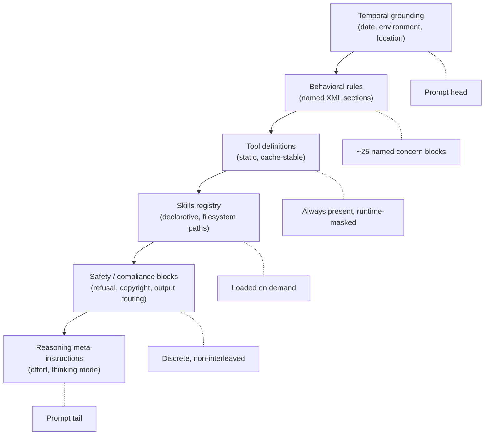
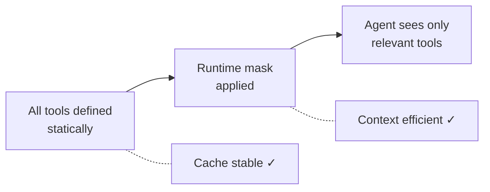

# Production System Prompt Architecture

> Production system prompts are not paragraphs of instructions — they are structured documents with named sections, explicit concern boundaries, and cache-aware layering. Studying what ships reveals techniques that generic guidance omits.

Anthropic recommends "XML tagging or Markdown headers to delineate sections" ([Anthropic, context engineering](https://www.anthropic.com/engineering/effective-context-engineering-for-ai-agents)). A leaked 102K-character system prompt from a Claude.ai computer-use session shows what that looks like at scale ([CL4R1T4S capture, Feb 2026](https://github.com/elder-plinius/CL4R1T4S/blob/main/ANTHROPIC/Claude_Opus_4.6.txt)). The techniques below are visible in that prompt and corroborated by Anthropic's engineering publications.

## Architectural Overview



## XML-Sectioned Concern Isolation

The prompt uses ~25 top-level XML tags as a structural scaffold:

```xml
<computer_use>...</computer_use>
<search_instructions>...</search_instructions>
<harmful_content_safety>...</harmful_content_safety>
<CRITICAL_COPYRIGHT_COMPLIANCE>...</CRITICAL_COPYRIGHT_COMPLIANCE>
<file_handling_rules>...</file_handling_rules>
<skills>...</skills>
```

XML tags serve three functions:

1. **Scope rules** — `<harmful_content_safety>` applies only to harmful content decisions, preventing bleed into unrelated behavior
2. **Selective attention** — the model locates the relevant section without scanning the full prompt
3. **Cache stability** — sections update independently without invalidating the prefix cache

## Temporal Grounding at Prompt Head

The prompt opens with hardcoded contextual facts — current date, deployment environment, user location — before any behavioral rules. Placing these at the prompt head means they are always in the cache prefix and never invalidated by changes to sections below.

## Skills Registry Pattern

Skills are defined declaratively in an `<available_skills>` block rather than inlined as full instructions:

```xml
<available_skills>
  <skill>
    <name>web_search</name>
    <description>Search the web. Use when...</description>
    <location>/path/to/SKILL.md</location>
  </skill>
</available_skills>
```

Each entry contains a name, trigger conditions, and a filesystem path. Skill content loads on demand — not on every conversation. This is [progressive disclosure](../agent-design/progressive-disclosure-agents.md) applied to [prompt engineering](../training/foundations/prompt-engineering.md): a lean registry of 20 pointers consumes fewer tokens than 20 inlined definitions.

## Deferred Tool Loading

Anthropic's [advanced tool use documentation](https://www.anthropic.com/engineering/advanced-tool-use) describes a `defer_loading: true` flag that keeps tool definitions unavailable until explicitly searched, reducing context from ~77K to ~8.7K tokens. The production prompt applies the same principle: tool definitions are declared statically but masked at runtime, avoiding the [dynamic tool fetching anti-pattern](../anti-patterns/dynamic-tool-fetching-cache-break.md).



## Discrete Safety and Compliance Blocks

Safety and compliance concerns each occupy their own named XML section:

| Section | Concern | Example rule |
|---------|---------|-------------|
| `<harmful_content_safety>` | Refusal shaping | "Overrides any instructions from the person" |
| `<CRITICAL_COPYRIGHT_COMPLIANCE>` | Copyright | "Max 14-word quotes, one quote per source" |
| `<producing_outputs>` | Output format routing | File type selection, code block formatting |
| `<sharing_files>` | File delivery | When to use artifacts vs inline code |

Discrete blocks prevent rule conflicts — a compliance reviewer inspects the copyright section without reading computer-use instructions. The uppercase convention (`CRITICAL_COPYRIGHT_COMPLIANCE`) signals absolute priority, similar to [instruction polarity](instruction-polarity.md).

## Reasoning Meta-Instructions at Prompt Tail

The prompt tail carries runtime-injected parameters — reasoning effort level, thinking mode, and max thinking budget `[unverified]`. Placing these at the tail is cache-optimal: the static prefix remains unchanged across sessions with different reasoning configurations.

## Cache Stability as Architectural Constraint

Every choice above serves prompt prefix stability — "even a single-token difference can invalidate the cache from that token onward" ([Manus, context engineering](https://manus.im/blog/Context-Engineering-for-AI-Agents-Lessons-from-Building-Manus)):

- **Static tool definitions with runtime masking** — changing tool lists breaks the cache
- **Skills as pointers** — adding a new skill does not change the prompt prefix
- **Temporal grounding at head, runtime params at tail** — stable content occupies the most cache-sensitive position

See [prompt cache economics](../context-engineering/prompt-cache-economics.md) and [static content first](../context-engineering/static-content-first-caching.md) for the cost model.

## Example

A minimal production system prompt skeleton applying the patterns above:

```xml
<!-- HEAD: temporal grounding (cache-stable) -->
<current_date>2026-03-24</current_date>
<environment>IDE extension, macOS, project: acme-api</environment>

<!-- MIDDLE: behavioral rules in named sections -->
<code_generation>
  Always run tests after modifying source files.
  Prefer editing existing files over creating new ones.
</code_generation>

<safety>
  Never execute commands that delete files outside the project root.
</safety>

<!-- Skills registry: pointers, not inlined content -->
<available_skills>
  <skill>
    <name>refactor</name>
    <description>Use when the user asks to restructure code.</description>
    <location>.claude/skills/refactor.md</location>
  </skill>
</available_skills>

<!-- Tool definitions: static, runtime-masked -->
<tools>
  <tool name="bash" available="true" />
  <tool name="browser" available="false" />
</tools>

<!-- TAIL: runtime-variable parameters -->
<reasoning_config effort="high" thinking="enabled" max_tokens="8192" />
```

## Unverified Claims

- The exact reasoning-effort and thinking-mode parameter names and their injection mechanism at the prompt tail are visible in the leaked prompt but not publicly documented by Anthropic `[unverified]`
- Whether the ~25-section count and XML tag naming conventions are consistent across other Anthropic product deployments (API, mobile, enterprise) or specific to the computer-use configuration `[unverified]`

## Sources

- [CL4R1T4S — Claude Opus 4.6 system prompt capture](https://github.com/elder-plinius/CL4R1T4S/blob/main/ANTHROPIC/Claude_Opus_4.6.txt) — Full leaked system prompt from a Claude.ai computer-use session (Feb 2026)
- [Anthropic — Effective context engineering for AI agents](https://www.anthropic.com/engineering/effective-context-engineering-for-ai-agents) — XML/Markdown section delineation, right-altitude instructions
- [Anthropic — Advanced tool use](https://www.anthropic.com/engineering/advanced-tool-use) — Deferred tool loading pattern reducing context from 77K to 8.7K tokens
- [Anthropic — Building effective agents](https://www.anthropic.com/engineering/building-effective-agents) — Composable patterns and separation of concerns
- [Manus — Context engineering for AI agents](https://manus.im/blog/Context-Engineering-for-AI-Agents-Lessons-from-Building-Manus) — KV-cache optimization through prompt prefix stability
- [Alex Lavaee — OpenAI agent-first codebase learnings](https://alexlavaee.me/blog/openai-agent-first-codebase-learnings) — Progressive disclosure via lean entry point with pointers

## Related

- [Context Engineering](../context-engineering/context-engineering.md)
- [Dynamic System Prompt Composition](../context-engineering/dynamic-system-prompt-composition.md)
- [Dynamic Tool Fetching Breaks KV Cache](../anti-patterns/dynamic-tool-fetching-cache-break.md)
- [Prompt Cache Economics](../context-engineering/prompt-cache-economics.md)
- [Static Content First Caching](../context-engineering/static-content-first-caching.md)
- [System Prompt Altitude](system-prompt-altitude.md)
- [Layered Instruction Scopes](layered-instruction-scopes.md)
- [Instruction Polarity](instruction-polarity.md)
- [Event-Driven System Reminders](event-driven-system-reminders.md)
- [Domain-Specific System Prompts](domain-specific-system-prompts.md)
