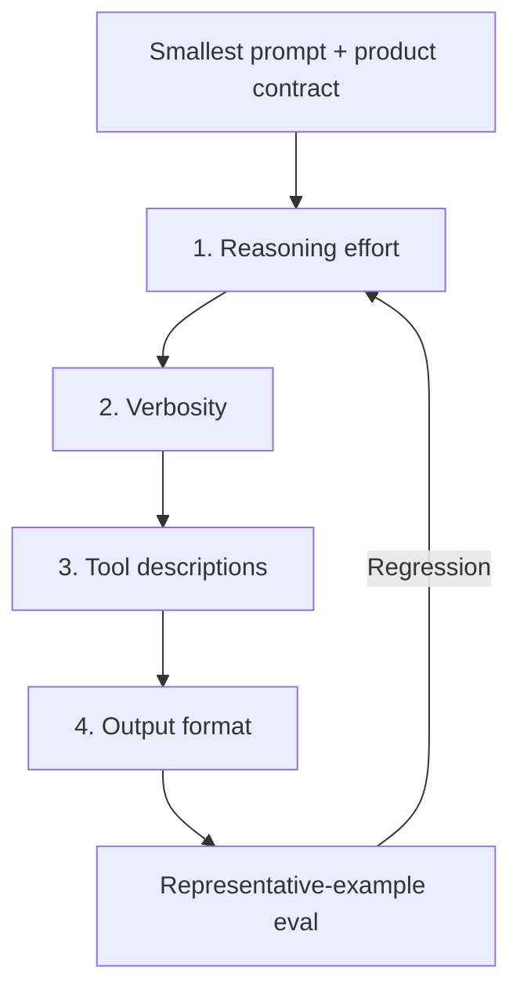

# Prompt-Rewrite Discipline on Cross-Generation Model Migration

> A cross-generation model swap is not a drop-in replacement. Discard the inherited prompt stack, start from the smallest prompt that preserves the product contract, and re-tune four axes — reasoning effort, verbosity, tool descriptions, output format — against representative examples.

## When the Discipline Applies

Both OpenAI and Anthropic now make this an explicit, in-product recommendation, bounded to cross-generation hops.

OpenAI's "Using GPT-5.5" guide states the recommendation verbatim:

> To get the most out of GPT-5.5, treat it as a new model family to tune for, not a drop-in replacement for `gpt-5.2` or `gpt-5.4`. Begin migration with a fresh baseline instead of carrying over every instruction from an older prompt stack. Start with the smallest prompt that preserves the product contract, then tune reasoning effort, verbosity, tool descriptions, and output format against representative examples ([OpenAI: Using GPT-5.5](https://developers.openai.com/api/docs/guides/latest-model)).

Anthropic's Opus 4.6 → 4.7 migration guide reaches the same conclusion: "Claude Opus 4.7 interprets prompts more literally and explicitly than Claude Opus 4.6... A prompt and harness review may be especially helpful for migration to Claude Opus 4.7" ([Anthropic: Migration guide](https://platform.claude.com/docs/en/about-claude/models/migration-guide)).

The discipline applies when the successor changes *how* it reads prompts, not just which weights produce the next token — not a blanket rule for every model-ID swap.

## Rewrite vs. Patch-Forward

OpenAI's `openai-docs` skill classifies upgrades into three buckets ([OpenAI skills upgrade-guide.md](https://raw.githubusercontent.com/openai/skills/724cd511c96593f642bddf13187217aa155d2554/skills/.curated/openai-docs/references/upgrade-guide.md)):

| Class | Choose when | Action |
|-------|-------------|--------|
| `model string only` | Minor-version successor, prompts already short and task-bounded, no strict output-shape dependency | Replace the model string, keep prompts unchanged, run the regression eval |
| `model string + light prompt rewrite` | Strict output shape, scaffolded prompts, observed verbosity or density change, tool-heavy or multi-agent flow | Replace the string, rewrite prompts tied to the workflow risk, leave the rest |
| `blocked` | Upgrade requires API-surface changes, parameter rewrites, or tool-handler rewiring | Report the blocker; do not improvise |

Cross-generation hops sit in the middle bucket by default; minor-version successors sit in the first. Anthropic aligns: "Claude Opus 4.7 should have strong out-of-the-box performance on existing Claude Opus 4.6 prompts and evals" ([Anthropic: Migration guide](https://platform.claude.com/docs/en/about-claude/models/migration-guide)) — the rewrite is conditional on observed drift, not assumed.

## The Smallest Prompt That Preserves the Product Contract

The product contract is the externally observable behavior the agent owes the user: input domain, output shape, tool-call discipline, refusal posture, latency envelope. The smallest prompt produces that contract on representative inputs without inherited compensation layers.

Old prompts encode workarounds for prior-generation defaults: verbosity controls compensating for over-explaining, scaffolding to force interim status messages, redundant examples to force generalization. Claude Opus 4.7 "will not silently generalize an instruction from one item to another, and it will not infer requests you didn't make" ([Anthropic: Migration guide](https://platform.claude.com/docs/en/about-claude/models/migration-guide)) — workarounds written for the old default become noise or actively misfire.

Anthropic's migration checklist tells teams to strip first: "Re-baseline response length with existing length-control prompts removed, then tune explicitly" and "If you've added scaffolding to force interim status messages ('After every 3 tool calls, summarize progress'), try removing it" ([Anthropic: Migration guide](https://platform.claude.com/docs/en/about-claude/models/migration-guide)).

## The Four-Axis Tuning Order

OpenAI names the order: **reasoning effort → verbosity → tool descriptions → output format** ([OpenAI: Using GPT-5.5](https://developers.openai.com/api/docs/guides/latest-model)). The order is not arbitrary.



1. **Reasoning effort** sets the depth of computation before anything downstream is observable. Anthropic instructs teams to "start with the new `xhigh` effort level for coding and agentic use cases, and use a minimum of `high` effort for most intelligence-sensitive use cases" ([Anthropic: Migration guide](https://platform.claude.com/docs/en/about-claude/models/migration-guide)). Tuning later axes before effort produces signals from the wrong substrate. See [Reasoning Budget Allocation](../agent-design/reasoning-budget-allocation.md).
2. **Verbosity** shapes response length and density. Higher effort tends to lengthen output, so verbosity prompts written before effort is fixed over-correct. Anthropic's worked example: "to decrease verbosity, add: 'Provide concise, focused responses. Skip non-essential context, and keep examples minimal.'" ([Anthropic: Migration guide](https://platform.claude.com/docs/en/about-claude/models/migration-guide)).
3. **Tool descriptions** calibrate against the model's literal-interpretation profile. Cross-generation models change tool-call frequency and subagent spawning defaults: "Claude Opus 4.7 tends to spawn fewer subagents by default... give Claude Opus 4.7 explicit guidance around when subagents are desirable" ([Anthropic: Migration guide](https://platform.claude.com/docs/en/about-claude/models/migration-guide)).
4. **Output format** is fixed last because format constraints surface most clearly once reasoning, length, and tool behavior are stable. Re-tuning format against an unstable lower-stack signal locks in transient artifacts.

## The Representative-Example Coupling

A rewrite without an eval set degenerates into vibes. Both vendors require representative examples as the tuning surface — OpenAI: "tune... against representative examples"; Anthropic's checklist: "Review prompts for the behavior changes above (response length, literalism, tone, progress updates, subagents, effort calibration, tool triggering...)" ([Anthropic: Migration guide](https://platform.claude.com/docs/en/about-claude/models/migration-guide)).

The eval set must predate the rewrite. A team that rewrites first cannot tell whether output drift is from the new model, the rewrite, or their interaction. Pair the rewrite with the regression infrastructure in [Golden Query Pairs Regression](../verification/golden-query-pairs-regression.md) and the operational wrapper in [Model Deprecation Lifecycle](../workflows/model-deprecation-lifecycle.md).

## When This Backfires

- **Minor-version successor with no eval drift.** Where the regression eval shows no behavioral change, rewriting from a fresh baseline discards working prompt-eval coupling for no measured gain. OpenAI's upgrade-guide recommends `model string only` here ([OpenAI skills upgrade-guide](https://raw.githubusercontent.com/openai/skills/724cd511c96593f642bddf13187217aa155d2554/skills/.curated/openai-docs/references/upgrade-guide.md)).
- **No representative example set.** Without evals, the four-axis tuning has no signal to optimise against and the rewrite produces unmeasured prompt churn.
- **Provider-managed harness.** For Claude Managed Agents, "no changes beyond updating model name are required" ([Anthropic: Migration guide](https://platform.claude.com/docs/en/about-claude/models/migration-guide)). Copilot consumer tiers route users to successors automatically.
- **Audited or change-controlled prompts.** Prompts pinned by a regulatory regime, security review, or external sign-off cannot be rewritten on every cross-generation hop without re-running the audit. The certification cost dominates the tuning gain.

## Example

Anthropic's migration checklist for Opus 4.6 → 4.7 codifies the four-axis rewrite as concrete tasks ([Anthropic: Migration guide](https://platform.claude.com/docs/en/about-claude/models/migration-guide)):

```text
- [ ] Re-tune max_tokens to account for the updated tokenization.
- [ ] Re-baseline response length with existing length-control prompts
      removed, then tune explicitly.
- [ ] Review prompts for the behavior changes above (response length,
      literalism, tone, progress updates, subagents, effort calibration,
      tool triggering, cyber safeguards, high-resolution image handling).
```

Anthropic's `/claude-api migrate` skill and the `openai-docs migrate this project to gpt-5.5` skill both automate the model-string swap and produce a manual-verification checklist for the prompt review ([Anthropic: Migration guide](https://platform.claude.com/docs/en/about-claude/models/migration-guide); [OpenAI skills upgrade-guide](https://raw.githubusercontent.com/openai/skills/724cd511c96593f642bddf13187217aa155d2554/skills/.curated/openai-docs/references/upgrade-guide.md)). Tooling handles mechanical edits; the prompt rewrite is a human review against representative examples.

## Key Takeaways

- Cross-generation hops are not drop-in replacements; minor-version successors usually are. Classify the upgrade before deciding to rewrite.
- The smallest prompt that preserves the product contract is the rewrite target — strip inherited compensation layers first, re-tune second.
- The four-axis order is reasoning effort → verbosity → tool descriptions → output format. Tuning out of order locks in transient artifacts from unstable lower stages.
- A representative example set must predate the rewrite. Without it, the team cannot tell whether output drift is from the model, the rewrite, or their interaction.
- Both OpenAI and Anthropic ship in-product migration tooling that automates the mechanical edits and explicitly defers the prompt review to a human pass.
- Provider-managed harnesses, change-controlled prompts, and stable-eval minor-version successors are the conditions under which patch-forward beats rewrite.

## Related

- [Model Deprecation Lifecycle for Agent Workloads](../workflows/model-deprecation-lifecycle.md) — operational wrapper around the migration; the prompt rewrite slots into the regression-eval and canary stages
- [Golden Query Pairs Regression](../verification/golden-query-pairs-regression.md) — representative-example structure required to make the four-axis tuning measurable
- [Reasoning Budget Allocation](../agent-design/reasoning-budget-allocation.md) — effort-level mechanics underlying axis 1 of the tuning order
- [Harness Engineering](../agent-design/harness-engineering.md) — the harness review that pairs with the prompt review per Anthropic's migration guide
- [Production System Prompt Architecture](production-system-prompt-architecture.md) — XML-sectioned prompt structure that makes axis-by-axis re-tuning tractable
- [System Prompt Altitude: Specific Without Being Brittle](system-prompt-altitude.md) — altitude calibration interacts with literal-interpretation shifts on the successor model
