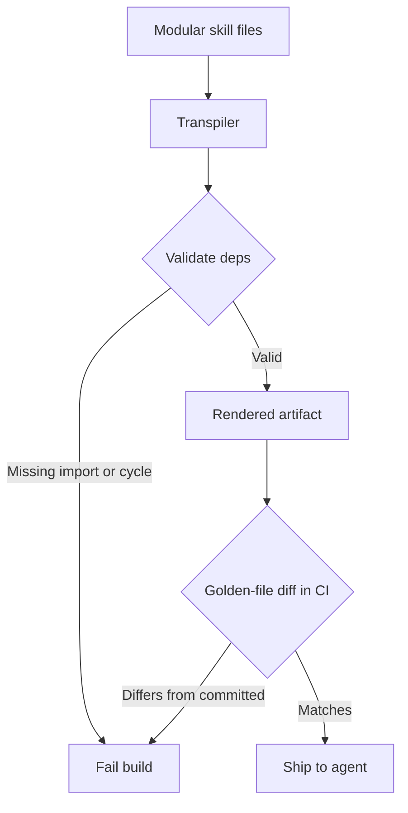

# Prompt Transpilation: Instructions as Build Artifacts

> Prompt transpilation compiles modular skill files into one validated prompt at build time, so a broken instruction set fails the build, not an agent run.

Prompt transpilation treats agent instructions as build artifacts rather than hand-edited text. You author instructions as small, reusable skill files, run them through a transpiler that resolves imports and variables and statically validates them, and wire that generation into CI so an invalid instruction set fails the build ([Google Developers, 2026](https://developers.googleblog.com/en/building-scalable-ai-agents-with-modular-prompt-transpilation/)). The model never sees the source files. It sees one deterministic, fully rendered artifact you can test, audit, and diff first.

## When it pays off

The payoff is scale-gated. A single monolithic prompt is usually fine when you are first building an agent, and the transpiler machinery is pure overhead until real pressure appears ([Google Developers, 2026](https://developers.googleblog.com/en/building-scalable-ai-agents-with-modular-prompt-transpilation/)). Reach for transpilation when these conditions hold:

- Many agents or teams share the same logic, so safety policies, PII handling, or escalation rules get copy-pasted and drift out of sync ([Google Developers, 2026](https://developers.googleblog.com/en/building-scalable-ai-agents-with-modular-prompt-transpilation/)).
- The instruction set is large enough that a one-sentence diff has an unpredictable blast radius across the whole agent.
- The agent runs in production, where a missing variable or bad import surfacing at runtime in a rarely-used workflow is a reliability incident.

Below that scale, a single well-organized instruction file reviewed through ordinary pull requests already delivers the same auditability without a build step. Thoughtworks reaches the same governance goal by treating prompts as versioned, reviewed artifacts kept in sync with code, with no transpiler required ([Thoughtworks, 2026](https://martinfowler.com/articles/structured-prompt-driven/)).

## How it works

Source template files compose shared fragments and inject environment values. The transpiler resolves every include as a dependency and every variable as a requirement, then emits one rendered file for the model ([Google Developers, 2026](https://developers.googleblog.com/en/building-scalable-ai-agents-with-modular-prompt-transpilation/)).

Build-time validation is the point. The transpiler models each fragment as a node in a dependency graph and fails the build on missing imports, undefined variables, or circular dependencies, catching them before runtime ([Google Developers, 2026](https://developers.googleblog.com/en/building-scalable-ai-agents-with-modular-prompt-transpilation/)). A golden-file check closes the last gap: CI regenerates the artifact from source and compares it to the committed one, and a mismatch fails the build, so the repo artifact is provably what runs in production ([Google Developers, 2026](https://developers.googleblog.com/en/building-scalable-ai-agents-with-modular-prompt-transpilation/)).



Once the system is modular, an agent can help maintain its own instruction layer. It drafts a new skill module and opens a pull request rather than mutating its instructions live, and that proposal passes the same validation, evals, and human review as any code change ([Google Developers, 2026](https://developers.googleblog.com/en/building-scalable-ai-agents-with-modular-prompt-transpilation/)).

## Example

A template composes shared fragments, then branches on an environment variable:

```jinja



You are an SRE triage agent operating in the {{ environment }} environment.


You may recommend remediation steps, but destructive actions require human approval.

You may inspect, summarize, and explain the issue, but do not recommend remediation actions.

```

With `environment = production` and `allow_remediation = true`, the transpiler renders a flat artifact with the includes resolved and the branch collapsed ([Google Developers, 2026](https://developers.googleblog.com/en/building-scalable-ai-agents-with-modular-prompt-transpilation/)):

```text
You are an SRE triage agent operating in the production environment.

You may recommend remediation steps, but destructive actions require human approval.
```

The reviewer diffs the rendered artifact, not the templating logic, so what they approve is exactly what the model receives.

## Why it works

The technique borrows three settled software-engineering mechanisms. Module boundaries bound the blast radius of a change, so a reviewer reasons about scope the way they do with code modules ([Google Developers, 2026](https://developers.googleblog.com/en/building-scalable-ai-agents-with-modular-prompt-transpilation/)). Static validation over a dependency graph shifts error detection left: a missing import or circular reference is caught at build time instead of failing silently in production ([Google Developers, 2026](https://developers.googleblog.com/en/building-scalable-ai-agents-with-modular-prompt-transpilation/)). A deterministic build plus a golden-file diff removes the gap between source and deployed artifact, so the thing that was reviewed is the thing that runs ([Google Developers, 2026](https://developers.googleblog.com/en/building-scalable-ai-agents-with-modular-prompt-transpilation/)). Thoughtworks reports the same drift-prevention effect from treating prompts as synced, versioned artifacts ([Thoughtworks, 2026](https://martinfowler.com/articles/structured-prompt-driven/)).

## When this backfires

The build pipeline is not free, and it does not guarantee what teams often assume it does:

- Small teams pay pure overhead. With one agent and a short, stable prompt there is no drift or duplication to solve, and a transpiler, template engine, and golden-file gate add a new class of build failures for no benefit ([Scott Logic, 2026](https://blog.scottlogic.com/2026/06/16/ponytail-yagni-and-the-problem-with-prompt-benchmarks.html)).
- A green build is not correct behavior. Static validation proves the artifact is well-formed, but prompt behavior is non-deterministic, so a passing transpile does not catch a semantic regression in what the agent actually does ([Scott Logic, 2026](https://blog.scottlogic.com/2026/06/16/ponytail-yagni-and-the-problem-with-prompt-benchmarks.html)). Pair the build gate with behavioral evals.
- Fast iteration stalls. Every change routes through the same validation and review gate as code ([Google Developers, 2026](https://developers.googleblog.com/en/building-scalable-ai-agents-with-modular-prompt-transpilation/)), which swamps eval-driven tuning that tries many variants per session. Prototype in a sandbox and promote the winner into the transpiled source.
- Over-fragmentation obscures the whole. Splitting into many tiny modules adds its own coherence cost and can hide the full rendered prompt a reviewer needs to read. Loading every skill on every run also wastes tokens, which is why the base prompt should stay stable and task-specific skills load on demand through [progressive disclosure](../patterns/agent-design/progressive-disclosure-agents.md) ([Google Developers, 2026](https://developers.googleblog.com/en/building-scalable-ai-agents-with-modular-prompt-transpilation/)).

## Key Takeaways

- Prompt transpilation compiles modular skill files into one validated, deterministic artifact so instruction failures surface at build time, not at agent runtime.
- The build catches missing imports, undefined variables, and circular dependencies over a fragment dependency graph; a golden-file CI diff proves the committed artifact equals what runs.
- It differs from Claude's runtime `@import` expansion, which composes at session start with no build step or static validation, and from prompt-search optimization, which tunes wording rather than gating a build.
- The payoff is scale-gated: worthwhile for large, shared, production instruction sets, and overhead for a single small prompt.
- A passing build proves the prompt is well-formed, not that the agent behaves; pair transpilation with behavioral evals.

## Related

- [@import Composition Pattern for Instruction Files](import-composition-pattern.md)
- [Prompt File Libraries](prompt-file-libraries.md)
- [Prompt Governance via PR](prompt-governance-via-pr.md)
- [The Specification as Prompt](specification-as-prompt.md)
- [Prompt Debt: Hand-Tuning Natural-Language Prompts as Technical Debt](../patterns/anti-patterns/prompt-debt.md)
- [Progressive Disclosure for Agents](../patterns/agent-design/progressive-disclosure-agents.md)
- [DSPy: Programmatic Prompt Optimization](../patterns/agent-design/dspy-programmatic-prompt-optimization.md)

## Sources

- [Building scalable AI agents with modular prompt transpilation](https://developers.googleblog.com/en/building-scalable-ai-agents-with-modular-prompt-transpilation/) — Google Developers blog (2026-07-16); primary source for the transpile, validate, and golden-file pipeline.
- [Structured-Prompt-Driven Development (SPDD)](https://martinfowler.com/articles/structured-prompt-driven/) — Thoughtworks / martinfowler.com (2026-04-28); independent case for prompts as governed, versioned, synced artifacts.
- [Ponytail? YAGNI!](https://blog.scottlogic.com/2026/06/16/ponytail-yagni-and-the-problem-with-prompt-benchmarks.html) — Scott Logic (2026-06-16); caution on overengineering prompt tooling and the non-determinism ceiling on structural validation.
