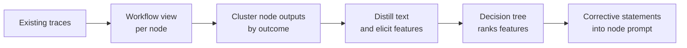

# Repairing Agent Prompts from Trace Contrast, Not Search

> When a rollout costs dollars, ranking candidate prompts is the expensive half, so repair the prompt from traces you already paid for.

Semantic Feature Analysis repairs an ambiguous system prompt by reading traces the agent has already produced. It never generates a candidate prompt and never runs the agent to score one. It clusters each workflow node's outputs by outcome, finds the semantic features that separate the passing cluster from the failing one, and writes those back into that node's prompt as corrective statements ([arXiv:2604.10513v2](https://arxiv.org/abs/2604.10513v2)).

## When this applies

Rollouts have to be expensive relative to analysis. On the cheap benchmarks in the study a rollout cost about $0.009. For a tool-using research agent with live web search it cost $0.22 on average. As the authors put it, "when rollouts are cheap, search is viable and the difference narrows" ([arXiv:2604.10513v2](https://arxiv.org/abs/2604.10513v2)).

The same task has to have been run more than once, because the signal is the contrast between runs that diverged on identical input. At one repetition per training task there is no same-task pass or fail contrast at all. The study reports that arms which do not need that contrast beat this method at that tier ([arXiv:2604.10513v2](https://arxiv.org/abs/2604.10513v2)).

An outcome label has to exist, or be cheap to invent once. Where the agent already emits a success signal, such as a benchmark metric or a production success event, the pipeline consumes it. Where none exists, it clusters the behaviors the agent shows on one repeated task, asks a judge once which cluster is wanted, and labels every run in that cluster the same way ([arXiv:2604.10513v2](https://arxiv.org/abs/2604.10513v2)).

## How the pipeline works

Node identity comes from grouping spans that share a system-prompt identity. A model distills each logged entry to clean natural language. A subject-verb-object schema, extended with discourse units for causes, conditions and results, then decomposes it into features. Each run becomes a row in a binary feature matrix carrying its outcome cluster as the label, and a CART tree ranks feature values by impurity reduction. A model then receives the node's current prompt, the ranked features and the tree rules, and writes the corrective statements ([arXiv:2604.10513v2](https://arxiv.org/abs/2604.10513v2)).

## Why it works

The method reads ambiguity as evidence, not only as a defect. The paper's claim is that "the same ambiguity that causes divergent trajectories also encodes, in the semantic differences between those trajectories, a precise account of what the prompt failed to say" ([arXiv:2604.10513v2](https://arxiv.org/abs/2604.10513v2)). Feature decomposition turns those differences into comparable columns that the tree can rank.

The cost argument is structural. Search pays for the agent twice, once to generate a candidate and once to score it. The second cost resists reduction, because a cheaper selector picks worse candidates. A pipeline with no selection loop "has no loop in which noise can accumulate", so its margin is widest where a budget-constrained optimizer cannot buy enough rollouts to tell a good candidate from a noisy one. At a $6.98 budget on the expensive benchmark, five of seven arms returned their seed unchanged while this method reached 0.752 against a base of 0.700 ([arXiv:2604.10513v2](https://arxiv.org/abs/2604.10513v2)).

## When this backfires

- The metric is not governed by the instruction. On the retrieval-scored benchmark MIPROv2 led at every budget, 0.5933 against 0.5233 at the top tier, because "instructions change what the agent does with retrieved evidence, not which documents come back" ([arXiv:2604.10513v2](https://arxiv.org/abs/2604.10513v2)).
- The defect is a number. The pipeline treats instructions as text, cannot represent thresholds, counts or weights as features, and so cannot repair numeric under-specification ([arXiv:2604.10513v2](https://arxiv.org/abs/2604.10513v2)).
- Rules accumulate unchecked. Statements are appended with no length budget and no conflict check, and one rule-set version in the study had one node's rule contradicting another's. Neither effect was measured ([arXiv:2604.10513v2](https://arxiv.org/abs/2604.10513v2)).
- The fault is upstream. The pipeline scans nodes without reachability or causal awareness, so it can write rules for a node that is a consequence of an earlier fault ([arXiv:2604.10513v2](https://arxiv.org/abs/2604.10513v2)).
- Traces are assumed to carry the fix. In automatic program repair, putting execution traces into the prompt beat the trace-free baseline in only 2 of 6 dataset and model configurations, and helped less as the traces grew more complex ([arXiv:2505.04441v1](https://arxiv.org/abs/2505.04441v1)).

Read the aggregate as parity. Against MIPROv2 and BootstrapRS the effect was positive but not statistically separable from zero, and the paper says outright that its method "does not score highest in every cell". An ANOVA over 21,455 outcomes found the method-by-benchmark interaction exceeded the method main effect: "which optimizer wins depends on the benchmark, not on any property of the optimizer alone" ([arXiv:2604.10513v2](https://arxiv.org/abs/2604.10513v2)). Search-based reflection is also cheaper than the framing suggests: GEPA reports using up to 35 times fewer rollouts than its reinforcement-learning baseline, GRPO ([arXiv:2507.19457v2](https://arxiv.org/abs/2507.19457v2)).

## Example

Three budget points on the expensive-rollout benchmark show where the advantage sits and where it stops ([arXiv:2604.10513v2](https://arxiv.org/abs/2604.10513v2)):

| Budget | Result | What the baselines did |
|---|---|---|
| $6.98 | 0.752 against a base of 0.700 | Five of seven arms returned their seed unchanged |
| $53.67 | 0.790 | GEPA produced format rules only; the 5.2pp gap came from tool-usage workarounds |
| $96.60 | 0.771 | The drop back suggests saturation |

That evaluation ran 42 tasks with 5 repetitions each. The aggregate lead over the unmodified agent was 9.1 percentage points at p<.01, but at that task count no individual baseline contrast survived multiple-comparison correction ([arXiv:2604.10513v2](https://arxiv.org/abs/2604.10513v2)), so read the pattern rather than any single pairwise win.

## Key Takeaways

- Price a rollout before choosing an optimizer. The decision is set by the ratio between one agent execution and one analysis pass, not by which method reads better on paper.
- Log repetitions of the same task deliberately. A trace store with one run per input carries no contrast, and no amount of analysis recovers it afterwards.
- Budget for a rule-set lint you will have to write yourself. Length caps and cross-node conflict checks are named as missing, so the accumulation problem lands on the operator.
- Re-derivation stability is unmeasured. Re-evaluating a fixed rule set gave a band of about 2 percentage points, but no analysis was re-run on a resampled corpus ([arXiv:2604.10513v2](https://arxiv.org/abs/2604.10513v2)), so treat a derived rule set as one draw.

## Related

- [Reflective Prompt Evolution with Pareto Selection (GEPA)](../patterns/agent-design/gepa-reflective-prompt-evolution.md) — the search-based comparator this method is budget-matched against
- [DSPy: Programmatic Prompt Optimization](../patterns/agent-design/dspy-programmatic-prompt-optimization.md) — the optimizer family, MIPROv2 included, that scores candidates by running the agent
- [Trajectory Attribution for Context Repair (TRACE)](../context-engineering/trajectory-attribution-context-repair.md) — attributes one failed session to the context file behind it, rather than reading the contrast across many runs
- [Probe-and-Refine Tuning of Repository Guidance](probe-and-refine-guidance-tuning.md) — refines guidance by running the agent on probe tasks, the loop this method drops
- [Traces Need Feedback to Power Learning](../observability/traces-need-feedback-to-power-learning.md) — the outcome labels this pipeline consumes have to be attached somewhere first
