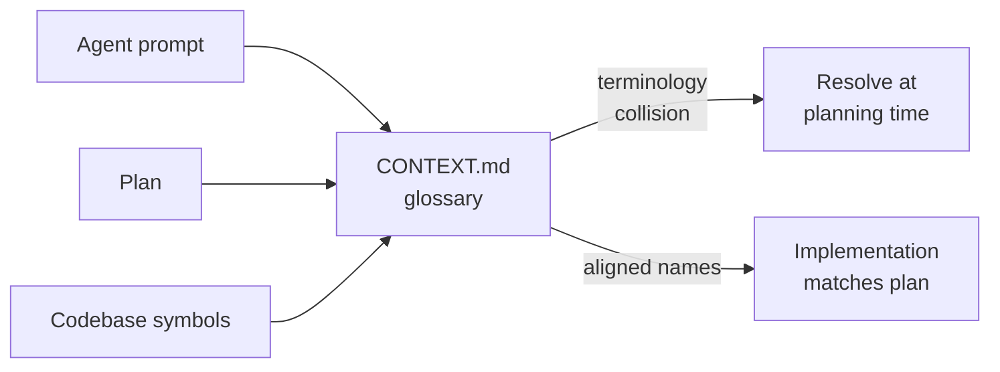

# Ubiquitous Language for AI Plans

> A maintained domain glossary plus a small ADR set anchors agent plans to the codebase's vocabulary, surfacing terminology collisions at planning time, not in implementation.

## The Problem

When an agent plans a feature, it invents names. "Account" becomes `User` in one file and `Customer` in another. "Cancellation" means a refund in the plan and a status flag in the schema. The plan is coherent, the code compiles, and the names diverge — every new session re-litigates terminology because nothing in the prompt anchors meaning to existing modules.

This is the failure Eric Evans named with **ubiquitous language**: a common, rigorous language "based on the Domain Model used in the software — hence the need for it to be rigorous, since software doesn't cope well with ambiguity" ([Fowler, _Ubiquitous Language_](https://martinfowler.com/bliki/UbiquitousLanguage.html)). Applied to agentic coding, the agent becomes the third party: plan, source tree, and prompt all draw from one glossary.

## The Artifact Contract

Matt Pocock's `/grill-with-docs` and `/domain-model` skills (April 2026) operationalise this with three files ([Pocock, /grill-with-docs](https://www.aihero.dev/grill-with-docs); [SKILL.md](https://github.com/mattpocock/skills/tree/main/skills/engineering/grill-with-docs)):

| Artifact | Role |
|----------|------|
| `CONTEXT.md` | The bounded-context glossary — every domain term and what it means in this codebase today |
| `CONTEXT-MAP.md` | Multi-context index — present only when one repo holds multiple bounded contexts (e.g., `ordering/` and `billing/` each with their own `CONTEXT.md`) |
| `docs/adr/` | Architectural Decision Records for the small set of decisions that earn one |

The skill files are created **lazily**: no `CONTEXT.md` until the first term is resolved; no `docs/adr/` until the first ADR is needed ([SKILL.md](https://github.com/mattpocock/skills/tree/main/skills/engineering/grill-with-docs)). A glossary that exists before the language exists is fiction.



## The ADR Test

ADRs accumulate into noise unless they are gated. The skill's three-condition test ([SKILL.md](https://github.com/mattpocock/skills/tree/main/skills/engineering/grill-with-docs)):

1. **Hard to reverse** — changing your mind later costs real work
2. **Surprising without context** — a future reader will ask "why this way?"
3. **Result of a real trade-off** — there were genuine alternatives

If any condition is missing, no ADR. The point is that the agent reads ADRs in its planning context and stops re-suggesting the option you already rejected — for example, the agent that proposed `ON DELETE CASCADE` last session does not propose it again next session because the ADR records why `ON DELETE RESTRICT` won ([Pocock, /grill-with-docs](https://www.aihero.dev/grill-with-docs)).

## Mechanism

The win has two legs.

**The rigour leg** comes from Evans: when domain prose, plans, and code share names, terminology collisions surface as conflicts during planning rather than as bugs during implementation. Pocock's worked example: a plan introduces "pitches" attached to standalone videos; the existing glossary defines "Standalone Video" as `lessonId IS NULL`; the agent surfaces the conflict and forces a precise resolution ("Pitched Standalone Video" vs "Unattached Standalone Video") before any code is written ([Pocock, /grill-with-docs](https://www.aihero.dev/grill-with-docs)).

**The token-economics leg** is Pocock's: with shared language, "the AI uses fewer tokens. Instead of verbosely re-describing everything, it says: 'Standalone videos are changing, we need to make a change to the pitches and how the pitches display.'" Chain-of-thought reasoning becomes more efficient because the agent reasons in canonical names.

## When It Backfires

The pattern is not free. Recent empirical work on AGENTS.md-style context files found LLM-generated context files reduce success rate ~3% on the AGENTbench suite of 138 niche-repo Python tasks, and human-written files produce only +4% success at a parallel +19% inference cost ([Gloaguen et al., InfoQ summary](https://www.infoq.com/news/2026/03/agents-context-file-value-review/) — covered in detail at [Evaluating AGENTS.md](evaluating-agents-md-context-files.md)). Trace analysis showed agents follow context-file instructions even when those instructions add work without raising patch quality.

That study is on undifferentiated context content, not specifically glossary-with-ADR files, but the lesson generalises: a thicker context file is not free. The pattern earns its keep under specific conditions:

- The codebase has non-trivial domain terminology that is not already encoded structurally (TypeScript / Rust types or exhaustive enums often make a separate prose glossary redundant).
- Multiple bounded contexts exist or are imminent — the `CONTEXT-MAP.md` layer exists exactly for this case ([Pocock, skills changelog](https://www.aihero.dev/skills-changelog-ubiquitous-language-grill-with-docs)).
- Names appear in load-bearing places that a type system does not reach: SQL columns, domain events, prose specs, ticket titles.

It backfires when the codebase is greenfield, refactors weekly (the glossary rots faster than maintainers update it), or already encodes terminology densely in the type system. Agents follow stale glossary entries even after symbols move — the same "follows instructions even when wrong" behaviour Gloaguen et al. observed.

## Example

A team adds the `domain-model` skill (or its equivalent `/grill-with-docs`) to a Claude Code project. The agent reads `CONTEXT.md`, sees the existing definition of `Standalone Video`, and challenges the plan's use of "pitched standalone video" before any code is generated:

```text
Your CONTEXT.md defines:
  Standalone Video: video with lessonId = NULL

Your plan introduces "pitches" attached to standalone videos.
Resolution required:
  (a) Sub-term: Pitched Standalone Video / Unattached Standalone Video
  (b) New top-level: Pitched Video as sibling of Standalone Video
```

Once resolved, the skill updates `CONTEXT.md` inline with the new sub-terms and the deletion-behaviour decision (`ON DELETE RESTRICT`) gets an ADR because it is hard to reverse, surprising, and the result of a real trade-off ([Pocock, /grill-with-docs](https://www.aihero.dev/grill-with-docs)).

## Key Takeaways

- A maintained domain glossary plus a small ADR set is the artifact that anchors agent plans to existing code; the agent prompt, plan, and source tree all draw from it.
- Create files lazily — no `CONTEXT.md` until the first term resolves, no ADR unless all three conditions (hard to reverse, surprising without context, real trade-off) hold.
- Cite the Gloaguen et al. evidence honestly: thicker context files have measured costs. The glossary-plus-ADR variant earns its keep when domain language is non-trivial and not already encoded by types.
- Mechanism is the rigour Evans cited plus the token-economics Pocock observed — terminology collisions surface at planning time instead of at implementation time.

## Related

- [Evaluating AGENTS.md: When Context Files Hurt More Than Help](evaluating-agents-md-context-files.md)
- [Three Knowledge Tiers: Sourced, Unverified, Hallucinated](three-knowledge-tiers.md)
- [The Specification as Prompt](specification-as-prompt.md)
- [Emergent Architecture in AI-Driven Codebases](../agent-design/agent-driven-codebase-fingerprint.md)
