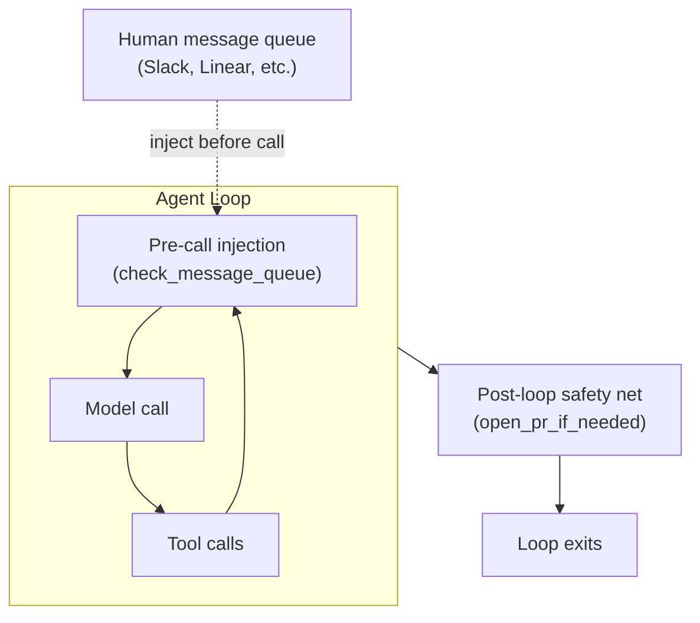

# Agent Loop Middleware

> Wrap the agent loop from the outside: middleware nodes guarantee critical steps run regardless of agent behavior and inject queued input before each model call.

## The problem

Agents are probabilistic. The model may skip a critical step — committing changes, opening a PR, logging state — depending on context, token pressure, or model attention. Prompt instructions reduce the failure rate. They do not remove it.

Middleware wraps the [agent turn model](../patterns/agent-design/agent-turn-model.md) to remove the dependence on agent compliance. Either the agent does the critical step or the middleware does, and the outcome is the same. This differs from the per-tool-call enforcement that [hooks rather than prompts](../instructions/hooks-vs-prompts.md) handle, and the CI checks that [deterministic guardrails](../verification/deterministic-guardrails.md) run. Those act within the loop or after it. Middleware acts at loop boundaries. For the placement inside the loop, where the model has proposed a tool call and the runtime has not yet dispatched it, see [in-loop interception](in-loop-interception.md).

## Two middleware patterns



### Post-loop safety nets

A post-loop safety net runs after the agent loop ends. If the agent did the step, the safety net does nothing. Otherwise it does the step deterministically.

The clearest example comes from [Open SWE](https://github.com/langchain-ai/open-swe) — LangChain's open-source coding agent modeled on internal agents built independently by Stripe, Ramp, and Coinbase. Open SWE keeps a narrow toolset of about 15 curated tools per agent, versus roughly 500 in Stripe's internal Toolshed ([Source: Open SWE README](https://github.com/langchain-ai/open-swe)). Stripe's ["Minions" engineering post](https://stripe.dev/blog/minions-stripes-one-shot-end-to-end-coding-agents-part-2) describes the same blueprint architecture, sequencing deterministic nodes around agentic loops. More than 1,300 Stripe pull requests a week are now fully minion-produced, up from 1,000 a week when the architecture launched ([Source: Stripe Minions engineering blog](https://stripe.dev/blog/minions-stripes-one-shot-end-to-end-coding-agents-part-2)) — evidence the safety-net pattern holds at production scale:

```python
# open_pr_if_needed — runs after the agent loop exits
def open_pr_if_needed(state: AgentState) -> AgentState:
    if not state.pr_opened:
        # Agent didn't open a PR — do it deterministically
        create_pr(state.branch, state.title, state.body)
    return state
```

Common safety-net targets:

| Critical step | Why the agent may skip it |
|--------------|--------------------------|
| Open a PR | Agent thinks task is done; PR is implicit |
| Commit changes | Agent ran out of steps before cleanup |
| Write to a log / update a ticket | Side effect, not rewarded by task completion |
| Persist session state | Only matters for the next session |
| Apply cost cap / abort over-budget | Token and tool-call budgets are easy to ignore mid-loop; the safety net halts deterministically. See [Per-Call Budget Hints for Tool Calls](../patterns/agent-design/per-call-budget-hints-tool-calls.md) and [Dual-Budget Control](../patterns/agent-design/dual-budget-control-search-agents.md). |

### Pre-call message injection

A pre-call injection node runs before each model call. It inserts queued messages — human feedback, follow-up instructions, external events — without restarting the loop.

The Open SWE equivalent:

```python
# check_message_queue_before_model — runs before each model call
def check_message_queue_before_model(state: AgentState) -> AgentState:
    messages = poll_message_queue()  # Slack, Linear, etc.
    if messages:
        state.conversation.extend(as_user_messages(messages))
    return state
```

## Relationship to Claude Code hooks

Claude Code's [hook system](../tools/claude/hooks-lifecycle.md) provides the equivalent of both patterns:

| Middleware pattern | Claude Code equivalent |
|-------------------|----------------------|
| Post-loop safety net | `Stop` hook (fires when agent finishes responding; can force continuation); `SessionEnd` hook (fires on session termination) |
| Pre-call injection | `UserPromptSubmit` hook or context prepended before the next invocation |

A `Stop` hook fires when the agent would otherwise stop:

```json
{
  "hooks": {
    "Stop": [
      {
        "hooks": [
          {
            "type": "command",
            "command": "bash .claude/hooks/post-loop-safety-net.sh"
          }
        ]
      }
    ]
  }
}
```

## Complementary, not redundant

| Layer | Mechanism | Scope |
|-------|-----------|-------|
| Prompt | Instruction in system prompt | Requests compliance — probabilistic |
| Per-call hook | `PreToolUse` / `PostToolUse` | Enforces per-tool-call rules |
| CI guardrail | Linter, test suite, schema check | Validates output properties |
| Loop middleware | Safety-net + injection nodes | Guarantees loop-level outcomes |

## When to use this pattern

Apply post-loop safety nets when:

- A step is non-negotiable but the agent treats it as optional (PR creation, state persistence)
- The loop may end early from errors or resource limits
- The correct outcome is verifiable and automatable independently of the agent

Apply pre-call message injection when:

- Humans send feedback or follow-up instructions asynchronously (Slack, Linear, GitHub comments)
- Multiple queued messages should be batched into a single model call
- The loop should continue without restarting after human input

## Example

A LangGraph-style agent with both middleware patterns wired around the loop:

```python
from langgraph.graph import StateGraph, END

def agent_node(state):
    """Core agent: model call + tool execution."""
    response = call_model(state.messages)
    state.messages.append(response)
    if response.tool_calls:
        results = execute_tools(response.tool_calls)
        state.messages.extend(results)
    return state

def pre_call_inject(state):
    """Pre-call middleware: drain the message queue."""
    queued = poll_queue(state.queue_url)
    if queued:
        state.messages.extend(as_user_messages(queued))
    return state

def post_loop_commit(state):
    """Post-loop middleware: commit if the agent forgot."""
    if state.files_changed and not state.committed:
        run(["git", "add", "-A"])
        run(["git", "commit", "-m", state.task_summary])
        state.committed = True
    return state

graph = StateGraph(AgentState)
graph.add_node("inject", pre_call_inject)
graph.add_node("agent", agent_node)
graph.add_node("commit", post_loop_commit)

graph.set_entry_point("inject")
graph.add_edge("inject", "agent")
graph.add_conditional_edges("agent", should_continue,
    {"continue": "inject", "done": "commit"})
graph.add_edge("commit", END)
```

The `inject` node drains external messages before every model call. The `commit` node commits changes even if the agent forgot.

## When this backfires

Post-loop safety nets rely on idempotency. If a net fires when the agent already did the step, the result must be identical, not doubled. Three conditions produce failures:

- Non-idempotent critical steps. `open_pr_if_needed` is safe only when the `state.pr_opened` flag is set reliably. If the agent opens a PR but fails to persist the flag, the net opens a second PR. Design safety nets around verifiable state, not assumed state.
- A safety net that masks systematic compliance failures. If the agent never opens PRs and the net fires every run, the pattern hides a prompt or tool-call problem you should fix at the source. Monitor the net fire-rate the way you track [loop detection](../observability/loop-detection.md) signals. A rate that climbs over time points to an upstream issue worth fixing rather than masking.
- Message queue injection in high-latency channels. Pre-call injection polls an external queue synchronously before each model call. If the queue endpoint has variable latency, injection adds overhead on each iteration. Rate-limit the poll or use a local buffer when the queue source is unreliable.

## Key Takeaways

- Treat the agent loop as a unit to wrap from the outside — middleware nodes guarantee critical steps regardless of model compliance.
- Post-loop safety nets perform skipped critical steps deterministically; pre-call injection nodes drain external message queues before each model invocation.
- Safety nets require [idempotent operations](../patterns/agent-design/idempotent-agent-operations.md) and verifiable state — if a flag can be wrong, the net can fire twice.
- Monitor net fire-rate; a rate that stays high or climbs hides an upstream prompt or tooling problem that should be fixed at the source.
- Claude Code's `Stop` and `UserPromptSubmit` hooks provide host-side equivalents of the same two patterns.

## Related

- [Harness Engineering](../training/copilot/harness-engineering.md) — environment-level design that constrains what agents can do
- [Hooks for Enforcement vs Prompts for Guidance](../instructions/hooks-vs-prompts.md) — per-tool-call enforcement inside Claude Code
- [PostToolUse Hooks: Auto-Formatting on Every File Edit](../tools/claude/posttooluse-auto-formatting.md) — automatic formatting via PostToolUse hooks
- [Deterministic Guardrails](../verification/deterministic-guardrails.md) — CI and commit-level output checks
- [Pre-Completion Checklists](../verification/pre-completion-checklists.md) — verification gates before task completion
- [Steering Running Agents](../patterns/agent-design/steering-running-agents.md) — human intervention patterns during agent execution
- [Agent Turn Model](../patterns/agent-design/agent-turn-model.md) — the inference-tool-call loop that middleware intercepts at each iteration
- [Idempotent Agent Operations](../patterns/agent-design/idempotent-agent-operations.md) — designing operations for safe retry, relevant when safety nets re-run critical steps
