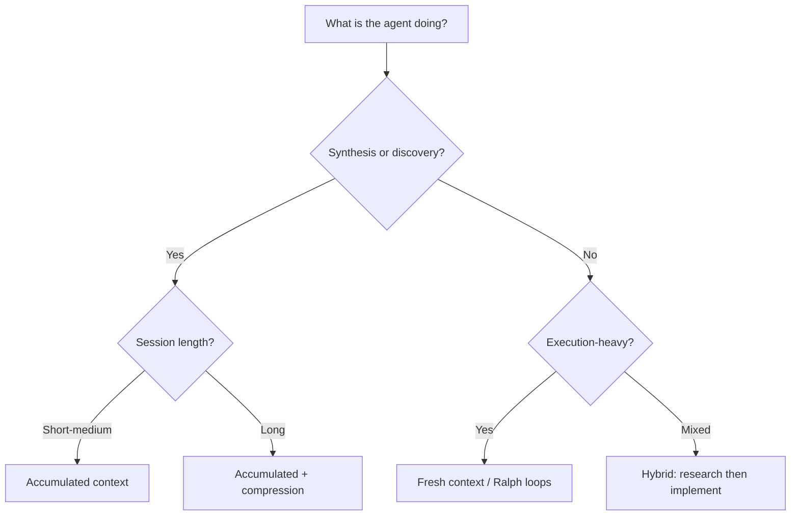
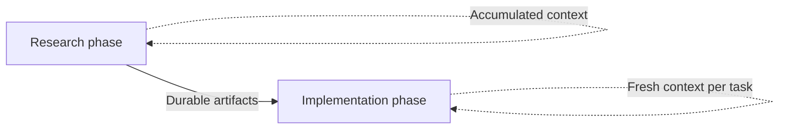

# Loop Strategy Spectrum: Accumulated vs Fresh Context

> Agent loops manage context three ways: accumulated context suits synthesis, fresh context suits execution, and compression sits between. Choose by workload, not habit.

## The decision

The loop strategy spectrum gives you three ways to choose how context carries between iterations of a long-running agent workflow: accumulated context, within-session compression, or fresh context per iteration. The right choice depends on whether the workload is [synthesis-heavy or execution-heavy](../patterns/agent-design/cognitive-reasoning-execution-separation.md), or mixed.

This choice is itself an emerging named discipline. LangChain calls the deliberate design of an agent's iterate, observe, and act loop "loop engineering" — a distinct engineering practice rather than an incidental implementation detail ([LangChain on the art of loop engineering](https://blog.langchain.com/the-art-of-loop-engineering)). Addy Osmani arrives at the same framing, positioning loop engineering as a core practice for agentic coding ([Addy Osmani on loop engineering](https://addyo.substack.com/p/loop-engineering)). Two sources converging on the same term mark it as a recognized discipline, not one author's coinage.

| Strategy | Context model | Best for | Primary risk |
|----------|--------------|----------|-------------|
| Accumulated context | Single session, growing context | Synthesis, cross-referencing, discovery | Context rot degrades reasoning |
| Within-session compression | Single session with compaction/offloading | Medium-horizon mixed tasks | Lossy compression, objective drift |
| Fresh context (Ralph loops) | Clean slate per iteration, state on disk | Execution-heavy, unattended workflows | Fragmented research coherence |

These are not competing philosophies. They are tools for different workloads, and they compose well in hybrid workflows.

## Accumulated-context loops

The agent stays in a single session and builds on everything it has seen. Each iteration reads prior results and accumulated artifacts without resetting.

Karpathy's [autoresearch](https://github.com/karpathy/autoresearch) is the canonical example. The agent modifies `train.py`, runs a 5-minute experiment, evaluates the result via `val_bpb`, keeps or discards it, and repeats. It reads prior experiment history, Git history of successful commits, and current code to decide what to try next. The autoresearch README targets roughly 12 experiments per hour, enough to run hundreds of iterations over a multi-day session.

Why it works for synthesis: the agent needs to cross-reference findings, spot patterns across experiments, and avoid repeating failed approaches. Accumulated context supports this naturally.

Why it breaks for long runs: [context rot](../context-engineering/context-window-dumb-zone.md). Reasoning quality degrades as the window fills. Anthropic identifies this as a "performance gradient" that appears "across all models." BABILong benchmarks show reasoning tasks retain only [10 to 20% effective context](../context-engineering/context-window-dumb-zone.md) at high fill levels. Karpathy noted this failure mode directly: as sessions lengthened, the agent began producing spurious correlations that needed manual correction.

## Within-session compression

Rather than reset context, compress it. Offload large tool responses to disk, summarize conversation history, and keep the session alive but leaner.

[LangChain's Deep Agents](https://blog.langchain.com/context-management-for-deepagents/) implements three tiers: it offloads responses above 20K tokens, offloads large inputs at 85% capacity, and summarizes history. [Manus](https://manus.im/blog/Context-Engineering-for-AI-Agents-Lessons-from-Building-Manus) takes a different approach. It recites objectives via `todo.md` at the end of context to hold focus, treating the filesystem as "the ultimate context."

This is a middle ground. The session continues without the hard reset of a Ralph loop, but accumulated noise gets pruned. The risk is lossy compression: summaries that drop decision rationale cause [objective drift](../patterns/anti-patterns/objective-drift.md).

For more detail, see [Context Compression Strategies](../context-engineering/context-compression-strategies.md).

## Fresh-context loops (Ralph loops)

Each iteration starts a clean context window, reads persistent state from disk, completes one bounded task, writes results back, and restarts. State lives in files, not in conversation history.

This removes [context rot](../context-engineering/context-window-dumb-zone.md) by design. Failed iterations leave disk state at the last successful write, so the next cycle continues cleanly.

The trade-off is that the agent cannot cross-reference findings from prior iterations except through what it wrote to disk. Research coherence depends entirely on the quality of persisted artifacts.

For the full pattern, see [The Ralph Wiggum Loop](ralph-wiggum-loop.md).

## Choosing a strategy

## Hybrid: research then implement

A hybrid approach combines both strategies across phases, matching each phase to the workload it handles best.

Phase 1, research (accumulated context): the agent explores, investigates, and synthesizes. It writes findings to durable artifacts: markdown documents, specs, and [feature lists](../instructions/feature-list-files.md).

Phase 2, implementation (fresh context): each implementation task starts a clean session, reads the research artifacts, and runs one bounded unit of work.

Anthropic's [multi-agent research system](https://www.anthropic.com/engineering/multi-agent-research-system) implements this at scale. The LeadResearcher agent accumulates context as it plans, and saves that plan to memory so it survives the 200K-token point at which the context window would otherwise be truncated. It spawns fresh subagents with clean contexts for parallel investigation, and they return condensed findings for synthesis. This is accumulated context at the orchestrator level with fresh context at the worker level.

OpenAI's [agent-first codebase approach](https://alexlavaee.me/blog/openai-agent-first-codebase-learnings) uses a similar pipeline: research artifacts feed into specs, specs feed into [feature lists](../instructions/feature-list-files.md), and feature lists feed into bounded implementation sessions. Each phase generates durable artifacts that contextualize later phases.

## Example

A code-quality agent runs nightly over a large repository. It needs to scan files, identify issues, and apply fixes across hundreds of modules.

Research phase (accumulated context): the agent reads existing lint configs, prior issue reports, and a sample of files to learn the codebase's patterns. It produces a prioritized issue list as a [durable artifact](../instructions/feature-list-files.md).

Implementation phase (fresh context per module): each module fix starts a clean session, reads the issue list and the target module, applies fixes, and writes results back to disk. Context rot cannot accumulate because each session is bounded.

If this were a single accumulated-context run, the agent would degrade after dozens of modules — BABILong-style context rot would cause it to miss or duplicate fixes. If it used [Ralph loops](ralph-wiggum-loop.md) for the research phase, it would lose cross-file pattern recognition. The hybrid matches the workload: synthesis needs accumulated context; execution needs fresh context.

## Key Takeaways

- Each strategy has a primary risk: context rot (accumulated), lossy compression (within-session), fragmented coherence (fresh). Choose based on which risk matters least for the workload.
- Hybrid workflows -- [research with accumulated context, then implement with fresh context](../workflows/research-plan-implement.md) -- combine the strengths of both strategies.
- The choice is workload-dependent, not ideological. Match the strategy to the task.

## Related

- [The Ralph Wiggum Loop](ralph-wiggum-loop.md)
- [Context Compression Strategies](../context-engineering/context-compression-strategies.md)
- [Context Window Dumb Zone](../context-engineering/context-window-dumb-zone.md)
- [Objective Drift](../patterns/anti-patterns/objective-drift.md)
- [Agent Self-Review Loop](../code-review/agent-self-review-loop.md)
- [Agent Harness](../patterns/agent-design/agent-harness.md)
- [Orchestrator-Worker Pattern](../patterns/multi-agent/orchestrator-worker.md)
- [Cognitive Reasoning vs Execution: A Two-Layer Agent Architecture](../patterns/agent-design/cognitive-reasoning-execution-separation.md)
