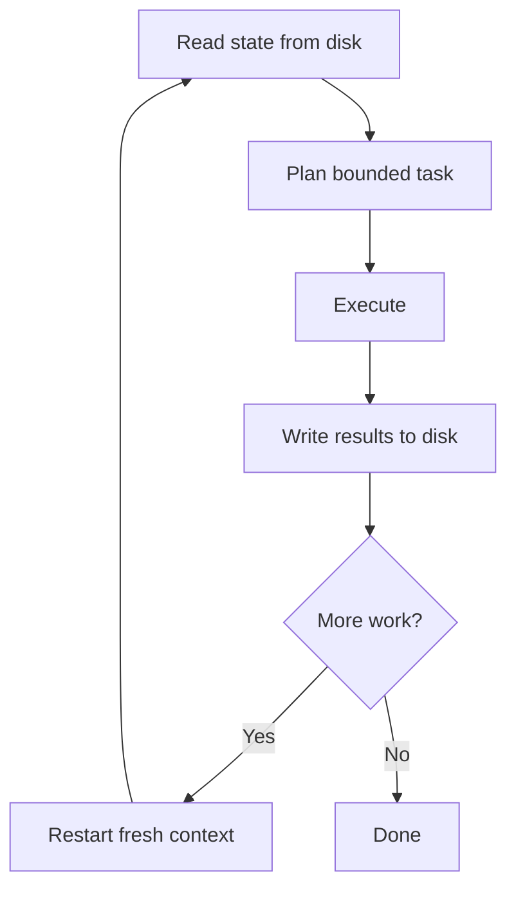

# The Ralph Wiggum Loop: Fresh-Context Iteration Pattern

> The Ralph Wiggum Loop runs each iteration in a fresh context window, persisting state to disk so context never accumulates to the point of degradation.

Related lesson: [Steering Running Agents](https://learn.agentpatterns.ai/harness-engineering/steering-running-agents/) covers this concept in a hands-on lesson with quizzes.

## The pattern

Long agent sessions degrade as context fills. Early instructions get pushed out. The agent starts ignoring conventions it followed hours ago. [Accumulated context](loop-strategy-spectrum.md) is a liability, not a feature.

The Ralph Wiggum Loop solves this by design. Each iteration starts with a clean context window, reads persistent state from disk, completes a bounded unit of work, and writes results back before restarting. State lives in files, not in conversation history.

It works because LLM quality degrades non-linearly past roughly 60–70% context fill — a range practitioners call the ["dumb zone"](../context-engineering/context-window-dumb-zone.md). At that point, compaction starts discarding tokens to make room for new content. If the discarded tokens include original instructions or accumulated conventions, instruction-following gets worse. Restarting with a fresh window prevents compaction entirely, so every iteration runs at full capacity.

Geoff Huntley named and popularized the pattern — see [ghuntley.com/loop](https://ghuntley.com/loop/) and [ghuntley/how-to-ralph-wiggum](https://github.com/ghuntley/how-to-ralph-wiggum). It is now widely used for unattended and long-running agent workflows.

## Cycle structure



Read: the agent reads specs, AGENTS.md, task lists, progress markers, and any other persistent state from the file system at session start.

Plan: the agent picks one bounded unit of work from the state. Bounded means the agent can finish it within a single session without context pressure.

Execute: the agent completes the task using its tools.

Write: the agent writes results — output files, updated task lists, [progress markers](../agent-design/goal-monitoring-progress-tracking.md) — back to disk before the session ends.

Restart: the next iteration opens a fresh context and reads the updated state.

## What counts as persistent state

Any information the agent needs across iterations should live in files:

- Task lists and progress markers (which items are done, which are next)
- Specs and requirements
- AGENTS.md — conventions the agent reads at session start
- Partial outputs when a deliverable spans multiple iterations

## Natural recovery

If an iteration fails, the disk state reflects the last successful write. The next iteration reads that state and continues from there, without inheriting the failed session's context or misconceptions. Recovery is automatic.

## Unattended operation

The pattern enables unattended loops. A script restarts the agent after each iteration, checks CI or test results, and feeds the outcome back into disk state for the next cycle. The human reviews results from time to time rather than supervising continuously.

This pairs well with worktree isolation. Each iteration runs in a sandboxed environment, so failures do not contaminate the working directory.

## Anti-pattern: infinite session

Running one continuous session across many tasks means:

- Context fills over time, weakening instruction adherence
- Early session state colors later decisions
- A failure midway requires recovering from an unknown state
- No natural verification point between tasks

## When this backfires

The pattern assumes you can bound and verify each iteration. Several conditions break that assumption:

- Unbounded tasks: if a single unit of work does not fit in one context window, the loop stalls or produces partial output every cycle. Decompose further before looping.
- No progress signal: without a [reliable completion check](convergence-detection.md) such as a test suite, task-list marker, or CI result, the loop can cycle forever on a task it cannot solve, burning tokens without converging.
- Shared mutable state: if multiple concurrent loop iterations write to the same files, later iterations may overwrite earlier progress. Use per-iteration output paths or explicit locking.
- Context-sensitive tasks: tasks that need [deep continuity](../agent-design/cross-cycle-consensus-relay.md) — extended negotiation, multi-turn clarification, stateful debugging sessions — do not benefit from fresh context. The lost context is load-bearing.

Practitioner reports add three caveats. Architectural coherence suffers — generated code reflects the agent's path to a working state, not an intentional structure ([Wiggum breakdown of the Ralph loop](https://wiggum.app/blog/what-is-the-ralph-loop/)). Cost scales fast: a fifty-iteration loop on a medium codebase typically runs $50 to $100 or more in API credits ([Leanware analysis of Ralph Wiggum coding costs](https://www.leanware.co/insights/ralph-wiggum-ai-coding)). Worst, an agent facing an impossible task can overbake — iterate destructively, chasing a spurious error for hours. So Sondera's ["Supervising Ralph"](https://blog.sondera.ai/p/ralph-wiggum-principal-skinner-agent-reliability) argues every loop needs a supervisor that detects non-convergence and halts. An iteration cap alone is a financial circuit breaker, not a quality gate.

## Example

A bash wrapper script implements the loop externally, restarting the agent after each iteration:

```bash
#!/usr/bin/env bash
# loop-runner.sh - restarts the agent each cycle until the task list is empty

TASK_FILE="tasks.md"
MAX_CYCLES=20
CYCLE=0

while [[ $CYCLE -lt $MAX_CYCLES ]]; do
  remaining=$(grep -c "^- \[ \]" "$TASK_FILE" 2>/dev/null || echo 0)
  if [ "$remaining" -eq 0 ]; then
    echo "All tasks complete."
    exit 0
  fi

  echo "=== Cycle $((CYCLE + 1)) ==="
  claude --no-cache --prompt "Read $TASK_FILE. Complete the next unchecked task. Mark it done. Write all output files. Stop."

  CYCLE=$((CYCLE + 1))
done

echo "Max cycles reached." && exit 1
```

The prompt tells the agent to read state, complete one bounded task, and write results. The `--no-cache` flag forces a genuinely fresh context each cycle. The script exits when the task list is empty.

## Key Takeaways

- Fresh context each iteration prevents the ["dumb zone"](../context-engineering/context-window-dumb-zone.md) that accumulates in long sessions.
- Persistent state belongs on disk, not in conversation history.
- Bounded tasks per iteration ensure each cycle is verifiable and recoverable.
- Failed iterations leave disk state at the last successful write — the next cycle continues cleanly.

## Related

- [AGENTS.md: A README for AI Coding Agents](../standards/agents-md.md) — project instruction file that agents read at session start for conventions and context
- [Session Initialization Ritual](../agent-design/session-initialization-ritual.md) — the disk-state read that opens each fresh-context cycle
- [Worktree Isolation](../workflows/worktree-isolation.md) — sandboxes each iteration so failures don't contaminate the working directory
- [Loop Strategy Spectrum](loop-strategy-spectrum.md) — where fresh-context looping sits among other agent loop strategies
- [Convergence Detection](convergence-detection.md) — the progress signal that stops a loop cycling on an unsolvable task
- [Idempotent Agent Operations](../agent-design/idempotent-agent-operations.md) — design operations for safe retry across iterations
- [Goal Monitoring and Progress Tracking](../agent-design/goal-monitoring-progress-tracking.md) — tracking progress across the multi-session iterations this pattern creates
- [Cross-Cycle Consensus Relay](../agent-design/cross-cycle-consensus-relay.md) — structured relay document that preserves decisions and forward momentum across fresh-context cycles
