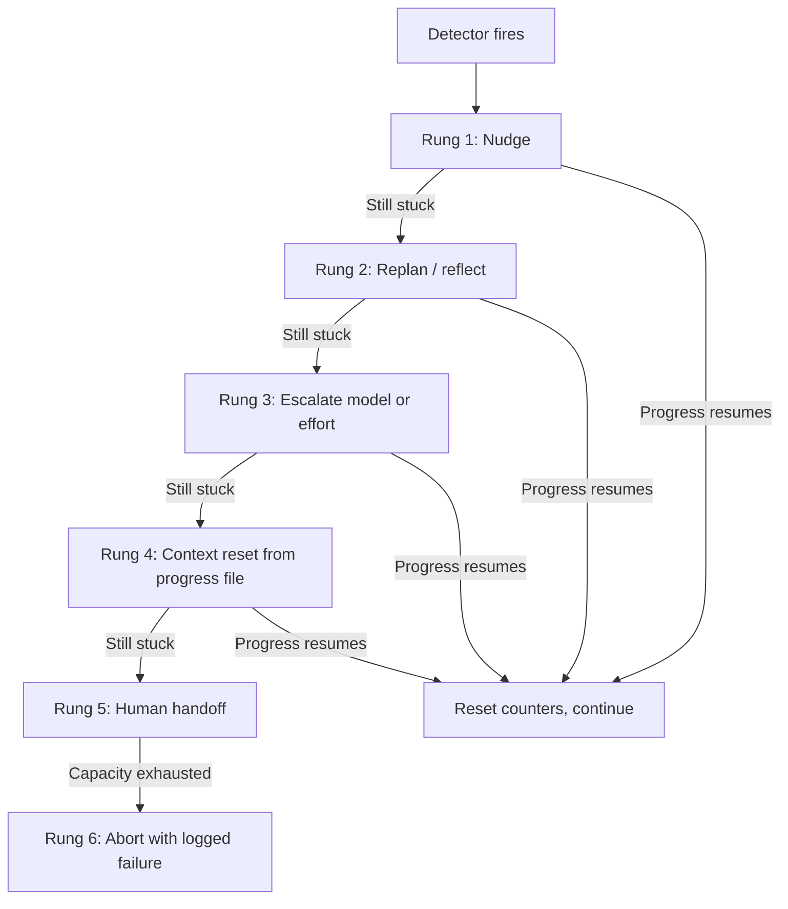

# Stuck-Loop Recovery: Detecting and Escaping Non-Converging Agent Loops

> Once detection fires, climb a bounded recovery ladder — nudge, replan, escalate, reset, hand off — until the stuck agent escapes.

[Loop detection](../observability/loop-detection.md) catches a stuck agent. [Convergence detection](convergence-detection.md) tells a healthy loop when to stop. The gap between them is the recovery playbook: what the harness does once the detector says "stuck." Recovery is a separate discipline from detection because the cheap fix that breaks a repeater fails on a wanderer, and the heaviest move — human handoff — is a poor first choice when a single nudge would have sufficed.

## Stuck vs slow-but-converging

Recovery should not fire on slow legitimate work. The clean separator is a progress metric that can only increase when real work is done — failing tests resolved, unique sources gathered, checklist items completed. Activity proxies like API call counts, file edits, or log volume rise during a stuck loop too, so they cannot distinguish the two ([Cole, 2026](https://dev.to/clawgenesis/how-to-detect-when-your-ai-agent-is-stuck-and-what-to-do-about-it-ce9)).

A loop is stuck when the progress metric is flat across N heartbeats while activity continues. A loop is converging slowly when the metric is rising — even by small increments. Tune N against the workload: a tight refactor on one file looks identical to an edit loop if N is set too low ([LangChain, 2026](https://blog.langchain.com/improving-deep-agents-with-harness-engineering/)).

## The three stuck shapes

Stuck states fall into three shapes, and the right recovery move depends on the shape ([Cole, 2026](https://dev.to/clawgenesis/how-to-detect-when-your-ai-agent-is-stuck-and-what-to-do-about-it-ce9)):

| Shape | Symptom | Recovery move |
|-------|---------|---------------|
| Repeater | Same action, same result, repeated | Inject a nudge naming the failed action; ask the agent to try a different approach |
| Wanderer | Activity continues but nothing connects to the goal | Reassess the goal; ask "what would move the needle?" |
| Looper | Alternates between a small set of actions without resolving | Context reset — wipe the priors that anchor the oscillation |

Wrong-shape recovery makes things worse. Telling a wanderer to "try a different approach" sends it further off-goal; telling a repeater to "reassess the goal" leaves the failed action unchallenged.

## The recovery ladder

Recovery escalates in rungs. Each rung is a strictly larger perturbation of the agent's policy; the cheapest rung that breaks the fixed point is the right one, but you cannot know in advance which rung suffices, so you climb.

1. Nudge. Inject one message naming the observation: "You have edited `{file}` N times without passing tests. Consider whether a different approach is needed." LangChain's `LoopDetectionMiddleware` ships this pattern; they note the model can ignore it but the rung is cheap enough to try first ([LangChain, 2026](https://blog.langchain.com/improving-deep-agents-with-harness-engineering/)).
2. Replan / reflect. Force a structured reasoning step before the next action — restate the goal, list what has been tried, propose a new plan. Heavier than a nudge because it consumes a reasoning turn, but still in-context.
3. Escalate model or effort. Swap to a stronger model or raise the reasoning budget. LangChain's "reasoning sandwich" allocates more compute to verification specifically because stuck-loop recovery benefits from deeper deliberation ([LangChain, 2026](https://blog.langchain.com/improving-deep-agents-with-harness-engineering/)).
4. Context reset from progress file. Discard the current context window and reload from durable state — git logs, progress files, the last green test run. Anthropic's long-running-agent guidance treats this as the canonical reset move: the model uses git to revert bad code changes and recover working states of the codebase ([Anthropic, 2026](https://www.anthropic.com/engineering/effective-harnesses-for-long-running-agents)). Safe only when state has been externalised cleanly.
5. Human handoff. Surface the stuck state, the failed recovery attempts, and the last action to a human. Cole's pattern escalates after three consecutive failed recovery cycles on the same signal ([Cole, 2026](https://dev.to/clawgenesis/how-to-detect-when-your-ai-agent-is-stuck-and-what-to-do-about-it-ce9)).
6. Abort with logged failure. When human capacity is the constraint and the agent cannot proceed, abort the run and log the failure for later triage. Better than queue-starving a fleet.

## Bound the recovery itself

Recovery has the same runaway problem as the original loop. Without a cap, the harness builds a recovery-loop on top of the original loop. Two bounds keep this from happening:

- Per-incident attempt cap. Cole's three-strikes rule: after three consecutive recovery attempts on the same stuck signal, climb to the next rung instead of repeating the current one. After three rungs have failed, escalate to human ([Cole, 2026](https://dev.to/clawgenesis/how-to-detect-when-your-ai-agent-is-stuck-and-what-to-do-about-it-ce9)).
- Iteration-cap backstop. A hard maximum iteration count per conversation catches everything pattern detectors miss. OpenDev pairs doom-loop detection with this iteration cap as defence-in-depth — pattern detectors miss iterations that differ each time but are equally unproductive ([Bui, 2026 §2.2.6](https://arxiv.org/abs/2603.05344)).

## Why it works

A stuck loop is a fixed point in the agent's policy — the same state keeps producing the same action, which produces the same state. Each rung is a strictly larger perturbation of that policy: a nudge changes one token; reflection adds a reasoning step; a model swap changes the policy itself; a context reset wipes the priors; a human handoff replaces the policy entirely. Climbing one rung at a time finds the cheapest perturbation that breaks the fixed point, so recovery does not become more disruptive than the original problem.

The cap exists because no single rung is universal. LangChain note that the model can continue down the same path if it thinks it is correct ([LangChain, 2026](https://blog.langchain.com/improving-deep-agents-with-harness-engineering/)); Boucle measured that only 6 of 12 automated recovery responses reduced their target signal ([Boucle, 2026](https://dev.to/boucle2026/how-to-tell-if-your-ai-agent-is-stuck-with-real-data-from-220-loops-4d4h)). Either rung will sometimes fail; the ladder routes around that.

## When this backfires

- Recovery-on-recovery amplification. A nudge fires; the agent's response triggers the same detector; more nudges fire. Boucle observed one recovery detector that generated 13.3x more signals than it suppressed because it triggered on its own output. The fix in their case was removing the detector entirely ([Boucle, 2026](https://dev.to/boucle2026/how-to-tell-if-your-ai-agent-is-stuck-with-real-data-from-220-loops-4d4h)). Measure each recovery move's hit rate; drop the ones that do not reduce their target signal.
- Premature escalation kills slow but converging work. Detection thresholds that fire after three heartbeats classify legitimate slow refactors as stuck. The detection thresholds and the recovery escalation thresholds need to be tuned against the same workload, not chosen in isolation.
- Context reset wipes load-bearing in-context state. If the agent has built a useful partial plan in the context window that has not been externalised, "reset from progress file" loses the work and the next iteration repeats it. Context reset is only safe when [trajectory logging and progress files](../observability/trajectory-logging-progress-files.md) already capture the state to be reloaded.
- Human-handoff queues starve at fleet scale. Escalating every stuck loop to a human works at low volume; at fleet scale the queue becomes the bottleneck. When human capacity is the binding constraint, auto-abort with a logged failure is the better terminal rung.
- Untested recovery moves. Half of automated recovery responses in Boucle's 220-loop dataset either did nothing or made things worse ([Boucle, 2026](https://dev.to/boucle2026/how-to-tell-if-your-ai-agent-is-stuck-with-real-data-from-220-loops-4d4h)). Treat each new rung as a hypothesis: measure its effect on the target signal before trusting it in production.

## Example

A coding agent has edited `auth_middleware.py` five times in a row with failing tests. The harness's `LoopDetectionMiddleware` fires after the fifth edit.

- Rung 1 (nudge). "You have edited `auth_middleware.py` 5 times without passing tests. The last three failures all named `JWTValidationError`. Consider whether a different approach is needed."
- Agent's next action. It edits `auth_middleware.py` again with a similar patch — repeater shape, no escape.
- Rung 2 (replan). The middleware injects a structured reflection prompt: restate the goal, list what was tried, propose a different file or approach.
- Agent's next action. Reads the test setup file and notices the JWT secret is loaded from an env var that is not set in the test fixture. Edits the fixture instead. Tests pass.

Progress metric (failing-test count) drops from 4 to 0. The recovery counter resets; the run continues without escalation.

## Key Takeaways

- Detection and recovery are separate disciplines; this page owns recovery
- Distinguish stuck from converging-slowly with a progress metric that only rises on real work — activity proxies rise during stuck loops too
- Identify the stuck shape (repeater / wanderer / looper) before choosing a recovery move — wrong-shape recovery makes things worse
- Climb the ladder one rung at a time: nudge, replan, escalate model, context reset, human handoff, abort
- Cap recovery attempts per incident and pair every detector with a hard iteration backstop
- Half of automated recovery moves do not work in the wild — measure each one against its target signal before trusting it

## Sources

- LangChain, [Improving Deep Agents with Harness Engineering](https://blog.langchain.com/improving-deep-agents-with-harness-engineering/) (2026) — `LoopDetectionMiddleware` ships the nudge rung; reasoning sandwich illustrates the model-effort escalation rung
- Cole, [How to Detect When Your AI Agent Is Stuck (And What to Do About It)](https://dev.to/clawgenesis/how-to-detect-when-your-ai-agent-is-stuck-and-what-to-do-about-it-ce9) (2026) — three stuck shapes and shape-keyed recovery; three-strikes escalation cap before human handoff
- Boucle, [How to Tell If Your AI Agent Is Stuck (With Real Data From 220 Loops)](https://dev.to/boucle2026/how-to-tell-if-your-ai-agent-is-stuck-with-real-data-from-220-loops-4d4h) (2026) — measured hit rate of automated recovery responses (6 of 12 effective); 13.3x detector-amplification case
- Bui, [Building AI Coding Agents for the Terminal](https://arxiv.org/abs/2603.05344) §2.2.6 (2026) — doom-loop detection plus iteration cap as defence-in-depth
- Anthropic, [Effective Harnesses for Long-Running Agents](https://www.anthropic.com/engineering/effective-harnesses-for-long-running-agents) (2026) — progress-file and git-revert as the canonical context-reset move

## Related

- [Loop Detection](../observability/loop-detection.md) — the detector this page picks up from
- [Convergence Detection in Iterative Agent Refinement](convergence-detection.md) — the inverse problem: when to stop a healthy loop
- [Agent Loop Middleware](agent-loop-middleware.md) — the middleware layer where recovery rungs are typically wired
- [Failure-Driven Iteration](../workflows/failure-driven-iteration.md) — the productive iteration pattern recovery aims to restore
- [Trajectory Logging and Progress Files](../observability/trajectory-logging-progress-files.md) — the durable state that makes context reset safe
- [Circuit Breakers for Agent Loops](../observability/circuit-breakers.md) — the harder stopping mechanisms that flank recovery
- [Ralph Wiggum Loop](ralph-wiggum-loop.md) — the abort-and-restart pattern recovery can fall back on
- [Unbounded Agent Feedback Paths (Infinite Agentic Loops)](../anti-patterns/unbounded-agent-feedback-paths.md) — the failure taxonomy this recovery playbook picks up from when a feedback path was left unbounded
