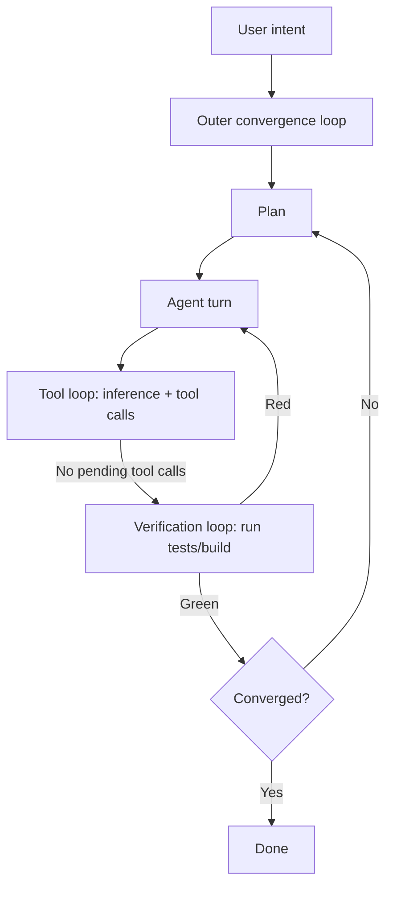

# The Three Loops of Agentic Coding: A Diagnostic Vocabulary

> Name three nested loops in an agent session — tool, verification, convergence — so the symptom you see tells you which intervention applies.

The three loops are a diagnostic mental model, not a new architecture. An agent session looks like one stream of activity until you slice it into three: the inner tool loop (model and tool calls inside a single turn), the verification loop (run tests or build, feed results back, fix), and the outer convergence loop (plan → act → verify repeated across turns until the work converges). Each loop has a different boundary, a different stopping condition, and a different way of failing. So the symptom you see tells you which loop is broken and which fix to reach for.

## When to use this frame

This frame pays off in two conditions:

- The agent has stopped making progress and the cause is not obvious. "It looks stuck" is too vague to act on. Naming the loop where progress stopped narrows the candidate fixes from a dozen to two or three.
- The session has run long enough that multiple loops run at once. A 30-second typo fix has one loop. A multi-turn feature with mid-turn tool calls, test runs, and partial reverts has all three running at once, and which one is failing matters.

Skip the frame for single-shot tasks (one-line config edits, version bumps) where there is one loop. Skip it for exploratory or debugging sessions where the goal is to find out what is wrong. The operator move there is to read more, not to pick a loop.

## The diagnostic table

| Observable symptom | Likely failing loop | Operator intervention |
|---|---|---|
| Same tool call repeating with similar arguments; no progress between turns | Inner tool loop | Inspect tool definitions and permissions; clip the iteration cap; see [Loop Detection](../observability/loop-detection.md) |
| Tests or build keep failing; agent's fix-attempts cycle through the same handful of edits | Verification loop | Improve the error signal: shorter feedback cycle, more specific test, paste full stack trace; see [Failure-Driven Iteration](../workflows/failure-driven-iteration.md) |
| Each turn produces a fresh-looking attempt; diff oscillates, scope drifts, no version is meaningfully closer to done | Outer convergence loop | Stop iterating on the artifact; revisit the plan or scope; see [Convergence Detection](convergence-detection.md) |
| Many tool calls but tests are green and the diff stabilizes | Healthy — converging | None — let it finish |

The signals are distinct in the trace. A spinning inner tool loop shows up as repeated tool calls inside a single agent turn. A failing verification loop shows up as test runs that stay red across turns. A non-converging outer loop shows up as a series of substantially different diffs across turns, none of them reaching a stable state. Modexa's analysis of stuck agent loops — a single turn consuming millions of tokens before hitting a wall — is the textbook inner-loop pathology ([Modexa, 2026](https://medium.com/@Modexa/the-agent-loop-problem-when-smart-wont-stop-ccbf8489180f)).

## What each loop is

### Loop 1: Tool loop (inside a turn)

A user-facing turn is itself a loop. The model emits a response, the harness runs any tool call, the result is appended to the prompt, and the model is queried again. The loop stops at "no pending tool calls" ([Unrolling the Codex Agent Loop, OpenAI](https://openai.com/index/unrolling-the-codex-agent-loop/)). Context grows inside the turn because each tool result is appended. For the full treatment, see [Model a Single Agent Turn as Many Inference and Tool-Call Iterations](../patterns/agent-design/agent-turn-model.md). The boundary that matters for diagnosis: this loop sits entirely inside one turn, and a stuck tool loop appears as repeated tool calls with no final assistant message.

### Loop 2: Verification loop (across turns, tests as boundary)

The verification loop runs the code, observes a failure, passes the error back, and verifies the fix — sourced as run, inspect, ask, and review-diff in GitHub's Copilot CLI guide ([GitHub Blog](https://github.blog/ai-and-ml/github-copilot/from-idea-to-pull-request-a-practical-guide-to-building-with-github-copilot-cli/)). The boundary is binary and machine-checkable: a test or build runs green. Anthropic's evaluator-optimizer is the same shape, with a second model as the evaluator ([Building Effective Agents, Anthropic](https://www.anthropic.com/engineering/building-effective-agents)). For the full treatment, see [Failure-Driven Iteration](../workflows/failure-driven-iteration.md). The boundary that matters: the loop stops only when the verification tool says PASS. "The agent thinks it's done" does not count.

### Loop 3: Convergence loop (across turns, stable state as boundary)

The outer loop iterates plan → act → verify across many turns. For tasks with a deterministic test harness, the verification loop is enough: tests pass, stop. For prose, specs, design documents, and partly-specified code tasks, no machine-checkable gate exists. So the outer loop needs convergence signals — change velocity, output size, content similarity — to decide when further passes yield diminishing returns ([Convergence Detection](convergence-detection.md), drawing on [Madaan et al., Self-Refine](https://arxiv.org/abs/2303.17651)).

The outer loop's failure mode is progress that does not converge: the diff between consecutive turns stays large, the agent alternates between two trade-offs, or the output grows each turn. Lee et al.'s RefineBench found that self-refinement without an external check gains only +1.8 percentage points over five iterations on frontier models, and that models routinely halt early under overconfidence ([RefineBench, 2025](https://arxiv.org/abs/2511.22173v1)). So the outer loop needs external checks or convergence signals, not the model's own confidence. Addy Osmani makes the human the external check: loop engineering means owning the outer loop, keeping a person at its boundary to hold the stop decision rather than delegating convergence to the agent ([Addy Osmani — Own the Outer Loop](https://addyo.substack.com/p/own-the-outer-loop)).

## How the loops nest

A symptom at one layer often masks a failure at another. The agent looks stuck mid-tool-loop, but the spec was ambiguous (outer loop). Tests stay red, but the test encodes a flawed assumption (the verification-loop boundary is wrong). Naming the loops separately makes "where is the failure" answerable.

## Why it works

Each loop produces a distinct observable signal that maps to a distinct operator intervention. Repeated identical tool calls inside one turn signal a runaway tool loop, and the fix is an iteration cap ([Modexa, 2026](https://medium.com/@Modexa/the-agent-loop-problem-when-smart-wont-stop-ccbf8489180f)). Persistent red tests across turns signal a verification-loop failure, and the fix is a sharper error signal: a shorter feedback cycle, a narrower test, the full stack trace pasted rather than summarized ([Claude Code best practices](https://code.claude.com/docs/en/best-practices), [Anthropic: Effective Harnesses](https://www.anthropic.com/engineering/effective-harnesses-for-long-running-agents)). Oscillating diffs across turns signal a non-converging outer loop, and the fix is to stop iterating and revisit the plan, using convergence signals rather than intuition ([Convergence Detection](convergence-detection.md)). Without the frame, the operator reaches for the nearest intervention. With it, the symptom routes to the matching fix.

## How this differs from other tri-loop framings

Two other tri-loop framings exist; each cuts at a different axis, so they are additive rather than interchangeable.

| Framing | Axis | Loops named |
|---|---|---|
| This page (Tool / Verification / Convergence) | Failure-mode diagnostics — which intervention applies | Inside one turn / across turns with tests / across turns with no test gate |
| Kim & Yegge, *Vibe Coding* ([IT Revolution](https://itrevolution.com/articles/the-three-developer-loops-a-new-framework-for-ai-assisted-coding/)) | Lifecycle timeframes — what to invest in at each cadence | Inner (within-task) / middle (memory, coordination) / outer (governance, CI/CD) |
| Kief Morris's why / how loops ([Martin Fowler](https://martinfowler.com/articles/exploring-gen-ai/humans-and-agents.html)) | Human positioning — where the human sits | Why loop (human-owned) / how loop (agent-owned, nested feature/story/code) — see [Humans and Agents in Software Engineering Loops](../workflows/humans-agents-development-loops.md) |

Use the diagnostic loops when the question is "why is the agent stuck right now". Use Kim and Yegge's for "what should we invest in this quarter". Use Morris's for "should the human be reviewing diffs or fixing the harness". Mixing labels without naming the axis produces confused conversations.

## When this backfires

The frame adds cognitive overhead — three loops to remember — worth paying only when diagnosis is hard. It backfires in four conditions:

- Single-shot tasks. A typo fix or version bump runs entirely inside one tool loop. No verification or convergence loop exists to diagnose.
- Code tasks with a sharp test gate. When `pytest -x` is the entire stopping criterion, the convergence loop collapses into the verification loop, and two loops suffice. This is the case Philipp Schmid argues from ([philschmid.de](https://www.philschmid.de/inner-loop-vs-outer-loop)), and it holds for most CRUD-shaped code work.
- A team already uses Kim and Yegge's or Morris's framing. Introducing competing tri-loop vocabulary produces terminology drift, not better diagnosis. Adopt the local framing, or accept the rename cost up front.
- Pure exploration or debugging. When the goal is to find out what is wrong, "which loop am I in" is the wrong question. The move is to read more, then [hypothesize](../patterns/agent-design/hypothesis-driven-debugging.md), not to pick a loop.

The signal: if you can name the failing loop in under five seconds, the frame is doing its job. If you find yourself debating which loop a symptom belongs to, the underlying issue is something else (spec ambiguity, missing context) and the label is a distraction.

## Example

A developer is running a multi-step refactor with Claude Code. After 40 minutes the session is still working. Three symptoms appear in close succession.

Symptom 1: a single turn runs for two minutes without surfacing a response. The trace shows the agent has called `Read` on the same file four times with slight path variations. This is the inner tool loop spinning: the file is in an unexpected location and the agent is searching by retry. Intervention: pause the session, run `Glob` by hand, paste the correct path into the next prompt, and lift the iteration cap.

Symptom 2: after the file is located, the agent makes a fix. `pytest` stays red across three turns in a row, and each turn the agent tries a different small edit but the failing test does not change. This is the verification loop failing: the error message in the test is too generic ("AssertionError") to give the agent useful signal. Intervention: rerun the test with `-v --tb=long`, paste the full traceback, and ask the agent to fix the root cause rather than the symptom.

Symptom 3: tests pass, but the next turn's diff looks much different from the previous turn's. The agent has refactored a function that was already correct, which adds risk. The turn after that, the agent reverts most of those changes. This is the [outer convergence loop](convergence-detection.md) oscillating: the agent has finished the original task but the session has not stopped. Intervention: end the session, because the task converged two turns ago.

The same session showed three failures across three different loops, each with a distinct fix. Without the named-loop frame they all read as "the agent is being weird". With it, each one routed to a specific intervention page.

## Key Takeaways

- Three nested loops compose an agent session: the inner tool loop (within a turn), the verification loop (tests as boundary), and the outer convergence loop (stable state as boundary).
- Each loop fails with a distinct observable signature — spinning tool calls, persistent red tests, oscillating diffs — so the symptom routes to the matching intervention.
- The frame's contribution is diagnostic, not architectural — it does not change how agents are built, only how operators read traces.
- Single-shot tasks and tasks with a deterministic test gate do not need the frame; the [verification loop](../workflows/failure-driven-iteration.md) is sufficient.
- Two other tri-loop framings exist (Kim & Yegge's lifecycle, Morris's human-positioning); pick the one that matches the question you're asking and label which axis you're cutting on.

## Sources

- Kim, G. & Yegge, S. [The Three Developer Loops: A New Framework for AI-Assisted Coding](https://itrevolution.com/articles/the-three-developer-loops-a-new-framework-for-ai-assisted-coding/), IT Revolution (excerpted from *Vibe Coding*) — competing inner / middle / outer framing on the lifecycle axis
- Schmid, P. [Agents — Inner Loop vs Outer Loop](https://www.philschmid.de/inner-loop-vs-outer-loop) — two-loop framing argued from CRUD-shaped tasks
- Morris, K. [Humans and Agents in Software Engineering Loops](https://martinfowler.com/articles/exploring-gen-ai/humans-and-agents.html), Martin Fowler — why / how loop hierarchy on the human-positioning axis
- [Unrolling the Codex Agent Loop](https://openai.com/index/unrolling-the-codex-agent-loop/), OpenAI — primary source for the inner-turn loop terminating on "no pending tool calls"
- [Building Effective Agents](https://www.anthropic.com/engineering/building-effective-agents), Anthropic — evaluator-optimizer pattern as the canonical verification-loop shape
- [The Agent Loop Problem: When Smart Won't Stop](https://medium.com/@Modexa/the-agent-loop-problem-when-smart-wont-stop-ccbf8489180f), Modexa (2026) — runaway-token failure mode of the inner tool loop
- Lee et al. [RefineBench: Evaluating Refinement Capability of Language Models via Checklists](https://arxiv.org/abs/2511.22173) (2025) — outer-loop convergence under self-refinement is unreliable on frontier models
- Madaan et al. [Self-Refine: Iterative Refinement with Self-Feedback](https://arxiv.org/abs/2303.17651) (2023) — quantitative stopping criteria for the outer loop
- Osmani, A. [Own the Outer Loop](https://addyo.substack.com/p/own-the-outer-loop) — loop engineering keeps a human at the boundary of the outer convergence loop to hold the stop decision

## Related

- [Model a Single Agent Turn as Many Inference and Tool-Call Iterations](../patterns/agent-design/agent-turn-model.md) — the inner tool loop in full
- [Failure-Driven Iteration for Improving Agent Workflows](../workflows/failure-driven-iteration.md) — the verification loop in full
- [Convergence Detection in Iterative Agent Refinement](convergence-detection.md) — the stopping signal for the outer convergence loop
- [Humans and Agents in Software Engineering Loops](../workflows/humans-agents-development-loops.md) — the why / how loop framing on the human-positioning axis
- [The Plan-First Loop: Always Design Before Writing Code](../workflows/plan-first-loop.md) — a specific instance of the outer loop
- [Loop Detection](../observability/loop-detection.md) — runtime instrumentation that catches the inner-loop pathology
- [The Software Factory Model: Industrializing Agent Loops](../workflows/software-factory-model.md) — composing these loops into a production line bounded by verification
