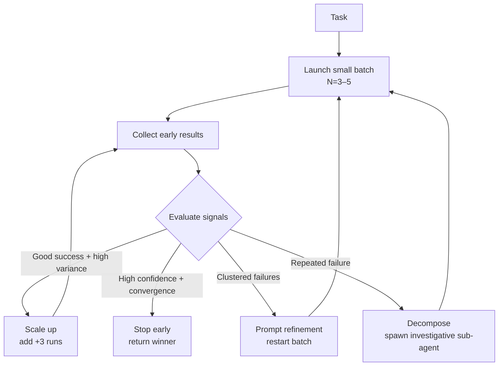

<!-- source: nibzard/awesome-agentic-patterns (Apache 2.0, https://github.com/nibzard/awesome-agentic-patterns) — retain attribution per license -->

# Adaptive Sandbox Fan-Out Controller

> Start with a small parallel batch, monitor four quality signals, then decide whether to scale up, stop early, refine the prompt, or decompose — rather than committing to a fixed N upfront.

## The Problem with Static N

Static best-of-N policies ("always run 10 sandboxes") break in two ways:

**Prompt fragility:** If the prompt is underspecified, scaling N scales errors. Ten sandboxes all fail the same way. The signal was visible after three runs; you paid for ten.

**Redundant success:** If the first three runs converge on a high-confidence winner, the remaining seven produce near-duplicate outputs at full cost. Early stopping could have yielded the same result for 30% of the spend.

Most systems still use static caps rather than true signal-driven adaptation. The adaptive controller replaces the fixed-N decision with a control loop. See [nibzard/awesome-agentic-patterns: adaptive-sandbox-fanout-controller.md](https://github.com/nibzard/awesome-agentic-patterns/blob/main/patterns/adaptive-sandbox-fanout-controller.md) for the full pattern specification.

## The Four Signals

The controller computes four observables after each batch completes:

| Signal | What it measures | How to collect |
|--------|-----------------|----------------|
| **Success rate** | Fraction of runs that pass execution validation | Exit codes, test suite pass/fail |
| **Diversity score** | Meaningful differences between solutions | Embedding similarity, AST diff, output distance |
| **Judge confidence** | Winner margin and decision certainty | LLM-as-judge score spread |
| **Error clustering** | Whether failures share a root cause | Top-N error signature coverage (e.g. >70% same error) |

Together, these signals distinguish four situations: good results that need a better winner, good results that need no more runs, a prompt gap, and a task that requires decomposition.

## Decision Logic

**Scale up** when success rate is acceptable but judge confidence is low and solutions diverge. More runs improve winner selection without changing the approach.

**Stop early** when the judge is confident, tests pass, and solutions converge. The additional runs would produce diminishing returns.

**Refine prompt** when error clustering is high — if >70% of runs fail with the same error signature, the problem is prompt underspecification, not task difficulty. Spawning more runs repeats the same mistake.

**Decompose** when repeated refinement attempts still fail. A consistent failure across diverse attempts signals the task is too ambiguous or too large for a single-prompt approach. Switch to an investigative sub-agent.

## Hysteresis Prevents Oscillation

Naive threshold designs cause oscillation: the controller scales up, confidence crosses the stop threshold, it stops, next iteration falls below the scale-up threshold, it scales up again. Hysteresis breaks this by using asymmetric thresholds:

- **Scale up** if judge confidence < 0.65
- **Stop** only if judge confidence > 0.75

The gap between 0.65 and 0.75 creates a neutral zone where the controller holds its current N rather than switching. This is the same principle as thermostat deadbands and Schmitt triggers in control systems.

## Guardrails

Dynamic scaling needs hard limits to prevent runaway cost:

- **N_max**: absolute sandbox cap (e.g. 50) — never exceeded regardless of signals
- **Runtime cap**: wall-clock limit per task
- **No-progress stop**: halt if consecutive batches produce no new successful solutions
- **Refinement limit**: two prompt refinement attempts maximum before switching to decomposition

## Trade-offs

**When the controller pays off:**

- Code generation with cheap execution validation (unit tests, static analysis, schema checks)
- Cost-sensitive production pipelines where early stopping yields significant savings
- Tasks with objective correctness criteria — the confidence and success signals are reliable

**When it adds overhead without benefit:**

- Tasks without cheap objective validation — diversity and confidence scoring requires an LLM judge, which adds cost and latency
- Small queues (under ~5 tasks) where setup overhead exceeds savings
- Tasks where prompt quality is already verified — if you know the prompt is solid, a static N is simpler and equally effective

## Instrumentation Requirements

The controller is only as good as its signals. Before adopting this pattern, verify you can collect:

1. Deterministic pass/fail per run (test suite, schema validation, exit code)
2. A diversity metric that captures meaningful output differences, not surface variation
3. A judge that produces a calibrated confidence score with interpretable margins
4. Error signature extraction that can cluster failures by root cause

If any of these is unavailable or unreliable, the controller degrades to guessing. A static N with good post-hoc judging ([Fan-Out Synthesis](fan-out-synthesis.md)) may be more practical.

## Example

A code-generation pipeline produces SQL query implementations. The task is objective: the output either passes the integration test suite or it does not.

**Initial batch (N=3):** 2 pass, 1 fails with a syntax error. Success rate: 67%. Judge evaluates the two passing solutions: confidence 0.58 (below 0.65 scale-up threshold). Solutions differ meaningfully in join strategy.

**Controller decision:** Scale up — good success rate but low confidence and high diversity. Add +3 runs.

**Second batch (N=3 additional):** 2 pass, 1 fails. Now 4 passing solutions total. Judge re-evaluates: confidence 0.81 (above 0.75 stop threshold). Top two solutions have converged on the same join strategy.

**Controller decision:** Stop early. Return the highest-confidence solution. Total: 6 runs instead of a static N=10. Cost reduction: 40%.

**Contrast — prompt failure case:** A different task produces N=3 runs where all three fail with `column 'user_id' does not exist`. Error clustering: 100% share the same signature. Controller triggers prompt refinement (the schema definition was missing from the prompt), not more runs.

## Key Takeaways

- Static best-of-N wastes cost in two modes: scaling errors when prompts are bad, paying for redundant successes when runs converge early
- Four signals — success rate, diversity, judge confidence, error clustering — determine which of four actions to take
- Hysteresis (asymmetric scale-up vs. stop thresholds) prevents oscillation between decisions
- Error clustering is the diagnostic that distinguishes "need more runs" from "need a better prompt"
- Hard guardrails (N_max, runtime cap, refinement limit) are required to prevent runaway cost
- The pattern requires reliable instrumentation; unreliable signals produce worse decisions than a static N

## Related

- [Fan-Out Synthesis](fan-out-synthesis.md) — Static best-of-N with post-hoc synthesis; simpler baseline without adaptive control
- [Recursive Best-of-N Delegation](recursive-best-of-n-delegation.md) — Best-of-N applied recursively at each delegation node
- [Bounded Batch Dispatch](bounded-batch-dispatch.md) — Static batching for rate-limit safety; the fixed-N approach this pattern extends
- [Voting / Ensemble Pattern](voting-ensemble-pattern.md) — Aggregate parallel results through voting rather than judge scoring
- [pass@k and pass^k Metrics](../verification/pass-at-k-metrics.md) — Measure capability vs. consistency across parallel runs
- [Oracle-Based Task Decomposition](oracle-task-decomposition.md) — Decompose when a single prompt consistently fails
