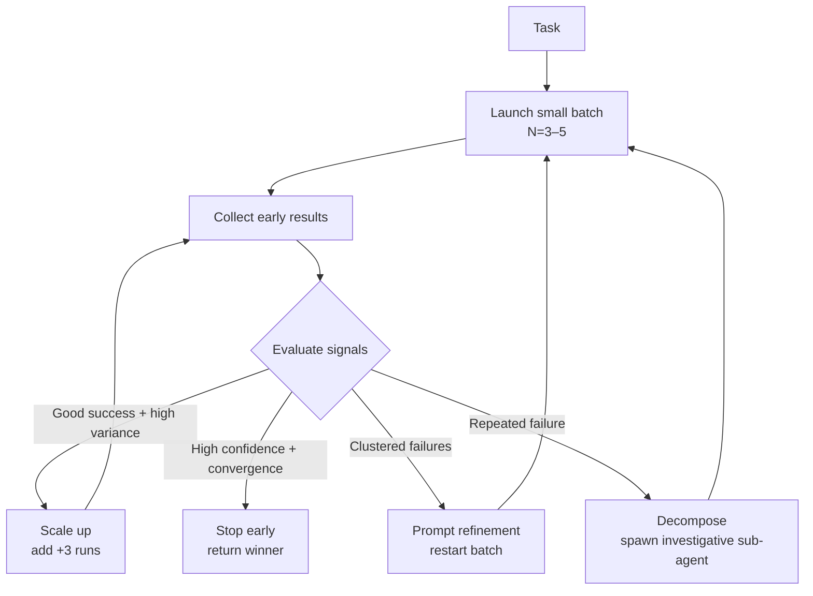

<!-- source: nibzard/awesome-agentic-patterns (Apache 2.0, https://github.com/nibzard/awesome-agentic-patterns) — retain attribution per license -->

# Adaptive Sandbox Fan-Out Controller

> Adaptively size the fan-out: launch a small batch, read four quality signals, then scale up, stop early, refine, or decompose instead of fixing N.

## The problem with static N

Static best-of-N policies ("always run 10 sandboxes") break in two ways.

Prompt fragility: if the prompt is underspecified, scaling N scales errors. The signal was visible after three runs. You paid for ten.

Redundant success: if the first three runs converge on a high-confidence winner, the remaining seven produce near-duplicate outputs at full cost. Early stopping gives the same result for 30% of the spend.

The adaptive controller replaces fixed N with a signal-driven control loop. See [nibzard/awesome-agentic-patterns](https://github.com/nibzard/awesome-agentic-patterns/blob/main/patterns/adaptive-sandbox-fanout-controller.md) for the full pattern specification. [Reinforce-Ada (Xiong et al., 2025)](https://arxiv.org/abs/2510.04996) formalizes the same intuition: it allocates inference budget per prompt and reports up to a 2× convergence speedup over fixed-N at equal total compute.

## The four signals

The controller computes four observables after each batch completes:

| Signal | What it measures | How to collect |
|--------|-----------------|----------------|
| Success rate | Fraction of runs that pass execution validation | Exit codes, test suite pass/fail |
| Diversity score | Meaningful differences between solutions | Embedding similarity, AST diff, output distance |
| Judge confidence | Winner margin and decision certainty | LLM-as-judge score spread |
| Error clustering | Whether failures share a root cause | Top-N error signature coverage (for example, over 70% the same error) |

Together, these signals distinguish four situations: good results that need a better winner, good results that need no more runs, a prompt gap, and a task that needs decomposition.

## Decision logic

```mermaid
graph TD
    A[Task] --> B[Launch small batch<br>N=3–5]
    B --> C[Collect early results]
    C --> D{Evaluate signals}
    D -->|Good success + high variance| E[Scale up<br>add +3 runs]
    D -->|High confidence + convergence| F[Stop early<br>return winner]
    D -->|Clustered failures| G[Prompt refinement<br>restart batch]
    D -->|Repeated failure| H[Decompose<br>spawn investigative sub-agent]
    E --> C
    G --> B
    H --> B
```

Scale up when success rate is acceptable but judge confidence is low and solutions diverge. More runs improve winner selection without changing the approach.

Stop early when the judge is confident, tests pass, and solutions converge. Extra runs hit diminishing returns.

Refine the prompt when error clustering is high. If more than 70% of runs fail with the same error signature, the problem is prompt underspecification, not task difficulty. More runs repeat the same mistake.

Decompose when repeated refinement still fails. Switch to [oracle-based task decomposition](oracle-task-decomposition.md). Consistent failure across diverse attempts signals the task is too ambiguous or too large for a single prompt. Hand it to an investigative sub-agent.

## Hysteresis prevents oscillation

A single threshold causes oscillation: scale up, cross the stop threshold, stop, drop below the scale-up threshold, scale up again. Asymmetric thresholds break the cycle:

- Scale up if judge confidence is below 0.65
- Stop only if judge confidence is above 0.75

The gap creates a neutral zone where the controller holds N — the same principle as thermostat deadbands and Schmitt triggers.

## Guardrails

Dynamic scaling needs hard limits to prevent runaway cost:

- N_max: absolute sandbox cap (for example, 50), never exceeded regardless of signals
- Runtime cap: wall-clock limit per task
- No-progress stop: halt if consecutive batches produce no new successful solutions
- Refinement limit: two prompt refinement attempts at most before switching to decomposition

## Trade-offs

When the controller pays off:

- Code generation with cheap execution validation (unit tests, static analysis, schema checks)
- Cost-sensitive production pipelines where early stopping saves a lot
- Tasks with objective correctness criteria — the confidence and success signals are reliable

When it adds overhead without benefit:

- Tasks without cheap objective validation — diversity and confidence scoring need an LLM judge, which adds cost and latency
- Small queues (under about 5 tasks) where setup overhead exceeds savings
- Tasks where prompt quality is verified — a static N is simpler and equally effective

## Instrumentation requirements

The controller is only as good as its signals. Before adopting this pattern, verify you can collect:

1. Deterministic pass/fail per run (test suite, schema validation, exit code)
2. A diversity metric that captures meaningful output differences, not surface variation
3. A judge that produces a calibrated confidence score with interpretable margins
4. Error signature extraction that can cluster failures by root cause

If any of these is unavailable or unreliable, the controller degrades to guessing. A static N with good post-hoc judging ([Fan-Out Synthesis](fan-out-synthesis.md)) may be more practical. The judge-confidence signal in particular is fragile: [Landesberg (2026)](https://arxiv.org/abs/2603.12520) shows pointwise judges with moderate global correlation (r = 0.47) recover only 21% of best-of-N gains, while pairwise judging raises recovery to 61%. Prefer pairwise comparison when you can.

## Example

A code-generation pipeline produces SQL query implementations. The task is objective: the output either passes the integration test suite or it does not.

Initial batch (N=3): 2 pass, 1 fails with a syntax error. Success rate: 67%. The judge evaluates the two passing solutions and returns confidence 0.58, below the 0.65 scale-up threshold. The solutions differ meaningfully in join strategy.

Controller decision: scale up. Success rate is good but confidence is low and diversity is high. Add 3 more runs.

Second batch (3 more runs): 2 pass, 1 fails. That gives 4 passing solutions in total. The judge re-evaluates and returns confidence 0.81, above the 0.75 stop threshold. The top two solutions have converged on the same join strategy.

Controller decision: stop early. Return the highest-confidence solution. Total: 6 runs instead of a static N=10. Cost reduction: 40%.

Contrast — prompt failure case: a different task produces 3 runs where all three fail with `column 'user_id' does not exist`. Error clustering: 100% share the same signature. The controller triggers prompt refinement (the schema definition was missing from the prompt), not more runs.

## Key Takeaways

- Static best-of-N wastes cost in two modes: scaling errors when prompts are bad, paying for redundant successes when runs converge early
- Four signals — success rate, diversity, judge confidence, error clustering — determine which of four actions to take
- Hysteresis (asymmetric scale-up vs. stop thresholds) prevents oscillation between decisions
- Error clustering is the diagnostic that distinguishes "need more runs" from "need a better prompt"
- Hard guardrails (N_max, runtime cap, refinement limit) are required to prevent runaway cost
- The pattern requires reliable instrumentation; unreliable signals produce worse decisions than a static N

## Related

- [Sandbox Runtime Comparison](../security/sandbox-runtime-comparison.md) — selection rubric for the per-task sandbox runtime when fanning out
- [Fan-Out Synthesis](fan-out-synthesis.md) — Static best-of-N with post-hoc synthesis; simpler baseline without adaptive control
- [Recursive Best-of-N Delegation](recursive-best-of-n-delegation.md) — Best-of-N applied recursively at each delegation node
- [Bounded Batch Dispatch](bounded-batch-dispatch.md) — Static batching for rate-limit safety; the fixed-N approach this pattern extends
- [Voting / Ensemble Pattern](voting-ensemble-pattern.md) — Aggregate parallel results through voting rather than judge scoring
- [pass@k and pass^k Metrics](../verification/pass-at-k-metrics.md) — Measure capability vs. consistency across parallel runs
- [Oracle-Based Task Decomposition](oracle-task-decomposition.md) — Decompose when a single prompt consistently fails
