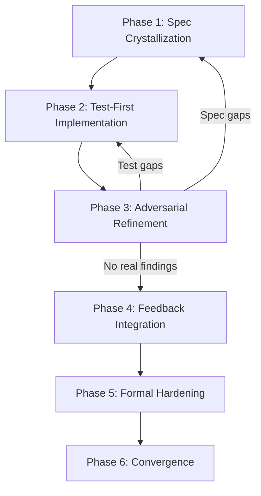

# Adversarial Multi-Model Development Pipeline (VSDD)

> A six-phase AI-orchestrated pipeline that assigns a fresh-context adversary model to attack builder output until convergence, combining spec-driven development, TDD, and formal verification.

## Roles

The pipeline separates two antagonistic roles across different model instances — ideally different providers:

- **Builder** — owns spec authorship, test generation, and code implementation. Accumulates context across phases and can develop confirmation bias toward its own decisions.
- **Adversary** — receives a context reset between each review pass. Attacks specs, tests, and implementation with no prior investment in them. The context reset is the mechanism: the adversary cannot rationalize decisions it did not make.

Using a different model family for each role (e.g., Claude as Builder, Gemini as Adversary) reduces correlated failure modes — multi-model ensembles suppress shared error patterns that same-family models exhibit even with a fresh context window ([LLM-TOPLA, EMNLP 2024](https://aclanthology.org/2024.findings-emnlp.698.pdf)). See [Loop Strategy Spectrum](../agent-design/loop-strategy-spectrum.md) for context on when fresh-context resets are appropriate.

## The Six Phases



**Phase 1 — Spec Crystallization.** Establish behavioral contracts, interface definitions, and an edge case catalog. [Spec-driven development](../workflows/spec-driven-development.md) provides a structured approach for authoring and maintaining these specification files across agent sessions. Critically, define the Purity Boundary Map (see below) before any implementation begins, since it shapes module decomposition and the dependency graph.

**Phase 2 — Test-First Implementation.** Translate specs into failing tests first. Write implementation only when tests demand it. Red → Green → Refactor.

**Phase 3 — Adversarial Refinement.** The Adversary model reviews specs, tests, and code with a clean context window. It identifies spec fidelity gaps, missing test scenarios, and implementation flaws. Each finding is tagged by dimension.

**Phase 4 — Feedback Integration.** Route findings to the phase they belong to: spec revisions cycle back to Phase 1; test gaps cycle back to Phase 2. Phases 3 and 4 repeat until convergence.

**Phase 5 — Formal Hardening.** Execute formal verification proofs, fuzzing, and mutation testing against the now battle-tested implementation. The Purity Boundary Map defines which components are candidates for formal verification. Cross-examination at phase boundaries is a documented robustness mechanism in LLM multi-agent SE systems ([ACM TOSEM, 2024](https://dl.acm.org/doi/10.1145/3712003)).

**Phase 6 — Convergence.** Exit the loop. See convergence criterion below.

## Purity Boundary Map

The Purity Boundary Map separates the codebase into two zones before implementation begins:

| Zone | Properties | Verification approach |
|------|-----------|----------------------|
| Pure core | Deterministic, no side effects | Formal proofs, property-based testing |
| Effectful shell | I/O, network, database, time | Integration tests, contract tests, fuzzing |

Designing this boundary in Phase 1 is not optional — it determines module structure. Retrofitting purity after implementation is significantly more expensive. The pure core is the target for formal verification in Phase 5; the effectful shell is not formally verifiable by definition.

## Convergence Criterion

The loop exits when the Adversary's findings shift from genuine to invented:

- Spec critiques become stylistic nitpicks, not substantive behavioral gaps
- The Adversary cannot identify untested scenarios; mutation testing kill rates are high
- Implementation findings require the Adversary to invent implausible inputs, not observe actual flaws
- All formal properties pass proof; fuzzing finds nothing new

This is a qualitative signal, not a counter. Tag each finding on intake as "substantive" or "hypothetical" and track the ratio across rounds — when the Adversary can only raise hypothetical issues, the loop has converged.

## When This Backfires

VSDD's cost is proportional to convergence cycles. Skip it when:

- **Low-stakes changes.** Routine refactoring or single-line patches produce low-signal Adversary critiques; convergence stalls on style.
- **Thin specs.** Underspecified contracts cause the Adversary to invent gaps rather than find real ones — the pipeline amplifies spec quality, not compensates for its absence.
- **Narrow specialist domains.** General-purpose adversary models hallucinate plausible-sounding but incorrect findings in embedded systems, cryptography, or other deep-context domains. Domain-specific tests must validate Adversary output before acting on it.

## The Waterfall Trap

Treating Phase 1 specs as a fixed gate repeats waterfall's failure mode. Implementation is discovery — edge cases emerge during building, not beforehand. When Phase 3 finds a genuine behavioral gap, update the spec. Route minor edge case additions directly to Phase 2; reserve Phase 1 revision for findings that change the behavioral contract.

## When This Backfires

- **Overhead exceeds benefit on small tasks.** A six-phase adversarial loop adds substantial orchestration cost — multiple model calls per phase, context management, finding triage. For throwaway scripts, prototypes, or any task where correctness failure is cheap to fix post-deployment, the pipeline cost exceeds the defect-prevention value.
- **Convergence stalls with a weak Adversary prompt.** If the Adversary role receives an under-specified prompt, it defaults to surface-level stylistic feedback rather than substantive behavioral attacks. Phases 3 and 4 then cycle without meaningful signal — producing the illusion of convergence rather than the reality. Multi-agent systems are specifically susceptible to premature consensus when reviewer incentives are not explicitly orthogonal ([Failure Modes in LLM Systems, 2025](https://arxiv.org/abs/2511.19933)).
- **Purity boundary retrofitting breaks the model.** If Phase 1 skips the Purity Boundary Map, the effectful shell typically becomes entangled with the pure core during Phase 2. Attempting to separate them after implementation is significantly more expensive than designing the boundary upfront, often requiring near-full rewrites.

## Example

The following shows a minimal two-role pipeline using Claude as Builder and Gemini as Adversary. The Builder accumulates context across phases; the Adversary is initialised fresh for each review pass.

```python
import anthropic
import google.generativeai as genai

# Phase 1 & 2: Builder accumulates context
builder = anthropic.Anthropic()
builder_history = []

def builder_turn(prompt: str) -> str:
    builder_history.append({"role": "user", "content": prompt})
    response = builder.messages.create(
        model="claude-opus-4-5",
        max_tokens=4096,
        system="You are the Builder. Author specs, write failing tests, then implement.",
        messages=builder_history,
    )
    reply = response.content[0].text
    builder_history.append({"role": "assistant", "content": reply})
    return reply

# Phase 3: Adversary gets NO prior context — fresh model call each time
genai.configure(api_key="GEMINI_API_KEY")
adversary_model = genai.GenerativeModel("gemini-2.0-flash")

def adversary_review(spec: str, tests: str, code: str) -> str:
    prompt = (
        "Review the following spec, tests, and implementation. "
        "Identify spec fidelity gaps, missing test scenarios, and implementation flaws. "
        f"\n\n## Spec\n{spec}\n\n## Tests\n{tests}\n\n## Code\n{code}"
    )
    # No history passed — context reset is the mechanism
    return adversary_model.generate_content(prompt).text

spec  = builder_turn("Write a spec for a rate-limiter with a sliding window algorithm.")
tests = builder_turn("Write failing pytest tests that cover every clause in that spec.")
code  = builder_turn("Implement the rate-limiter so all tests pass.")

findings = adversary_review(spec, tests, code)
print(findings)
```

The Adversary call passes only the artifacts under review — no prior conversation history. If `findings` contains substantive behavioral gaps, route them back into `builder_turn` with the appropriate phase prompt; repeat until the Adversary can only raise stylistic issues.

## Key Takeaways

- The context reset on the Adversary is the mechanism — it cannot rationalize decisions it did not make
- Use a different model family for the Adversary so its blind spots do not overlap the Builder's
- Define the Purity Boundary Map in Phase 1; retrofitting it after implementation is expensive
- Convergence is when the Adversary can only invent problems, not find real ones
- Treat specs as living hypotheses; route minor edge case discoveries to Phase 2, not Phase 1 re-review

## Related

- [Convergence Detection in Iterative Refinement](../agent-design/convergence-detection.md) — the signal-based model behind the Phase 6 convergence criterion
- [Evaluator-Optimizer Pattern](../agent-design/evaluator-optimizer.md)
- [Committee Review Pattern](../code-review/committee-review-pattern.md)
- [Fan-Out Synthesis Pattern](fan-out-synthesis.md)
- [Sub-Agents for Fan-Out Research and Context Isolation](sub-agents-fan-out.md)
- [Specialized Agent Roles](../agent-design/specialized-agent-roles.md)
- [Pre-Completion Checklists](../verification/pre-completion-checklists.md)
- [Incremental Verification](../verification/incremental-verification.md)
- [Red-Green-Refactor for Agent Development](../verification/red-green-refactor-agents.md)
- [Closed-Loop Role-Based Refinement](closed-loop-role-based-refinement.md)
- [Emergent Behavior Sensitivity](emergent-behavior-sensitivity.md)
- [Multi-Agent SE Design Patterns](multi-agent-se-design-patterns.md)
- [Multi-Model Plan Synthesis](multi-model-plan-synthesis.md)
- [Independent Test Generation in Multi-Agent Code Systems](independent-test-generation-multi-agent.md)
- [Voting / Ensemble Pattern](voting-ensemble-pattern.md)
- [Orchestrator-Worker Pattern](orchestrator-worker.md)
- [Multi-Agent Topology Taxonomy](multi-agent-topology-taxonomy.md)
- [System-Level Optimization Pipeline](system-level-optimization-pipeline.md)
- [Declarative Multi-Agent Composition](declarative-multi-agent-composition.md)
