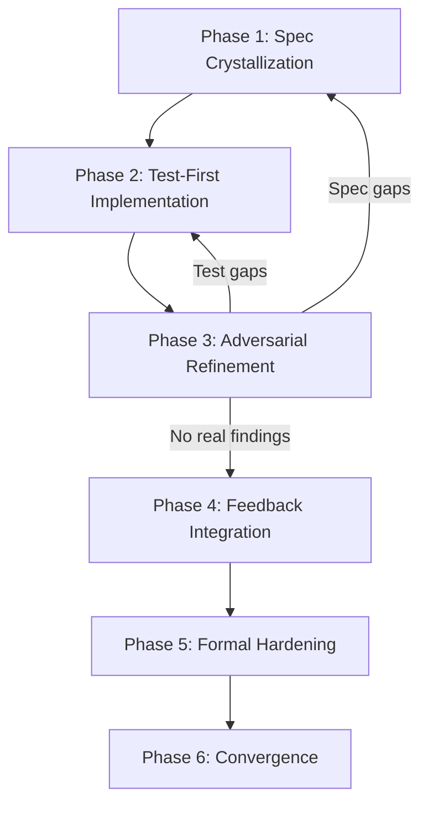

# Adversarial Multi-Model Development Pipeline (VSDD)

> A six-phase AI-orchestrated pipeline that assigns a fresh-context adversary model to attack builder output until convergence, combining spec-driven development, TDD, and formal verification.

## Roles

The pipeline splits two opposing roles across different model instances, ideally different providers:

- Builder — owns specs, tests, and implementation. It accumulates context across phases and can develop confirmation bias toward its own decisions.
- Adversary — gets a [fresh context window](../loop-engineering/loop-strategy-spectrum.md) each review pass and attacks specs, tests, and code with no prior investment. The context reset is the mechanism: the adversary cannot rationalize decisions it did not make.

Use a different model family for each role, for example Claude as Builder and Gemini as Adversary. This reduces correlated failure modes. Multi-model ensembles suppress shared error patterns that same-family models show even with a fresh context ([LLM-TOPLA, EMNLP 2024](https://aclanthology.org/2024.findings-emnlp.698.pdf)). See [when fresh-context resets are appropriate](../loop-engineering/loop-strategy-spectrum.md) for more.

## The six phases


```mermaid
graph TD
    P1[Phase 1: Spec Crystallization] --> P2[Phase 2: Test-First Implementation]
    P2 --> P3[Phase 3: Adversarial Refinement]
    P3 -->|Spec gaps| P1
    P3 -->|Test gaps| P2
    P3 -->|No real findings| P4[Phase 4: Feedback Integration]
    P4 --> P5[Phase 5: Formal Hardening]
    P5 --> P6[Phase 6: Convergence]
```

Phase 1 — Spec crystallization. Establish behavioral contracts, interface definitions, and an edge-case catalog using [spec-driven development](../workflows/spec-driven-development.md). Define the Purity Boundary Map (see below) before any implementation, because it shapes how you split the code into modules.

Phase 2 — Test-first implementation. Translate specs into failing tests, then implement only what the tests demand. Red, green, refactor.

Phase 3 — Adversarial refinement. The Adversary reviews specs, tests, and code with a clean context window. It tags each finding by dimension: spec fidelity, test coverage, or implementation flaw.

Phase 4 — Feedback integration. Route findings back to the phase they belong to. Phases 3 and 4 repeat until convergence.

Phase 5 — Formal hardening. Run formal proofs, fuzzing, and [mutation testing](../verification/mutation-testing-quality-gate.md) against the tested implementation. The Purity Boundary Map identifies the formally verifiable subset. Cross-examination at phase boundaries is a documented robustness mechanism in LLM multi-agent SE systems ([ACM TOSEM, 2024](https://dl.acm.org/doi/10.1145/3712003)).

Phase 6 — Convergence. Exit the loop. See the convergence criterion below.

## Purity Boundary Map

The Purity Boundary Map separates the codebase into two zones before implementation begins:

| Zone | Properties | Verification approach |
|------|-----------|----------------------|
| Pure core | Deterministic, no side effects | Formal proofs, property-based testing |
| Effectful shell | I/O, network, database, time | Integration tests, contract tests, fuzzing |

Design this boundary in Phase 1. It determines module structure, and retrofitting it later is expensive. The pure core is the formal-verification target in Phase 5. The effectful shell cannot be formally verified, by definition.

## Convergence criterion

The loop exits when the Adversary's findings shift from genuine to invented:

- Spec critiques become stylistic nitpicks, not substantive behavioral gaps
- The Adversary cannot identify untested scenarios; mutation testing kill rates are high
- Implementation findings require the Adversary to invent implausible inputs, not observe actual flaws
- All formal properties pass proof; fuzzing finds nothing new

This is a qualitative signal, not a counter. Tag each finding on intake as "substantive" or "hypothetical", then track the ratio across rounds. When the Adversary can only raise hypothetical issues, the loop has converged.

## When this backfires

VSDD's cost is proportional to [convergence](../loop-engineering/convergence-detection.md) cycles. Skip it or expect degraded results when:

- Low-stakes or small tasks. Refactors, single-line patches, throwaway scripts, and prototypes produce low-signal critiques and stall on style. Orchestration cost — multiple model calls per phase, context management, finding triage — exceeds defect-prevention value when failure is cheap to fix after deployment.
- Thin specs or weak Adversary prompts. Both push the Adversary toward inventing gaps or surface-level stylistic feedback rather than finding real flaws. Phases 3 and 4 then cycle without meaningful signal — an illusion of convergence rather than the reality. Multi-agent systems are especially prone to premature consensus when reviewer incentives are not explicitly orthogonal ([Failure Modes in LLM Systems, 2025](https://arxiv.org/abs/2511.19933)).
- Narrow specialist domains. General-purpose adversary models hallucinate plausible but incorrect findings in embedded systems, cryptography, or other deep-context domains. Domain-specific tests must validate Adversary output before you act on it.
- Purity boundary retrofitting. If Phase 1 skips the map, the effectful shell typically entangles with the pure core during Phase 2. Separating them later often requires near-full rewrites.

## The waterfall trap

Treating Phase 1 specs as a fixed gate repeats waterfall's failure mode. Implementation is discovery: edge cases emerge during building, not beforehand. When Phase 3 finds a genuine behavioral gap, update the spec. Route minor edge case additions directly to Phase 2; reserve Phase 1 revision for findings that change the behavioral contract.

## Example

This example shows a minimal two-role pipeline. The Builder uses Claude and the Adversary uses Gemini. The Builder accumulates context across phases. The Adversary starts fresh for each review pass.

```python
import anthropic
import google.generativeai as genai

# Phase 1 & 2: Builder accumulates context
builder = anthropic.Anthropic()
builder_history = []

def builder_turn(prompt: str) -> str:
    builder_history.append({"role": "user", "content": prompt})
    response = builder.messages.create(
        model="claude-opus-4-5",
        max_tokens=4096,
        system="You are the Builder. Author specs, write failing tests, then implement.",
        messages=builder_history,
    )
    reply = response.content[0].text
    builder_history.append({"role": "assistant", "content": reply})
    return reply

# Phase 3: Adversary gets NO prior context — fresh model call each time
genai.configure(api_key="GEMINI_API_KEY")
adversary_model = genai.GenerativeModel("gemini-2.0-flash")

def adversary_review(spec: str, tests: str, code: str) -> str:
    prompt = (
        "Review the following spec, tests, and implementation. "
        "Identify spec fidelity gaps, missing test scenarios, and implementation flaws. "
        f"\n\n## Spec\n{spec}\n\n## Tests\n{tests}\n\n## Code\n{code}"
    )
    # No history passed — context reset is the mechanism
    return adversary_model.generate_content(prompt).text

spec  = builder_turn("Write a spec for a rate-limiter with a sliding window algorithm.")
tests = builder_turn("Write failing pytest tests that cover every clause in that spec.")
code  = builder_turn("Implement the rate-limiter so all tests pass.")

findings = adversary_review(spec, tests, code)
print(findings)
```

The Adversary call passes only the artifacts under review, with no prior conversation history. If `findings` contains substantive behavioral gaps, route them back into `builder_turn` with the right phase prompt. Repeat until the Adversary can only raise stylistic issues.

## Key Takeaways

- The context reset on the Adversary is the mechanism — it cannot rationalize decisions it did not make
- Use a different model family for the Adversary so its blind spots do not overlap the Builder's
- Define the Purity Boundary Map in Phase 1; retrofitting it after implementation is expensive
- Convergence is when the Adversary can only invent problems, not find real ones
- Treat specs as living hypotheses; route minor edge case discoveries to Phase 2, not Phase 1 re-review

## Related

- [Convergence Detection in Iterative Refinement](../loop-engineering/convergence-detection.md) — the signal-based model behind the Phase 6 convergence criterion
- [Evaluator-Optimizer Pattern](../agent-design/evaluator-optimizer.md) — the two-role evaluator/generator scaffold VSDD specializes
- [Committee Review Pattern](../code-review/committee-review-pattern.md) — alternative when you want multiple adversaries instead of one
- [Closed-Loop Role-Based Refinement](closed-loop-role-based-refinement.md) — generalized Builder/Adversary loop without the spec-first phases
- [Multi-Model Plan Synthesis](multi-model-plan-synthesis.md) — uses cross-model diversity at the planning stage rather than the review stage
- [Independent Test Generation in Multi-Agent Code Systems](independent-test-generation-multi-agent.md) — the Phase 2 mechanism applied across agents
- [Red-Green-Refactor for Agent Development](../verification/red-green-refactor-agents.md) — the TDD substrate Phase 2 builds on
- [Spec-Driven Development](../workflows/spec-driven-development.md) — the spec-authorship workflow Phase 1 invokes
- [Reviewer Precision as a Pipeline Quality Proxy](reviewer-precision-proxy.md) — the failure mode this pipeline must design against: a precise reviewer whose critique is not coupled into the next candidate
