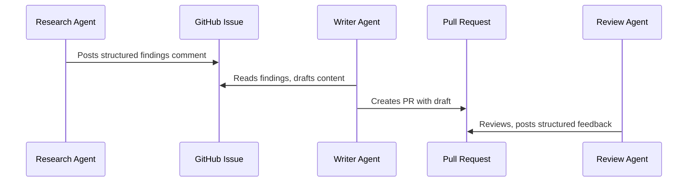

# Agent Handoff Protocols: Passing Work Between Agents

> Define explicit contracts between pipeline stages — what the upstream agent produces and what the downstream agent expects — to prevent information loss at handoff points.

## The Handoff Problem

Each agent in a pipeline operates in its own context window. The research agent's findings don't automatically transfer to the draft agent. Each handoff is a potential information loss point: too little context and the next agent makes wrong assumptions; too much and it's burdened with noise.

The handoff protocol is the contract between agents: a defined structure that the upstream agent writes and the downstream agent reads.

## Structured Handoff Formats

Define what each pipeline stage produces. Common fields across handoff formats:

- **What was done** — the scope of work completed
- **What was found** — conclusions, not raw exploration
- **What needs attention** — items the next agent must address
- **What is unresolved** — open questions or blockers

A research agent producing prose notes is less reliable as a handoff than one producing structured JSON or a defined markdown schema [unverified]. The receiving agent can extract the right fields without guessing at the format.

## Summarize, Don't Forward

The receiving agent needs conclusions, not transcripts. Passing raw exploration logs to the next agent inflates its context with noise the agent didn't produce and can't efficiently parse. Summarize at the boundary:

- Retain decisions made and why
- Retain unresolved items that the next stage must handle
- Drop intermediate reasoning, failed attempts, and tool call details

## Persistent Handoff Media

GitHub issues and PRs function as durable handoff artifacts: they're persistent, reviewable, and linkable. A research agent commenting findings on an issue creates a handoff that survives context resets and is auditable by humans. A draft agent reading that issue comment gets a clean, structured input without needing access to the research agent's full session.

Labels encode pipeline state — they tell the next agent what stage the work is in and what format to expect.



## Context Isolation is a Feature

Each agent starting with a fresh context — informed by the handoff, not burdened by the predecessor's full session — is a design goal, not a limitation. It prevents context bleed between pipeline stages and forces each handoff to be explicit about what information matters.

## Anti-Pattern: Raw Transcript Forwarding

Passing a previous agent's full output or conversation transcript to the next agent as its prompt causes context bloat: the receiving agent's context fills with the sender's reasoning process rather than its conclusions. Extract and summarize at each boundary.

## Example

The following shows a research agent producing a structured JSON handoff that a writer agent can consume directly. The upstream agent writes conclusions and open items — not its reasoning trace — into a file that becomes the writer agent's sole input.

```json
{
  "stage": "research",
  "completed": "Surveyed Claude API rate limiting behaviour across Tier 1–4 accounts",
  "findings": [
    "Tier 1 accounts are limited to 50 RPM on claude-3-5-sonnet; Tier 4 accounts have no published hard cap",
    "429 responses include a Retry-After header; exponential backoff without this header is unreliable",
    "Batch API bypasses RPM limits but introduces up to 24-hour latency"
  ],
  "needs_attention": [
    "Verify Tier 4 limits via direct API measurement — documentation is outdated",
    "Add Batch API latency trade-off to the draft"
  ],
  "unresolved": [
    "Whether prompt caching affects RPM accounting is undocumented"
  ]
}
```

The writer agent's system prompt references this schema explicitly: it reads `findings` for content, `needs_attention` for required coverage, and `unresolved` for items to flag as open questions rather than assert as facts. This prevents the writer from inventing answers for gaps the research agent deliberately left open.

## Key Takeaways

- Define explicit output schemas for each pipeline stage — structured handoffs are more reliable than prose.
- Summarize at boundaries: the next agent needs conclusions, not the full exploration history.
- Use persistent artifacts (GitHub issues, PRs, comments) as handoff media when cross-session durability matters.
- Context isolation between agents is intentional — the handoff is the only channel.

## Unverified Claims

- Structured JSON or defined markdown schema is more reliable as a handoff than prose notes [unverified]

## Related

- [Separation of Knowledge and Execution](../agent-design/separation-of-knowledge-and-execution.md)
- [Agent Backpressure](../agent-design/agent-backpressure.md)
- [Tool Selection Guidance](../tool-engineering/tool-description-quality.md)
- [File-Based Agent Coordination](file-based-agent-coordination.md)
- [Orchestrator-Worker Pattern](orchestrator-worker.md)
- [Closed-Loop Role-Based Refinement](closed-loop-role-based-refinement.md)
- [Sub-Agents for Fan-Out Research and Context Isolation](sub-agents-fan-out.md)
- [Multi-Agent Topology Taxonomy](multi-agent-topology-taxonomy.md)
- [Declarative Multi-Agent Composition](declarative-multi-agent-composition.md)
- [Fan-Out Synthesis Pattern](fan-out-synthesis.md)
- [LLM Map-Reduce Pattern](llm-map-reduce.md)
- [Bounded Batch Dispatch](bounded-batch-dispatch.md)
- [Multi-Agent SE Design Patterns](multi-agent-se-design-patterns.md)
