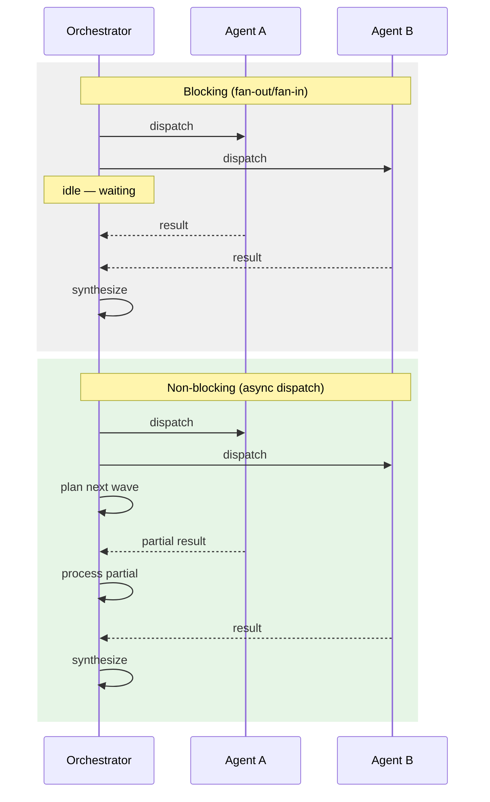

# Async Non-Blocking Subagent Dispatch

> Decouple the orchestrator's processing loop from subagent lifecycle so it continues planning, processing partial results, and managing state while delegates execute concurrently — but only when the orchestrator has genuine work to perform during the wait.

## The Qualifying Condition

Standard [fan-out patterns](sub-agents-fan-out.md) and [bounded batch dispatch](bounded-batch-dispatch.md) treat the orchestrator as a passive waiter: launch N agents, block until all return, synthesize results. When the orchestrator itself has productive work — planning next dispatch waves, processing partial results, managing cross-agent state — blocking wastes its execution budget.

Async dispatch decouples orchestration from subagent lifecycle. The orchestrator dispatches work and continues its own processing loop, handling results as they arrive.

**The condition matters.** When the orchestrator is purely a dispatch-and-synthesize node with no intermediate processing, async dispatch adds coordination complexity — task tracking, timeout detection, partial-result reconciliation — without throughput gain. The orchestrator just busy-waits or idle-polls instead of blocking cleanly. Anthropic's own [multi-agent research system](https://www.anthropic.com/engineering/multi-agent-research-system) deliberately chose synchronous execution because "asynchronicity adds challenges in result coordination, state consistency, and error propagation across the subagents."

## Blocking vs Non-Blocking Dispatch



The difference is what the orchestrator does between dispatch and result collection. In blocking dispatch, it idles. In async dispatch, it performs productive work — planning, partial synthesis, state management, or dispatching additional tasks.

## The Continuation Pattern

Async dispatch requires a mechanism for the orchestrator to learn when subagents complete. Two models:

**Polling.** The orchestrator periodically checks task status. LangChain Deep Agents v0.5 implements this via the [Agent Protocol](https://blog.langchain.com/deep-agents-v0-5/) — `start_async_task` returns a task ID immediately, and the supervisor uses `check_async_task` to poll status while continuing its own work. The supervisor also gets `update_async_task` for mid-execution instructions and `cancel_async_task` for cleanup.

**Event streaming.** The orchestrator subscribes to completion events. Claude Code's [Monitor tool](https://code.claude.com/docs/en/changelog) (v2.1.98) streams events from background processes, and [background subagents](https://code.claude.com/docs/en/sub-agents) run concurrently while the orchestrator continues working. Background subagents are configured via the `background: true` frontmatter field in the subagent definition.

## Backpressure: Bounding In-Flight Delegates

Unbounded async dispatch floods the orchestrator's context with pending task state and returning results. Apply backpressure:

- **WIP limits.** Cap the number of concurrent in-flight delegates. When the limit is reached, the orchestrator queues new dispatch requests until a slot opens. This is the same mechanism as [bounded batch dispatch](bounded-batch-dispatch.md), but applied per-slot rather than per-batch.
- **Result buffering.** Process returning results in order of arrival rather than accumulating all results. Each processed result frees context space for the next.
- **Dispatch gating.** Make subsequent dispatch waves contingent on partial results from earlier waves — the orchestrator uses early returns to refine later dispatches.

Without backpressure, async dispatch degenerates into the ["bag of agents" anti-pattern](https://towardsdatascience.com/why-your-multi-agent-system-is-failing-escaping-the-17x-error-trap-of-the-bag-of-agents/) where unstructured fire-and-forget dispatch amplifies errors up to 17x.

## Failure Handling Differs from Blocking Dispatch

Blocking dispatch gets failure detection for free — if a subagent fails, the join point raises an error. Async dispatch requires explicit mechanisms:

- **Timeout detection.** Background subagents that hang must be detected and cancelled. There is no implicit join to surface the timeout.
- **Partial-progress reporting.** Claude Code v2.1.89 added [partial-progress reporting](https://code.claude.com/docs/en/changelog) for failed background subagents. Previously, failures could go undetected.
- **Ghost agents.** Context compaction can make background subagents invisible, causing duplicate spawns. This was [fixed in Claude Code v2.1.83](https://code.claude.com/docs/en/changelog) but illustrates the class of bugs async dispatch introduces.
- **Permission model.** Background subagents in Claude Code prompt for all tool permissions upfront. Once running, the subagent auto-denies anything not pre-approved. If a background subagent needs to ask a clarifying question, that tool call fails but the subagent continues without the answer ([source](https://code.claude.com/docs/en/sub-agents)).

## When Not to Use Async Dispatch

| Condition | Why blocking is better |
|-----------|----------------------|
| Orchestrator has no work during wait | Async adds task tracking and timeout logic with zero throughput gain |
| High inter-task dependency | Subagent B needs A's output — async degrades to effectively-synchronous with extra bookkeeping |
| Small team (1-3 subagents) | The parallelism window is small enough that sequential dispatch with natural overlap achieves similar throughput |
| Frequent context compaction | Long-running sessions where compaction is common introduce ghost-agent risks |

## Example

A lead agent auditing 50 documentation pages dispatches review subagents in waves of 10 while using the time between dispatches productively:

```
Wave 1: dispatch 10 review subagents (background)
         ↓ orchestrator plans wave 2 file list based on dependency graph
         ↓ orchestrator processes first 3 results as they arrive
         ↓ orchestrator refines review criteria based on early findings
Wave 2: dispatch 10 review subagents (background, refined criteria)
         ↓ orchestrator synthesizes wave 1 results into summary
         ...
```

Compare with blocking batch dispatch, where the orchestrator dispatches 10, waits idle for all 10 to complete, then dispatches the next 10. The async variant uses the orchestrator's idle time to improve subsequent waves — each wave benefits from what earlier waves discovered.

## Key Takeaways

- Async dispatch is justified only when the orchestrator has productive work to perform while subagents execute — otherwise synchronous dispatch is simpler and safer
- The continuation pattern (polling or event streaming) determines how the orchestrator learns about completions — Claude Code uses [Monitor tool](../tools/claude/monitor-tool.md) event streaming, LangChain Deep Agents uses task-ID polling
- Backpressure (WIP limits, result buffering, dispatch gating) prevents context flooding — without it, async dispatch degenerates into unstructured fire-and-forget
- Failure handling requires explicit timeout detection and progress reporting — blocking dispatch gets these for free at the join point

## Related

- [Sub-Agents for Fan-Out Research and Context Isolation](sub-agents-fan-out.md) — the blocking fan-out pattern this extends
- [Fan-Out Synthesis Pattern](fan-out-synthesis.md) — adds a dedicated synthesis agent to merge parallel outputs into a composite result
- [Bounded Batch Dispatch](bounded-batch-dispatch.md) — sequential batch processing with blocking joins
- [Orchestrator-Worker Pattern](orchestrator-worker.md) — the broader orchestration model
- [Agent Composition Patterns](../agent-design/agent-composition-patterns.md) — survey of composition structures including fan-out
- [Staggered Agent Launch](staggered-agent-launch.md) — complementary pattern for avoiding thundering-herd on dispatch
