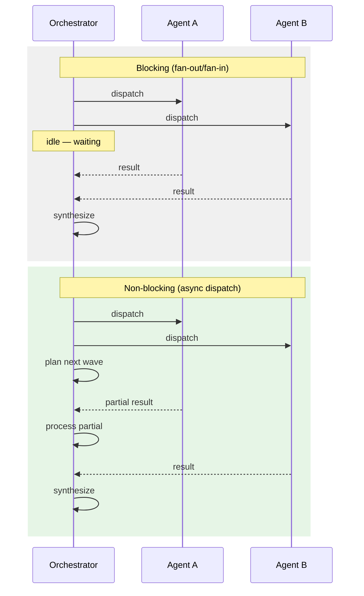

# Async Non-Blocking Subagent Dispatch

> Decouple the orchestrator's loop from subagent lifecycle so it keeps working while delegates run — but only when it has genuine work during the wait.

## The qualifying condition

Standard [fan-out patterns](sub-agents-fan-out.md) and [bounded batch dispatch](bounded-batch-dispatch.md) treat the orchestrator as a passive waiter: it launches N agents, blocks until all return, then synthesizes. Blocking wastes the orchestrator's execution budget when it has productive work of its own — planning next waves, processing partial results, or managing cross-agent state.

Async dispatch decouples orchestration from subagent lifecycle. The [orchestrator](orchestrator-worker.md) dispatches and continues its own loop, handling results as they arrive.

The condition matters. When the orchestrator is a pure dispatch-and-synthesize node with no intermediate work, async adds coordination complexity — task tracking, timeout detection, partial-result reconciliation — without any throughput gain. The orchestrator busy-waits or idle-polls instead of blocking cleanly. Anthropic's [multi-agent research system](https://www.anthropic.com/engineering/multi-agent-research-system) chose synchronous execution because "asynchronicity adds challenges in result coordination, state consistency, and error propagation across the subagents."

## Blocking and non-blocking dispatch


```mermaid
sequenceDiagram
    participant O as Orchestrator
    participant A as Agent A
    participant B as Agent B

    rect rgb(240, 240, 240)
    Note over O,B: Blocking (fan-out/fan-in)
    O->>A: dispatch
    O->>B: dispatch
    Note over O: idle — waiting
    A-->>O: result
    B-->>O: result
    O->>O: synthesize
    end

    rect rgb(230, 245, 230)
    Note over O,B: Non-blocking (async dispatch)
    O->>A: dispatch
    O->>B: dispatch
    O->>O: plan next wave
    A-->>O: partial result
    O->>O: process partial
    B-->>O: result
    O->>O: synthesize
    end
```

The difference is what the orchestrator does between dispatch and result collection. Blocking idles. Async dispatch does productive work — planning, partial synthesis, state management, or further dispatch.

## The continuation pattern

Async dispatch needs a way for the orchestrator to learn when subagents complete. Two models:

Polling: the orchestrator checks task status at intervals. LangChain Deep Agents v0.5 does this through the [Agent Protocol](https://blog.langchain.com/deep-agents-v0-5/) — `start_async_task` returns a task ID at once, and the supervisor uses `check_async_task` to poll status while continuing its own work. The supervisor also gets `update_async_task` for mid-execution instructions and `cancel_async_task` for cleanup.

Event streaming: the orchestrator subscribes to completion events. Claude Code's [Monitor tool](https://code.claude.com/docs/en/changelog) (v2.1.98) streams events from background processes, and [background subagents](https://code.claude.com/docs/en/sub-agents) run concurrently while the orchestrator keeps working. You configure a background subagent through the `background: true` frontmatter field in its definition.

## Backpressure: bounding in-flight delegates

Unbounded async dispatch floods the orchestrator's context with pending task state and returning results. Apply backpressure:

- WIP limits: cap the number of concurrent in-flight delegates. When the cap is reached, the orchestrator queues new dispatch requests until a slot opens. This is the same mechanism as [bounded batch dispatch](bounded-batch-dispatch.md), applied per-slot rather than per-batch.
- Result buffering: process returning results in order of arrival rather than holding all of them. Each processed result frees context space for the next.
- Dispatch gating: make later dispatch waves depend on partial results from earlier waves, so the orchestrator uses early returns to refine later dispatches.

Without backpressure, async dispatch degenerates into the ["bag of agents" anti-pattern](https://towardsdatascience.com/why-your-multi-agent-system-is-failing-escaping-the-17x-error-trap-of-the-bag-of-agents/) where unstructured fire-and-forget dispatch amplifies errors up to 17x.

## Failure handling differs from blocking dispatch

Blocking dispatch gets failure detection for free — if a subagent fails, the join point raises an error. Async dispatch needs explicit mechanisms:

- Timeout detection: you must detect and cancel hung background subagents, because no implicit join surfaces the timeout.
- Partial-progress reporting: Claude Code v2.1.89 added [partial-progress reporting](https://code.claude.com/docs/en/changelog) for failed background subagents. Earlier, such failures could go undetected.
- Ghost agents: context compaction can make background subagents invisible, which causes duplicate spawns. Claude Code v2.1.83 [fixed this](https://code.claude.com/docs/en/changelog), but it shows the bug class async introduces.
- Permission model: background subagents in Claude Code prompt for all tool permissions upfront, then auto-deny anything not pre-approved once running. A clarifying-question tool call fails, but the subagent continues without the answer ([Claude Code subagents docs](https://code.claude.com/docs/en/sub-agents)).

## When not to use async dispatch

| Condition | Why blocking is better |
|-----------|----------------------|
| Orchestrator has no work during wait | Async adds task tracking and timeout logic with zero throughput gain |
| High inter-task dependency | Subagent B needs A's output — async degrades to effectively-synchronous with extra bookkeeping |
| Small team (1-3 subagents) | The parallelism window is small enough that sequential dispatch with natural overlap achieves similar throughput |
| Frequent context compaction | Long-running sessions where compaction is common introduce ghost-agent risks |

## Example

A lead agent auditing 50 documentation pages dispatches review subagents in waves of 10 while using the time between dispatches productively:

```
Wave 1: dispatch 10 review subagents (background)
         ↓ orchestrator plans wave 2 file list based on dependency graph
         ↓ orchestrator processes first 3 results as they arrive
         ↓ orchestrator refines review criteria based on early findings
Wave 2: dispatch 10 review subagents (background, refined criteria)
         ↓ orchestrator synthesizes wave 1 results into summary
         ...
```

Compare with blocking batch dispatch, where the orchestrator dispatches 10, waits idle for all 10 to complete, then dispatches the next 10. The async variant uses the orchestrator's idle time to improve subsequent waves — each wave benefits from what earlier waves discovered.

## Key Takeaways

- Async dispatch is justified only when the orchestrator has productive work to perform while subagents execute — otherwise synchronous dispatch is simpler and safer
- The continuation pattern (polling or event streaming) determines how the orchestrator learns about completions — Claude Code uses [Monitor tool](../tools/claude/monitor-tool.md) event streaming, LangChain Deep Agents uses task-ID polling
- Backpressure (WIP limits, result buffering, dispatch gating) prevents context flooding — without it, async dispatch degenerates into unstructured fire-and-forget
- Failure handling requires explicit timeout detection and progress reporting — blocking dispatch gets these for free at the join point

## Related

- [Sub-Agents for Fan-Out Research and Context Isolation](sub-agents-fan-out.md) — the blocking fan-out pattern this extends
- [Fan-Out Synthesis Pattern](fan-out-synthesis.md) — adds a dedicated synthesis agent to merge parallel outputs into a composite result
- [Bounded Batch Dispatch](bounded-batch-dispatch.md) — sequential batch processing with blocking joins
- [Orchestrator-Worker Pattern](orchestrator-worker.md) — the broader orchestration model
- [Agent Composition Patterns](../agent-design/agent-composition-patterns.md) — survey of composition structures including fan-out
- [Staggered Agent Launch](staggered-agent-launch.md) — complementary pattern for avoiding thundering-herd on dispatch
