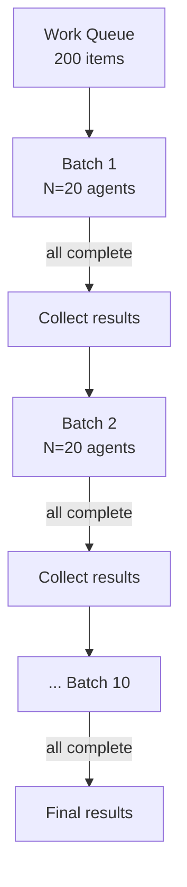

# Bounded Batch Dispatch

> Process large agent workloads without hitting API rate limits by dispatching work in sequential batches of fixed size — one agent per item, N items at a time.

## The Problem

Two naive approaches break at scale:

**Unbounded fan-out** — spawn one agent per item, all at once. Works for 5 items. At 200 items, API rate limits trip (Anthropic Tier 1 caps at [50 requests per minute](https://platform.claude.com/docs/en/api/rate-limits)), costs spike unpredictably, and a wave of 429 errors can lose all in-progress work simultaneously.

**Sequential processing** — one agent at a time, fully serialised. Safe but slow — a 200-item queue at 30 seconds per agent takes 100 minutes.

## The Pattern

Split the work queue into chunks of size N. For each chunk:

1. Spawn one agent per item using background execution — all agents in the chunk start simultaneously
2. Wait for **all agents in the chunk** to complete
3. Collect results
4. Proceed to the next chunk

Each agent handles exactly one work item in its own context window — no state shared between agents, no context bleed between items.

## The Control Variable

Batch size N is the single tuning knob. Set it against two constraints:

**Rate limits** — Anthropic's token bucket enforces RPM and ITPM ceilings per model tier. A batch of N agents firing simultaneously counts as N requests. N should stay comfortably below the RPM ceiling, accounting for retries.

**Cost budget** — N agents x average tokens per agent x token price = cost per batch. With a fixed N, total cost for the full queue is predictable before the run starts.

Start at N=10-20 for most workloads. Reduce if you're hitting 429s; increase if you have headroom and need throughput.

## Why Not a True Sliding Window

The intuitive design is a sliding window: maintain exactly N agents running at all times, and the moment any agent completes, immediately spawn a replacement. This maximises throughput by eliminating the wait for the slowest agent in each batch.

**It isn't implementable with LLM orchestrators.** A sliding window requires `wait-for-any` semantics — block until the first of N running tasks completes, then act. LLM orchestrators can only `wait-for-all` — they spawn a group of background agents and resume only when the entire group finishes. [unverified]

The practical consequence is minor: a slow agent in a batch slightly delays the start of the next batch. Throughput is marginally lower than a true sliding window but the concurrency cap, cost predictability, and context isolation are identical. For workloads where items have similar duration, the difference is negligible.

A true sliding window is achievable only with an external process or queue worker running outside the LLM context — a background service that polls for completed tasks and enqueues new ones.

## Error Handling

When an agent in a batch fails:

- Collect whatever results completed in the batch
- Record the failed item
- Continue to the next batch — do not abort the queue

Failed items surface in the final report for manual follow-up or a targeted retry run. A single failure never stops subsequent work.

## When to Use

Use bounded batch dispatch when:

- The work queue has more items than your API rate limit allows in a single burst
- Each item is independent — no output from one item feeds into another
- Context isolation matters — items must not share or contaminate each other's context
- Cost predictability is required before starting the run

Use unbounded fan-out when the queue is small (under ~15 items) and rate limits are not a concern. Use sequential processing only when items have strict ordering dependencies.

## Key Takeaways

- Batch size N is the single control variable — tune against RPM limits and cost budget
- One agent per item guarantees full context isolation at the cost of one agent spawn per item
- LLM orchestrators support wait-for-all, not wait-for-any — sequential batches are the correct implementation of bounded concurrency in this context
- Errors in one batch never abort subsequent batches

## Example

A code-review pipeline must audit 80 pull requests overnight. Each review is independent. The team sets N=20 to stay well within Anthropic Tier 1 rate limits (50 RPM).

**Batch 1 (items 1-20):** The orchestrator dispatches 20 background agents simultaneously, each receiving one PR diff and the review rubric. The orchestrator waits. The slowest agent finishes in 45 seconds; the batch completes and 20 review reports are collected.

**Batches 2-4 (items 21-80):** Identical process repeats. One agent in batch 3 times out; its PR is recorded as failed and the pipeline continues. Total wall time: ~4 batches x ~45 seconds = ~3 minutes, versus ~40 minutes sequentially.

**Result collection:** The orchestrator aggregates 79 successful reviews and flags 1 failed item for a targeted manual retry. Total cost is predictable: 80 agents x ~2 000 tokens average x token price, computed before the run starts.

Adjusting N: if 429 errors appear, reduce to N=10. If headroom exists and throughput matters, increase to N=30 — but verify the new batch size against current tier limits before scaling.

## Related

- [Fan-Out Synthesis](fan-out-synthesis.md)
- [Sub-Agents for Fan-Out Research and Context Isolation](sub-agents-fan-out.md)
- [Orchestrator-Worker](orchestrator-worker.md)
- [LLM Map-Reduce Pattern](llm-map-reduce.md)
- [Staggered Agent Launch](staggered-agent-launch.md)
- [Cost-Aware Agent Design](../agent-design/cost-aware-agent-design.md)
- [Multi-Agent Topology Taxonomy](multi-agent-topology-taxonomy.md)
