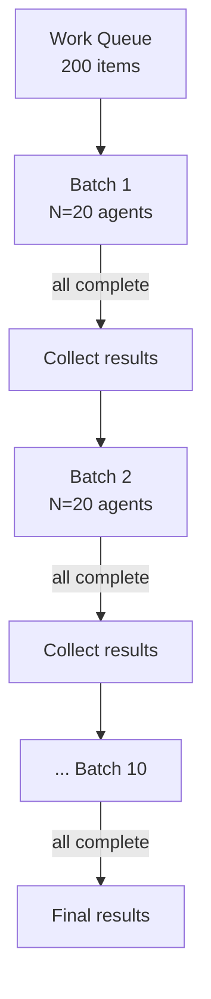

# Bounded Batch Dispatch

> Process large agent workloads without hitting API rate limits by dispatching work in sequential batches of fixed size — one agent per item, N items at a time.

## The Problem

Two naive approaches break at scale:

**Unbounded fan-out** — spawn one agent per item, all at once. Works for 5 items. At 200 items, API rate limits trip (Anthropic Tier 1 caps at [50 requests per minute](https://platform.claude.com/docs/en/api/rate-limits)), costs spike unpredictably, and a wave of 429 errors can lose all in-progress work simultaneously.

**Sequential processing** — one agent at a time, fully serialised. Safe but slow — a 200-item queue at 30 seconds per agent takes 100 minutes.

## The Pattern

Split the work queue into chunks of size N. For each chunk:

1. Spawn one agent per item using background execution — all agents in the chunk start simultaneously
2. Wait for **all agents in the chunk** to complete
3. Collect results
4. Proceed to the next chunk

Each agent handles exactly one work item in its own context window — no state shared between agents, no context bleed between items.

## The Control Variable

Batch size N is the single tuning knob, set against two constraints:

**Rate limits** — a batch of N agents firing simultaneously counts as N requests. N should stay comfortably below the RPM ceiling, accounting for retries.

**Cost budget** — `N × avg_tokens × price = cost per batch`. With a fixed N, total cost for the full queue is predictable before the run starts.

Start at N=10-20. Reduce if hitting 429s; increase if headroom exists and throughput matters.

## Why Not a True Sliding Window

A sliding window keeps exactly N agents in flight, spawning a replacement the moment one finishes. It eliminates head-of-line waits but requires `wait-for-any` semantics — block until the first of N tasks completes, then act. LLM orchestrators only support `wait-for-all`: they spawn a group of background agents and resume when the entire group finishes ([Claude Code agent teams](https://code.claude.com/docs/en/agent-teams)). A true sliding window therefore needs an external queue worker outside the LLM context — a service that polls for completions and enqueues replacements. For workloads where items have similar duration, the throughput gap is negligible.

## Error Handling

When an agent in a batch fails, collect completed results, record the failed item, and continue to the next batch. Failed items surface in the final report for targeted retry. A single failure never stops subsequent work.

## When This Backfires

- **Head-of-line blocking.** The slowest agent delays the entire batch. For highly variable item durations, consider a [staggered launch](staggered-agent-launch.md) or [adaptive fan-out](adaptive-sandbox-fanout-controller.md) instead.
- **Fixed N doesn't adapt.** Batch size is calibrated once at run start. If model latency spikes or your rate-limit tier changes mid-run, N is miscalibrated with no feedback loop to correct it.
- **Interdependent items.** If item 30 needs output from item 12, batching breaks the dependency — use sequential processing when items have ordering constraints.
- **Very short items at low N.** Agent spawn overhead can exceed work duration for trivial tasks; a single agent processing items sequentially is faster.
- **Context isolation has a cost.** One agent per item means one full context initialisation per item. For large queues with shared context (system prompt, rubric, reference data), prompt caching becomes essential to avoid ITPM exhaustion.
- **N near the rate-limit ceiling.** Failed agents retrying simultaneously can push the next burst over the limit. Keep N at 60–80% of the RPM ceiling.

## Why It Works

Sequential batches cap concurrent requests at N, so peak RPM is bounded at N × (1 / avg_agent_duration_minutes) — below the rate ceiling when N is set correctly. Cost is computable upfront because N is fixed: `queue_size × avg_tokens × token_price`. Context isolation is structural — each agent receives only its own work item, with no shared state to corrupt, so failures stay local and never cascade. Anthropic's own [multi-agent research system](https://www.anthropic.com/engineering/multi-agent-research-system) uses this synchronous batch model, noting that "asynchronicity adds challenges in result coordination, state consistency, and error propagation across the subagents."

## When to Use

Use bounded batch dispatch when:

- The work queue has more items than your API rate limit allows in a single burst
- Each item is independent — no output from one item feeds into another
- Context isolation matters — items must not share or contaminate each other's state
- Cost predictability is required before starting the run

Use unbounded fan-out for small queues (under ~15 items) where rate limits are not a concern. Use sequential processing when items have strict ordering dependencies.

## Key Takeaways

- Batch size N is the single control variable — tune against RPM limits and cost budget
- One agent per item guarantees full context isolation at the cost of one agent spawn per item
- Native background dispatch uses wait-for-all semantics; wait-for-any requires async dispatch or an external queue worker — sequential batches are the simpler default
- Errors in one batch never abort subsequent batches

## Example

A code-review pipeline must audit 80 pull requests overnight. Each review is independent. The team sets N=20 to stay well within Anthropic Tier 1 rate limits (50 RPM).

**Batch 1 (items 1-20):** The orchestrator dispatches 20 background agents simultaneously, each receiving one PR diff and the review rubric. The orchestrator waits. The slowest agent finishes in 45 seconds; the batch completes and 20 review reports are collected.

**Batches 2-4 (items 21-80):** Identical process repeats. One agent in batch 3 times out; its PR is recorded as failed and the pipeline continues. Total wall time: ~4 batches x ~45 seconds = ~3 minutes, versus ~40 minutes sequentially.

**Result collection:** The orchestrator aggregates 79 successful reviews and flags 1 failed item for a targeted manual retry. Total cost is predictable: 80 agents x ~2 000 tokens average x token price, computed before the run starts.

Adjusting N: if 429 errors appear, reduce to N=10. If headroom exists and throughput matters, increase to N=30 — but verify the new batch size against current tier limits before scaling.

## Related

- [Fan-Out Synthesis](fan-out-synthesis.md)
- [Sub-Agents for Fan-Out Research and Context Isolation](sub-agents-fan-out.md)
- [Orchestrator-Worker](orchestrator-worker.md)
- [LLM Map-Reduce Pattern](llm-map-reduce.md)
- [Staggered Agent Launch](staggered-agent-launch.md)
- [Async Non-Blocking Subagent Dispatch](async-non-blocking-subagent-dispatch.md)
- [Adaptive Sandbox Fan-Out Controller](adaptive-sandbox-fanout-controller.md)
- [Cost-Aware Agent Design](../agent-design/cost-aware-agent-design.md)
- [Multi-Agent Topology Taxonomy](multi-agent-topology-taxonomy.md)
