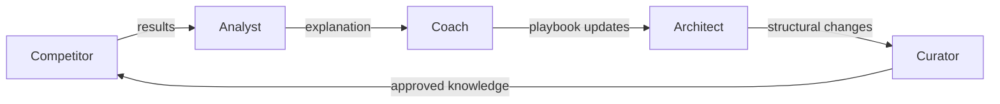
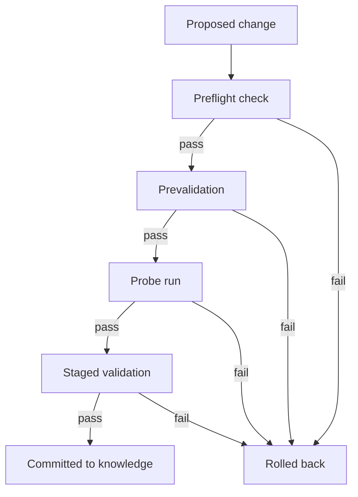

# Closed-Loop Role-Based Refinement

> Decompose the self-improving agent loop into discrete, specialized roles -- Competitor, Analyst, Coach, Architect, Curator -- with persistent knowledge layers, staged validation, and gated persistence to prevent regression.

## Beyond the Single-Loop Flywheel

Closed-loop role-based refinement structures the self-improvement cycle as five specialized roles -- Competitor, Analyst, Coach, Architect, and Curator -- each with a bounded contract, feeding output into the next role in sequence.

Single-loop patterns like the [agentic flywheel](../agent-design/agentic-flywheel.md) and the [continuous agent improvement](../workflows/continuous-agent-improvement.md) workflow treat improvement as one activity. Role-based refinement decomposes it into five responsibilities with different objectives and failure modes.

[AutoContext](https://github.com/greyhaven-ai/autocontext) (greyhaven-ai) implements this as five agent roles collaborating across repeated runs, with knowledge persisting between generations to avoid cold starts.

## Five-Role Decomposition

Each role maps to a stage in the improvement loop, but with explicit contracts that prevent scope bleed:



| Role | Responsibility | Contract |
|------|---------------|----------|
| **Competitor** | Propose and execute strategies against the current task | Produces results; does not analyze or persist them |
| **Analyst** | Explain why strategies succeeded or failed | Produces explanations; does not modify playbooks |
| **Coach** | Update playbooks and hints based on analysis | Modifies knowledge artifacts; does not propose strategies |
| **Architect** | Suggest structural changes to the system itself | Proposes tool and pipeline modifications; does not execute tasks |
| **Curator** | Gate what persists -- approve, reject, or roll back knowledge changes | Controls persistence; does not generate content |

The key constraint: each role's output is the next role's input, and no role exceeds its contract.

## Persistent Knowledge Layers

Cold starts waste the first portion of every agent session rediscovering context. Role-based refinement addresses this through structured knowledge that survives across runs:

| Layer | Contents | Update frequency |
|-------|----------|-----------------|
| **Playbooks** | Validated strategies and approaches | Updated by Coach after each analysis cycle |
| **Hints** | Tactical observations not yet promoted to playbook status | Updated frequently; pruned by Curator |
| **Tools** | Reusable scripts and utilities discovered during execution | Added by Architect; validated before persistence |
| **Reports** | Analysis outputs and progress snapshots | Append-only; used for trend detection |

Unlike simpler patterns (`claude-progress.txt`, AGENTS.md), hints are tentative and playbooks are validated -- promotion between them is gated by the Curator.

## Staged Validation and Rollback

Not every proposed improvement should persist. The system applies validation gates at multiple stages:



Weak strategies roll back automatically, preventing regressions where modifications pass initial tests but degrade edge cases. Quality guards include stagnation detection, dead-end management, and rapid gating.

## Frontier-to-Local Distillation

A practical cost-performance pattern: use frontier models (Claude, GPT-4) for exploration in the Competitor and Analyst roles, encode validated strategies in playbooks, then execute with local models (Ollama, vLLM, MLX) in subsequent runs. Frontier models re-engage only when local models hit stagnation or novel problems.

## Applying the Pattern

The five roles map to any multi-agent system without requiring AutoContext's full implementation:

| If you have... | Map the roles to... |
|----------------|-------------------|
| Claude Code sub-agents | Five sub-agents with role-scoped system prompts |
| A CI/CD pipeline | Five pipeline stages with distinct responsibilities |
| A manual review process | Five review passes, each checking one dimension |
| A single-agent loop | Five phases within the same session, with explicit transitions |

The minimum viable version: separate "generate" from "evaluate" from "persist." The [evaluator-optimizer](../agent-design/evaluator-optimizer.md) pattern covers the first two. Adding a Curator role that gates persistence is the critical third step that prevents regression.

## Example

A minimal five-role loop using Claude sub-agents with role-scoped system prompts:

```python
import anthropic

client = anthropic.Anthropic()

ROLES = {
    "competitor": "Propose and execute a strategy for the given task. Return only results.",
    "analyst":    "Explain why the strategy succeeded or failed. Return only analysis.",
    "coach":      "Update the playbook based on this analysis. Return only playbook changes.",
    "architect":  "Suggest structural improvements to the system. Return only proposals.",
    "curator":    "Approve or reject the proposed changes. Return APPROVE or REJECT with reason.",
}

def role_turn(role, content):
    response = client.messages.create(
        model="claude-opus-4-5",
        max_tokens=1024,
        system=ROLES[role],
        messages=[{"role": "user", "content": content}],
    )
    return response.content[0].text

task      = "Optimize the retry logic in our API client."
results   = role_turn("competitor", task)
analysis  = role_turn("analyst",    "Task: " + task + "
Results: " + results)
playbook  = role_turn("coach",      analysis)
proposals = role_turn("architect",  playbook)
decision  = role_turn("curator",    proposals)

if decision.startswith("APPROVE"):
    print("Persisting:", decision)
else:
    print("Rolled back:", decision)
```

Each role receives only the prior role output -- no shared context window. The Curator decision gates persistence; rejected proposals are discarded without modifying the knowledge store.

## Unverified Claims

- Whether any team beyond Grey Haven has deployed AutoContext in production -- no public case studies or production testimonials were found
- Whether the MLX distillation pathway produces models that match frontier performance on stabilized tasks -- the capability is described but no benchmark results are published
- Stanford ACE research claims 10.6% agent performance improvement from evolving context without fine-tuning -- cited in secondary sources but not independently verified against the original paper

## Related

- [Agentic Flywheel](../agent-design/agentic-flywheel.md) -- the general closed-loop improvement pattern this decomposition implements
- [Continuous Agent Improvement](../workflows/continuous-agent-improvement.md) -- the manual observe-update loop that role-based refinement automates
- [Evaluator-Optimizer](../agent-design/evaluator-optimizer.md) -- the two-role subset (generate + evaluate) without persistence gating
- [Specialized Agent Roles](../agent-design/specialized-agent-roles.md) -- role specialization applied to parallel task execution
- [Rollback-First Design](../agent-design/rollback-first-design.md) -- the rollback principle applied to agent operations generally
- [Trajectory Logging via Progress Files and Git History](../observability/trajectory-logging-progress-files.md)
- [Orchestrator-Worker](orchestrator-worker.md) -- the simpler two-tier coordination pattern that role-based refinement extends with specialized responsibilities
- [Multi-Agent Topology Taxonomy](multi-agent-topology-taxonomy.md) -- classification of coordination patterns including the sequential pipeline this pattern uses
- [Voting Ensemble Pattern](voting-ensemble-pattern.md) -- another multi-agent decision-making approach using consensus rather than sequential roles
