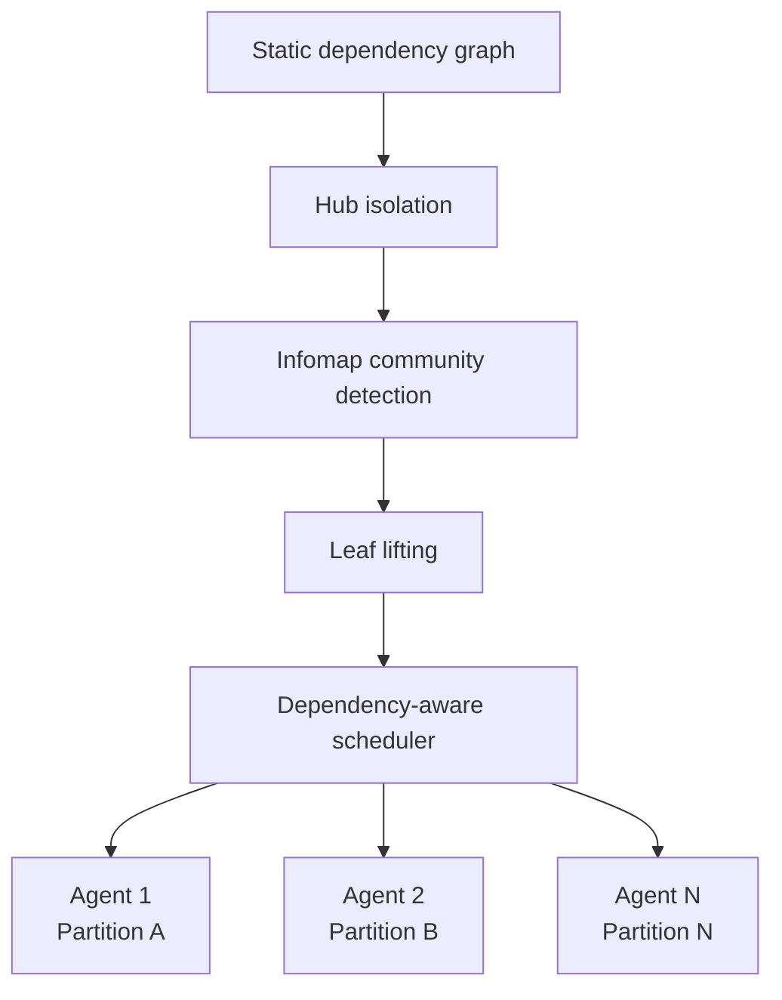

# Cohesion-Aware Task Partitioning for Multi-Agent Coding

> Partition coding work by dependency cohesion before fanning out — parallel speedup only pays off when cross-partition context-transfer cost stays below the parallelism gain.

!!! note "Also known as"
    Cohesion-aware partitioning, dependency-graph partitioning for agents. The decomposition decision upstream of [Orchestrator-Worker](orchestrator-worker.md) and [Sub-Agents Fan-Out](sub-agents-fan-out.md).

## The Trade-off

Multi-agent decomposition shortens critical-path computation when subtasks run in parallel, but each cross-partition dependency forces a context transfer that is not free. Yang et al. (2026) formalise this as graph partitioning over the code-dependency graph: the wall-clock cost of an N-agent run is `max(per-partition compute) + Σ(cross-partition context transfers)` ([arXiv:2606.00953](https://arxiv.org/abs/2606.00953)).

If partitions are chosen poorly the second term dominates. Pugachev (2025) measures exactly this across 600 multi-agent coding trials: parallel coordination achieves up to **21.1% speedup on some tasks but up to 39.4% slowdown on others** ([arXiv:2510.18893](https://arxiv.org/abs/2510.18893)). Inter-agent communication structures inflate token consumption **2×–11.8×** over single-chain baselines ([arXiv:2410.02506](https://arxiv.org/abs/2410.02506)).

The pattern is the decision rule: **partition by cohesion, or do not partition at all**.

## The Algorithm

Co-Coder, the system Yang et al. evaluate, runs a three-stage pipeline on the static dependency graph ([arXiv:2606.00953](https://arxiv.org/abs/2606.00953)):

1. **Hub isolation** — files with high in-degree or out-degree are removed from community detection and assigned to their own partition. Without this step, one structural hub pollutes every community.
2. **Community detection via Infomap** — partition the remaining directed graph using the [Infomap algorithm](https://www.mapequation.org), which models the graph as a random walk and picks the partition that minimises the two-level description length. Heavy edges stay inside partitions; cuts cross sparse edges.
3. **Leaf lifting** — independent leaf vertices are lifted into singleton partitions when latent parallelism exists that the community step missed.

Partitions feed a dependency-aware scheduler that respects topological order and runs unrelated partitions in parallel. The same shape recurs in practitioner tooling: Towards Data Science describes a per-task dynamic harness that fits its orchestration layer to the job and coordinates a team of agents on that single task, rather than fixing one topology up front ([Towards Data Science — A Harness for Every Task](https://towardsdatascience.com/a-harness-for-every-task-putting-a-team-of-claudes-on-one-job/)).



## Why It Works

The Infomap step is the load-bearing piece. It treats the directed dependency graph as a random walk and selects the partition that minimises the expected bits to describe that walk across boundaries — formally, the [map equation](https://www.mapequation.org). Minimising bits-across-boundaries is equivalent to minimising the "information leak" between partitions, which is the cross-agent context-transfer cost being optimised against ([arXiv:2606.00953](https://arxiv.org/abs/2606.00953)).

Hub isolation handles a separate failure mode: one highly-connected file (a base class, a shared utility, a central type) would otherwise be pulled into every community by the random walk, defeating partitioning. Isolating hubs first lets the community step see the natural structure of the rest of the graph.

Reported envelope on 1,028 repository-level tasks (1,010 DevEval + 18 CodeProjectEval): **+14.0% pass rate** on CodeProjectEval (34.1% vs 20.1% sequential), **+11.3%** on DevEval (68.1% vs 56.8%), **1.81×–2.10× wall-clock speedup**, and **28%–35% API cost reduction** versus sequential and naive file-per-agent baselines ([arXiv:2606.00953](https://arxiv.org/abs/2606.00953)).

## When This Backfires

The pattern is not universal. The authors document the primary failure mode; three more are reachable from independent evidence.

- **Near-complete coupling** — when nearly every file depends on every other, Infomap returns a single community and "execution degrades to sequential", offering no latency advantage over the sequential baseline ([arXiv:2606.00953](https://arxiv.org/abs/2606.00953)). The partitioning step then adds overhead without payoff.
- **Static-analysis blind spots** — the evaluation is Python-only and uses static dependency analysis. Codebases heavy in dynamic dispatch, plugin registries, reflection, or runtime dependency injection hide edges static analysis misses; partitions look clean while parallel workers collide at runtime. Statically-typed languages with strong cross-module type contracts (Rust, Go, TypeScript) sit in a related blind spot — a type change in one file forces edits in every dependent, but the graph understates that coupling.
- **Small task surface** — for a feature touching three to five files, the up-front cost of building the graph, running community detection, and scheduling exceeds the parallelism gain. An [Orchestrator-Worker](orchestrator-worker.md) lead agent reading the affected files ad-hoc reaches the same partition with no algorithmic overhead.
- **Dense communication regardless of partition** — independent measurement shows multi-agent communication structures inflating token cost 2×–11.8× over a single chain ([arXiv:2410.02506](https://arxiv.org/abs/2410.02506)), and parallel coordination producing up to 39.4% slowdowns where coordination overhead exceeds the parallelism dividend ([arXiv:2510.18893](https://arxiv.org/abs/2510.18893)). If the task lacks a sparse dependency cut, no partitioning algorithm rescues it.

The decision rule: **estimate dependency density before [fanning out](sub-agents-fan-out.md)**. If the natural partition cut is dense, run sequentially. Only fan out when the cut is sparse.

## Example

A repository-level refactor touching `auth/`, `billing/`, and `notifications/` modules:

**Before — naive file-per-agent fan-out** (the File-based Parallel baseline in Yang et al.):

```
Worker 1: auth/login.py
Worker 2: auth/session.py
Worker 3: billing/invoice.py
Worker 4: billing/charge.py
Worker 5: notifications/email.py
Worker 6: notifications/sms.py
```

Workers 1 and 2 modify shared `auth/` state; workers 3 and 4 share `billing/` types. The partition cuts straight through cohesive modules, so every worker pair triggers context transfers. On CodeProjectEval this baseline scored 20.1% pass rate ([arXiv:2606.00953](https://arxiv.org/abs/2606.00953)).

**After — cohesion-aware partitioning**:

```
Agent 1: auth/   (login.py + session.py — same community)
Agent 2: billing/ (invoice.py + charge.py — same community)
Agent 3: notifications/ (email.py + sms.py — same community)
```

Infomap keeps tightly-coupled files in one agent's context; the only cross-agent edges are sparse cross-module imports. Same physical parallelism, materially less context transfer. On CodeProjectEval this lifted pass rate to 34.1% with 2.10× speedup and 35% API cost reduction ([arXiv:2606.00953](https://arxiv.org/abs/2606.00953)).

For most practitioners, the takeaway is the intuition, not the algorithm: **keep tightly-coupled files in one agent's context, cut across natural module boundaries, isolate central utilities**.

## Key Takeaways

- N-agent wall-clock cost is `max(per-partition compute) + Σ(cross-partition context transfers)` — partition badly and the second term eats the speedup
- Partition by dependency cohesion: keep tightly-coupled files in one agent, cut across natural boundaries, isolate structural hubs
- Reported envelope on 1,028 tasks: +11–14% pass rate, 1.8–2.1× speedup, 28–35% cost reduction over sequential and file-parallel baselines
- The pattern degenerates to sequential on near-complete coupling, and offers no help on small task surfaces or dynamic-dispatch-heavy codebases
- The decision is upstream of fan-out: estimate the partition cut density before launching workers

## Related

- [Orchestrator-Worker Pattern for AI Agent Development](orchestrator-worker.md)
- [Sub-Agents for Fan-Out Research and Context Isolation](sub-agents-fan-out.md)
- [Parsimonious Agent Routing for Multi-Agent Dispatch](parsimonious-agent-routing.md)
- [Swarm Migration Pattern](swarm-migration-pattern.md)
- [Multi-Agent SE Design Patterns: A Taxonomy Across 94 Papers](multi-agent-se-design-patterns.md)
- [Bounded Batch Dispatch](bounded-batch-dispatch.md)
