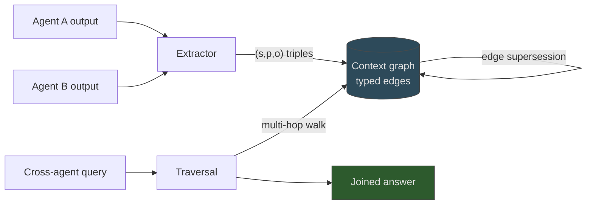

# Context-Graph Shared Memory for Multi-Agent Systems

> Context-graph memory stores cross-agent state as typed triples and beats vector RAG on multi-hop join queries — but only when entities are clean.

Context-graph shared memory layers cross-agent state as `(subject, predicate, object)` triples in a directed graph, replacing flat chat history or vector chunks with relational traversal. The architecture is qualified — independent benchmarks show it beats vector RAG on multi-hop join queries but matches or underperforms it on single-fact retrieval, and a production multi-agent comparison found no statistically significant accuracy advantage at 40% higher cost ([Wolff & Bennati 2025](https://arxiv.org/html/2601.07978v1)). Before defaulting to vector RAG, benchmark all three (chat history, vector RAG, context graph) on the regime your queries actually live in.

## When This Pattern Applies

Adopt context-graph shared memory only when every one of the following holds:

1. Cross-agent join queries — agents routinely ask questions that chain two separately-stated facts (e.g. "which component does the module owned by Agent_Implementer depend on?"). On Alexander's benchmark, vector RAG drops to 20% on join queries while a context graph holds 80% ([Alexander 2026](https://towardsdatascience.com/vector-rag-isnt-enough-i-built-a-context-graph-layer-for-multi-agent-memory/)). If queries are single-fact lookups, the mechanism never fires.
2. Controlled entity vocabulary — agents reference entities by stable names, or you fund LLM-based entity linking at every ingest. Alexander reports queries that say "the authentication module" instead of `AuthModule` fail outright without an extraction LLM in the loop.
3. Long-enough sessions to amortise construction — graph construction overhead never amortises across short interactions; the same Q&A inside one session that ends at handoff is cheaper served by raw chat history.
4. A team that can own a schema — Cypher / SPARQL / equivalent traversal logic and ongoing schema governance are real engineering costs flagged across practitioner write-ups; without that skill set the graph degrades faster than vector RAG and produces no compensating gain.

If any precondition fails, prefer vector RAG with a recency index or scoped chat history — see [agent memory patterns](../agent-design/agent-memory-patterns.md).

## Architecture

The shared layer stores cross-agent facts as triples in a directed multigraph, and serves agent queries via edge traversal rather than similarity scoring ([Alexander 2026](https://towardsdatascience.com/vector-rag-isnt-enough-i-built-a-context-graph-layer-for-multi-agent-memory/)):

- Triple writes — each agent's output is decomposed into `(subject, predicate, object)` triples (deterministic rules in the benchmark; LLM-based entity extraction is required in production, "an ongoing engineering cost" per [Alexander 2026](https://towardsdatascience.com/vector-rag-isnt-enough-i-built-a-context-graph-layer-for-multi-agent-memory/)) and added as typed edges
- Recency by edge supersession — when a new fact restates an existing `(subject, predicate)` pair, the old edge drops, preventing stale-fact retrieval
- Traversal-based retrieval — join queries walk typed edges (e.g. `ASSIGNED_TO` then `DEPENDS_ON`), returning exact answers instead of chunks the consumer must reason over
- Distractor filtering — irrelevant turns never get written, reducing storage noise upstream of retrieval

Compared to vector RAG, this trades similarity-based chunk retrieval for deterministic typed-edge traversal — the gain materialises specifically on queries that need to chain facts ([Wu et al. 2026](https://arxiv.org/html/2606.00610v1)).

## Why It Works

Context-graph memory works on multi-hop queries because it encodes relationships as first-class objects instead of inferring them from chunk co-occurrence. Vector RAG fragments a fact like "Agent_Implementer owns AuthModule" and "AuthModule depends on TokenStore" into two chunks that the consumer LLM must retrieve and then reason over; a graph encodes them as two typed edges and walks them in one deterministic step ([Alexander 2026](https://towardsdatascience.com/vector-rag-isnt-enough-i-built-a-context-graph-layer-for-multi-agent-memory/)). The MemGraphRAG evaluation corroborates the mechanism across HotpotQA, 2WikiMultiHopQA, MuSiQue, and G-Medical — graph-structured retrieval reaches 90.42% recall on multi-hop reasoning where vanilla RAG "plateaus as retrieval increases" because keyword similarity "overlooks the logical bridges required for multi-hop reasoning" ([Wu et al. 2026, KDD 2026](https://arxiv.org/html/2606.00610v1)). The advantage is mechanism-bound: when a query needs no joins, no walk happens and the maintenance overhead pays nothing back.

## When This Backfires

Two independent results show the gain is regime-specific, not universal:

- Vector RAG matches graph memory in production multi-agent settings — a distributed multi-agent system comparison of Graphiti (graph) vs mem0 (vector + LLM compression) found Graphiti's 11.1% accuracy advantage over mem0's 7.5% is not statistically significant (p > 0.05), and the graph cost 40.2% more per query; the authors flag mem0 as Pareto-optimal ([Wolff & Bennati 2025](https://arxiv.org/html/2601.07978v1)).
- Graph-RAG underperforms vanilla RAG on many real-world tasks — a systematic study across the graph-RAG pipeline finds the architecture "frequently underperforms vanilla RAG on many real-world tasks" outside the multi-hop reasoning regime ([Xiang et al. 2025](https://arxiv.org/abs/2506.05690)).

Specific failure conditions:

- Single-fact lookups with no joins — the graph's traversal mechanism is dead weight; vector RAG is cheaper at equal accuracy.
- Free-text agents without controlled vocabulary — Alexander's own benchmark fails on queries like "the dataset with anomaly" without LLM-based entity linking, which then destroys the deterministic-extraction cost advantage the same benchmark reports.
- Short sessions — graph construction never amortises before the session ends.
- Dynamic facts without temporal modelling — Alexander flags stale-fact retrieval as a major liability when supersession isn't implemented.
- Teams without graph-query expertise — Cypher / SPARQL / ontology maintenance is a skill gap that produces a half-implemented graph that underperforms vector RAG.

A further benchmark-vs-production gap matters: the Alexander head-to-head strips LLM calls from extraction, query answering, and grading to isolate architectural differences. Production reintroduces them as ongoing GPU and latency cost; treat the reported 18x token reduction as a retrieval-side signal, not a system-cost estimate.

## Reported Numbers

Treat these as preprint signals, not load-bearing:

| Metric | Raw history dump | Vector RAG | Context graph |
|---|---|---|---|
| Overall accuracy (18 queries) | 61.1% | 50.0% | 88.9% |
| Tokens per query | 490.9 | 75.9 | 26.9 |
| Join-query accuracy | 40.0% | 20.0% | 80.0% |

Source: [Alexander 2026](https://towardsdatascience.com/vector-rag-isnt-enough-i-built-a-context-graph-layer-for-multi-agent-memory/) — 5 scenarios, 18 queries, deterministic (no LLM calls). The distributed-MAS evaluation in [Wolff & Bennati 2025](https://arxiv.org/html/2601.07978v1) and the multi-hop-reasoning benchmarks in [Wu et al. 2026](https://arxiv.org/html/2606.00610v1) report substantially smaller gaps once LLM-based extraction is in the loop.

## Key Takeaways

- Context-graph shared memory beats vector RAG on cross-agent multi-hop join queries with controlled vocabulary; outside that regime two independent studies show it matches or underperforms vector RAG
- The mechanism is typed-edge traversal — the gain only materialises when queries actually require chaining facts; single-fact lookups extract no benefit and pay the schema-maintenance cost
- A production multi-agent comparison ([Wolff & Bennati 2025](https://arxiv.org/html/2601.07978v1)) found graphs cost 40% more per query with no statistically significant accuracy gain over vector + LLM-compressed memory
- Benchmark the three architectures (chat history, vector RAG, context graph) on your actual query mix before adopting; "vector RAG is enough" is the more common production answer

## Related

- [Decentralized Memory for Self-Evolving Multi-Agent Systems](decentralized-memory-multi-agent.md) — the symmetric trade: per-agent private memory instead of any shared store; both pages pick a structural lever (graph vs isolation) on the same dilution-vs-coordination axis
- [Schema-Guided Graph Retrieval](../context-engineering/schema-guided-graph-retrieval.md) — the single-agent precursor whose schema discipline a multi-agent context graph inherits
- [Experience Graphs as Structured Memory for Self-Evolving Agents](../agent-design/experience-graphs-self-evolving-agents.md) — graph-structured memory in a single-agent self-improvement loop; the mechanism transfers when joins matter
- [Agent Memory Patterns: Learning Across Conversations](../agent-design/agent-memory-patterns.md) — scope-based memory architecture covering shared-store designs; the destination once the graph-vs-vector decision is made
- [Agent Handoff Protocols: Passing Work Between Agents](agent-handoff-protocols.md) — explicit handoff contracts for state passed between agents; the alternative to a shared-memory layer when the handoffs are well-defined
