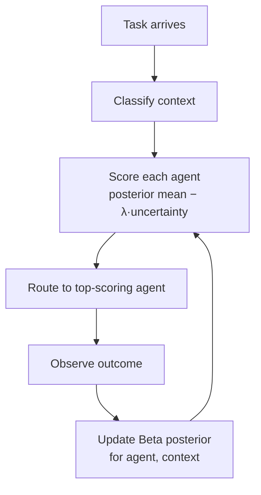

# Contextual Capability Calibration for Multi-Agent Delegation

> Skill-level capability profiles average over heterogeneous task contexts and misdelegate; condition the routing decision on the task features that actually predict success.

## The Misdelegation Problem

Multi-agent delegation typically treats capability as a fixed per-agent property. Routing then marginalizes over task context — the assumption breaks when performance depends on features the profile discards: horizon length, dependency depth, file health, repo familiarity.

Frontier models drop from 70%+ resolve on SWE-bench Verified to 23% on SWE-bench Pro ([Patel et al., 2025](https://arxiv.org/html/2509.16941v1)), which differs mainly in horizon and realism. A static "Opus-best-at-SWE" profile routes correctly on the first and badly on the second. Failure analysis of multi-agent LLM systems ([Cemri et al., 2025](https://arxiv.org/abs/2503.13657)) identifies agent-selection errors as a primary failure cluster — the symptom of profiles that average away the routing signal.

## The Pattern

Partition the task stream into **contexts** along features that plausibly differentiate capability (horizon, presence of failing tests, file health). For each (agent, context) pair, maintain a Beta posterior over success probability and route using a score that penalises uncertainty.



Three components from [CADMAS-CTX (Qiao, 2026)](https://arxiv.org/abs/2604.17950):

- **Hierarchical contextual profiles** — one Beta(α, β) per (agent, context). Success updates α, failure updates β; the posterior mean is the per-context success estimate.
- **Risk-aware routing** — route on `score = mean − λ · stddev`. Low-evidence contexts carry wider posteriors, so the penalty suppresses switches until observations accumulate.
- **Regret bound** — Qiao (2026) proves cumulative regret is lower than static routing under per-context heterogeneity; the bound is the standard Bayesian-bandit form adapted to per-context arms ([Agrawal & Goyal, 2012](https://arxiv.org/abs/1111.1797)).

## Convergent Evidence

[REDEREF (2026)](https://arxiv.org/abs/2603.13256) arrives at the same Beta-posterior mechanism via Thompson sampling without an explicit taxonomy — 28% fewer tokens, 17% fewer calls, 19% lower time-to-success versus uniform random delegation. Convergence on `Beta(α, β)` posteriors plus a calibrated judgment step suggests the mechanism is not a single-benchmark artefact.

## Reported Results

CADMAS-CTX on GPT-4o agents ([Qiao, 2026](https://arxiv.org/abs/2604.17950)):

| Benchmark | Static baseline | AutoGen | CADMAS-CTX |
|-----------|-----------------|---------|------------|
| GAIA | 0.381 | 0.354 | 0.442 |
| SWE-bench Lite | 22.3% resolve | — | 31.4% resolve |

Treat both as research claims pending independent replication. SWE-bench Lite has documented contamination concerns ([Mündler et al., 2025](https://arxiv.org/abs/2510.08996)); the resolve-rate gain has not been validated on mutated or held-out sets.

## When the Pattern Pays Off

Two conditions must hold for contextual calibration to beat static routing:

**Condition 1 — Task heterogeneity.** The task stream must span contexts with genuinely different per-agent reward distributions. Under a narrow distribution, context buckets carry no discriminative information and the per-context overhead is net-negative. ICLR 2026 workshop analysis ([Agents in the Wild](https://arxiv.org/pdf/2510.14133)) reports adaptive routing gains are architecture-specific and static baselines often win when task distribution is narrow.

**Condition 2 — Reliable context classification.** Noisy task → context mapping flattens posteriors and the uncertainty penalty masks the signal. Prefer deterministic heuristics (file health, token count, failing-test presence) over an LLM classifier, which introduces its own capability drift.

Below these thresholds, prefer uniform routing with a judge layer (see [recursive-best-of-N](recursive-best-of-n-delegation.md)) or Thompson sampling over a flat pool as in REDEREF — both capture heterogeneity without requiring a taxonomy.

## Failure Conditions

- **Small agent pool (K = 2).** Exploration-exploitation benefit is small; A/B routing with a judge captures most of the gain.
- **Cold-start regime.** Posteriors are uninformative early; behaviour degrades toward uniform random routing. The paper does not report cold-start latency — budget a warm-up phase or seed from prior deployments.
- **Non-stationary agents.** Model upgrades, prompt changes, or tool additions invalidate posteriors. Reset any changed agent's row in the profile table.
- **Subjective success criteria.** Beta updates require a binary signal. For taste-dependent outputs the posterior is only as calibrated as the judge — see [LLM-as-judge evaluation](../workflows/llm-as-judge-evaluation.md).

## Relationship to Other Routing Patterns

| Pattern | Routing signal | Capability model |
|---------|----------------|------------------|
| [Code-health-gated tier routing](../agent-design/code-health-gated-tier-routing.md) | Pre-computed file health score | Static per-tier |
| [Cross-vendor competitive routing](../agent-design/cross-vendor-competitive-routing.md) | Run both, select after | Implicit, per-task |
| [Recursive best-of-N](recursive-best-of-n-delegation.md) | K candidates, judge selects | None — selection replaces routing |
| Contextual capability calibration | Context classification + posterior | Per (agent, context) |

Contextual calibration generalises the first (route on pre-computed task features) and formalises the insight behind the second. It is complementary to the third: use recursive best-of-N inside a context when its posterior is high-variance.

## Example

A two-agent coding team — Agent A (short-horizon specialist, cheap) and Agent B (long-horizon planner, expensive) — receives mixed tasks. Contexts are defined by patch horizon:

```python
# Per-context Beta posteriors
profiles = {
    ("agent_a", "short"): {"alpha": 1, "beta": 1},
    ("agent_a", "long"):  {"alpha": 1, "beta": 1},
    ("agent_b", "short"): {"alpha": 1, "beta": 1},
    ("agent_b", "long"):  {"alpha": 1, "beta": 1},
}

def classify(task):
    return "long" if task.estimated_files_touched > 3 else "short"

def score(agent, ctx, lam=1.0):
    a, b = profiles[(agent, ctx)]["alpha"], profiles[(agent, ctx)]["beta"]
    mean = a / (a + b)
    var  = (a * b) / ((a + b) ** 2 * (a + b + 1))
    return mean - lam * var ** 0.5   # risk-aware

def route(task):
    ctx = classify(task)
    return max(("agent_a", "agent_b"), key=lambda ag: score(ag, ctx))

def update(agent, ctx, success: bool):
    key = "alpha" if success else "beta"
    profiles[(agent, ctx)][key] += 1
```

After 50 tasks, the long-horizon column for Agent A has updated to Beta(3, 18) — a posterior mean near 0.14 and wide variance; Agent B's long column has updated to Beta(15, 4) — mean 0.79, narrow. The risk-aware score routes long tasks to B with growing confidence. The short-horizon columns converge in the opposite direction. A static profile averaging success across all tasks would have routed to B on every task and spent 5–10× more on short tasks.

## Key Takeaways

- Static skill-level capability profiles average over heterogeneous task contexts and systematically misdelegate when performance depends on task features the profile discards.
- Per (agent, context) Beta posteriors combined with risk-aware scoring (`mean − λ · stddev`) are the standard Bayesian-bandit mechanism adapted to multi-agent routing.
- Two conditions must hold: task heterogeneity across contexts and reliable context classification; below either threshold, uniform routing with a judge layer is cheaper and often better.
- Treat reported benchmark gains (CADMAS-CTX: GAIA 0.381→0.442, SWE-bench Lite 22.3%→31.4%) as research claims pending independent replication on contamination-controlled benchmarks.
- Convergent evidence from REDEREF (28% token reduction, 17% fewer calls) supports the Beta-posterior mechanism but not the specific hierarchical-context contribution.

## Related

- [Recursive Best-of-N Delegation](recursive-best-of-n-delegation.md) — K candidates plus a judge instead of a routing decision
- [Code-Health-Gated LLM Tier Routing](../agent-design/code-health-gated-tier-routing.md) — route on a pre-computed file-health score
- [Cross-Vendor Competitive Routing](../agent-design/cross-vendor-competitive-routing.md) — surface capability differences across vendors
- [The Delegation Decision](../agent-design/delegation-decision.md) — whether to delegate at all before choosing where
- [Multi-Agent Topology Taxonomy](multi-agent-topology-taxonomy.md) — structural choices that constrain where routing applies
- [LLM-as-Judge Evaluation](../workflows/llm-as-judge-evaluation.md) — calibrating the judge that generates the binary success signal driving posterior updates
