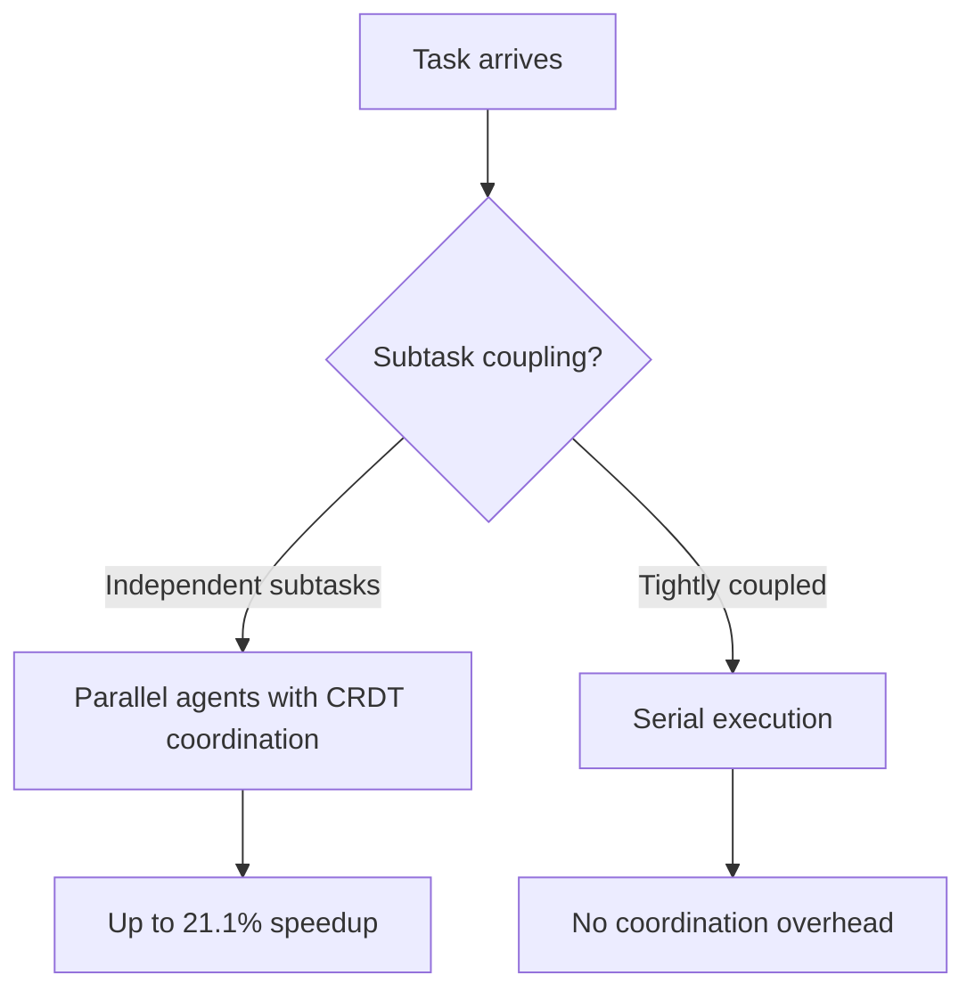

# Observation-Driven Coordination: CRDT-Based Parallel Agent Code Generation

> CRDT-based shared state enables lock-free concurrent code generation with zero structural merge conflicts, but parallel speedup depends entirely on task structure — tightly-coupled tasks are slower in parallel than in serial.

## The Coordination Overhead Problem

Multi-agent code generation systems often fail to realize expected parallel speedups because coordination overhead consumes the gains. When agents must explicitly communicate to share state — passing messages, acquiring locks, resolving conflicts — the coordination cost can exceed the time saved by parallelism. [arXiv:2510.18893](https://arxiv.org/abs/2510.18893) (CodeCRDT) evaluates this across 600 trials.

## CRDT-Based Shared State

**Conflict-free Replicated Data Types (CRDTs)** are data structures that support concurrent updates with deterministic convergence — no locks, no conflict resolution steps, no coordination messages required ([Preguiça et al., 2018](https://arxiv.org/abs/1805.06358)). Agents observe the shared CRDT state and make local updates; the CRDT guarantees all replicas converge to the same final state regardless of update order.

In the coding context:

- The shared workspace (files, AST fragments, symbol tables) is represented as a CRDT
- Agents observe updates as they arrive — no polling, no explicit synchronization
- When two agents modify non-overlapping parts of the codebase, both updates apply cleanly
- When they modify overlapping parts, the CRDT's convergence rules produce a deterministic result

## Key Results from 600 Trials

**Zero merge failures** — CRDT convergence guarantees concurrent agent updates produce a structurally consistent combined state. Message-passing systems accumulate merge failures as concurrency rises.

**Semantic conflict rate: 5–10%** — structural conflicts (two agents edit the same line) are rare and resolved by the CRDT. Semantic conflicts (two agents make structurally compatible but functionally incompatible changes) occur in 5–10% of parallel sessions and require resolution that the CRDT cannot automate.

**Speedup is task-dependent:**

- Up to **21.1% speedup** on tasks with parallelizable subtasks
- Up to **39.4% slowdown** on tightly-coupled tasks

Parallel agents on interdependent code generate more semantic conflicts and rework than a serial agent processing dependencies in order.

## The Task Structure Decision



Parallelizing tasks with tight internal dependencies produces worse outcomes than serial execution — more semantic conflicts, more rework.

Signals of parallelizable structure:

- Subtasks operate on separate files or modules
- Subtask outputs are independently testable
- Subtask A does not create symbols that subtask B consumes

Signals of tightly-coupled structure:

- Subtasks share mutable data structures
- One subtask's output is another's input
- The task requires consistent cross-module naming or interface design

## Explicit Message Passing vs Observation

The study compares CRDT-based observation with explicit message passing between agents:

| Mechanism | Coordination overhead | Merge failures | Speedup potential |
|---|---|---|---|
| Explicit message passing | High | Yes | Eliminated by overhead |
| CRDT observation | Near-zero | None (structural) | Up to 21.1% |

Message passing requires each agent to serialize state, send it to peers, wait for acknowledgment, and process replies — overhead that grows with agent count. CRDT updates propagate as a side effect of normal execution.

## When This Backfires

The 21.1% speedup is a ceiling, not an average. Several conditions flip the trade-off:

- **Implementation cost outweighs the gain** — integrating a CRDT runtime (state representation, observation hooks, AST/file convergence rules) is non-trivial. If most tasks in a codebase have implicit coupling (shared types, config, naming), the parallelizable share may not amortize the build cost.
- **Semantic conflict resolution is still bespoke** — the 5–10% semantic conflict rate forces a separate resolution layer; CRDTs eliminate structural merges, not the merge problem.
- **Scaling beyond small fleets is unverified** — the [CodeCRDT paper](https://arxiv.org/abs/2510.18893) measures 5-agent stress tests; behavior at 10+ agents is not characterized.
- **Generalization beyond the evaluated stack is open** — the study used TypeScript/React; transfer to typed compilers, generated code, or schema migrations is not established.

Where the parallelizable task share is small, simpler patterns — orchestrator-worker on isolated worktrees, or serial execution — may produce more value than a CRDT-backed workspace.

## Implication for Architecture

Parallel agent architectures should:

1. **Classify task coupling before routing** — measure subtask dependency; do not default to parallel execution
2. **Use observation-driven coordination rather than message passing** for parallel subtasks — the coordination overhead difference is decisive
3. **Route to serial execution for tightly-coupled tasks** — 39.4% slowdown is not a marginal penalty; it makes parallel architectures counterproductive for the wrong task types
4. **Accept semantic conflicts as unavoidable** — 5–10% semantic conflict rate at this level of parallelism requires a resolution step, either automated or human review

## Key Takeaways

- CRDT-based shared state delivers zero structural merge failures in concurrent code generation
- Semantic conflicts (5–10% of sessions) require resolution beyond CRDT convergence
- Speedup is task-dependent: up to 21.1% for independent subtasks, up to 39.4% slowdown for tightly-coupled ones
- Observation-driven coordination outperforms message passing by eliminating round-trip overhead
- Only parallelize tasks with demonstrably independent subtask structure

## Example

A two-agent code generation system using CRDT-based coordination:

```python
# Classify task coupling before routing
def route_task(task):
    subtasks = decompose(task)
    coupling = measure_coupling(subtasks)  # shared symbols, cross-module refs

    if coupling == "independent":
        # Parallel agents with CRDT-backed shared workspace
        workspace = CRDTWorkspace()  # shared AST, symbol table, file state
        agents = [CodeAgent(workspace) for _ in subtasks]
        results = run_parallel(agents, subtasks)
        # CRDT convergence guarantees structural consistency
        return workspace.merged_state()
    else:
        # Serial execution — no coordination overhead
        return run_serial(subtasks)

# Agents observe workspace updates passively — no polling or explicit sync
class CodeAgent:
    def __init__(self, workspace: CRDTWorkspace):
        self.workspace = workspace

    def execute(self, subtask):
        state = self.workspace.observe()
        changes = generate_code(subtask, state)
        # Local update propagates automatically; CRDT resolves concurrent edits
        self.workspace.apply(changes)
```

**When to parallelize:**

- `subtask_a` writes `utils/parser.py`; `subtask_b` writes `utils/formatter.py` — no shared symbols → parallel
- `subtask_a` defines `class Config`; `subtask_b` imports `Config` — shared symbol → serial

## Related

- [Fan-Out Synthesis Pattern](fan-out-synthesis.md)
- [File-Based Agent Coordination](file-based-agent-coordination.md)
- [Worktree Isolation](../workflows/worktree-isolation.md)
- [Orchestrator-Worker Pattern](orchestrator-worker.md)
- [Multi-Agent Topology Taxonomy](multi-agent-topology-taxonomy.md)
- [Sub-Agents Fan-Out](sub-agents-fan-out.md)
- [Staggered Agent Launch](staggered-agent-launch.md)
- [Parallel Agent Sessions](../workflows/parallel-agent-sessions.md)
