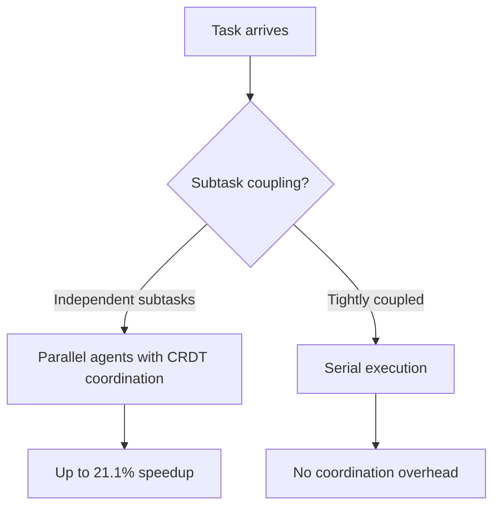

# Observation-Driven Coordination: CRDT-Based Parallel Agent Code Generation

> CRDT-based shared state enables lock-free concurrent code generation with zero structural merge conflicts, but parallel speedup depends entirely on task structure — tightly-coupled tasks are slower in parallel than in serial.

## The coordination overhead problem

Multi-agent code generation systems often miss the parallel speedups they expect, because coordination overhead eats the gains. Agents have to share state by passing messages, acquiring locks, and resolving conflicts. That coordination cost can exceed the time parallelism saves. [arXiv:2510.18893](https://arxiv.org/abs/2510.18893) (CodeCRDT) tests this across 600 trials.

## CRDT-based shared state

Conflict-free Replicated Data Types (CRDTs) are data structures that take concurrent updates and converge deterministically. They need no locks, no conflict resolution steps, and no coordination messages ([Preguiça et al., 2018](https://arxiv.org/abs/1805.06358)). Agents observe the shared CRDT state and make local updates. The CRDT guarantees every replica converges to the same final state, whatever order the updates arrive in.

In the coding context:

- The shared workspace (files, AST fragments, symbol tables) is one CRDT
- Agents observe updates as they arrive, with no polling and no explicit synchronization
- When two agents change non-overlapping parts of the codebase, both updates apply cleanly
- When they change overlapping parts, the CRDT's convergence rules produce a deterministic result

## Key results from 600 trials

Zero merge failures. CRDT convergence guarantees that concurrent agent updates produce a structurally consistent combined state. Message-passing systems pile up merge failures as concurrency rises.

A semantic conflict rate of 5 to 10%. Structural conflicts (two agents edit the same line) are rare, and the CRDT resolves them. Semantic conflicts (two agents make structurally compatible but functionally incompatible changes) occur in 5 to 10% of parallel sessions, and the CRDT cannot resolve them automatically.

Speedup depends on the task:

- Up to 21.1% faster on tasks with parallelizable subtasks
- Up to 39.4% slower on tightly-coupled tasks

Parallel agents on interdependent code produce more semantic conflicts and rework than one serial agent that handles dependencies in order.

## The task structure decision


```mermaid
graph TD
    A[Task arrives] --> B{Subtask coupling?}
    B -->|Independent subtasks| C[Parallel agents with CRDT coordination]
    B -->|Tightly coupled| D[Serial execution]
    C --> E[Up to 21.1% speedup]
    D --> F[No coordination overhead]
```

Parallelizing tasks with tight internal dependencies is worse than running them serially. You get more semantic conflicts and more rework.

Signals of parallelizable structure:

- Subtasks operate on separate files or modules
- You can test each subtask's output on its own
- Subtask A does not create symbols that subtask B consumes

Signals of tightly-coupled structure:

- Subtasks share mutable data structures
- One subtask's output is another's input
- The task needs consistent cross-module naming or interface design

## Explicit message passing vs observation

The study compares CRDT-based observation with explicit message passing between agents:

| Mechanism | Coordination overhead | Merge failures | Speedup potential |
|---|---|---|---|
| Explicit message passing | High | Yes | Eliminated by overhead |
| CRDT observation | Near-zero | None (structural) | Up to 21.1% |

Message passing makes each agent serialize state, send it to peers, wait for acknowledgment, and process replies. That overhead grows with agent count. CRDT updates spread as a side effect of normal execution.

## When this backfires

The 21.1% speedup is a ceiling, not an average. Several conditions flip the trade-off:

- Implementation cost outweighs the gain. A CRDT runtime (state representation, observation hooks, AST and file convergence rules) takes real work to build. If most tasks in a codebase have implicit coupling (shared types, config, naming), the parallelizable share may not pay back the build cost.
- Semantic conflict resolution is still bespoke. The 5 to 10% semantic conflict rate forces a separate resolution layer. CRDTs remove structural merges, not the merge problem.
- Scaling beyond small fleets is unverified. The [CodeCRDT paper](https://arxiv.org/abs/2510.18893) measures 5-agent stress tests, and does not characterize behavior at 10 or more agents.
- Generalization beyond the evaluated stack is open. The study used TypeScript and React. Whether the result transfers to typed compilers, generated code, or schema migrations is not established.

Where the parallelizable task share is small, simpler patterns may give you more than a CRDT-backed workspace. Orchestrator-worker on isolated worktrees, or plain serial execution, often wins.

## Implication for architecture

Parallel agent architectures should do four things:

1. Classify task coupling before routing. Measure subtask dependency, and do not default to parallel execution.
2. Use observation-driven coordination rather than message passing for parallel subtasks. The coordination overhead difference is decisive.
3. Route tightly-coupled tasks to serial execution. A 39.4% slowdown is not a marginal penalty; it makes parallel architectures counterproductive for the wrong task types.
4. Accept that semantic conflicts will happen. The 5 to 10% semantic conflict rate at this level of parallelism needs a resolution step, whether automated or human review.

## Key Takeaways

- CRDT-based shared state delivers zero structural merge failures in concurrent code generation
- Semantic conflicts (5–10% of sessions) require resolution beyond CRDT convergence
- Speedup is task-dependent: up to 21.1% for independent subtasks, up to 39.4% slowdown for tightly-coupled ones
- Observation-driven coordination outperforms message passing by eliminating round-trip overhead
- Only parallelize tasks with demonstrably independent subtask structure

## Example

A two-agent code generation system using CRDT-based coordination:

```python
# Classify task coupling before routing
def route_task(task):
    subtasks = decompose(task)
    coupling = measure_coupling(subtasks)  # shared symbols, cross-module refs

    if coupling == "independent":
        # Parallel agents with CRDT-backed shared workspace
        workspace = CRDTWorkspace()  # shared AST, symbol table, file state
        agents = [CodeAgent(workspace) for _ in subtasks]
        results = run_parallel(agents, subtasks)
        # CRDT convergence guarantees structural consistency
        return workspace.merged_state()
    else:
        # Serial execution — no coordination overhead
        return run_serial(subtasks)

# Agents observe workspace updates passively — no polling or explicit sync
class CodeAgent:
    def __init__(self, workspace: CRDTWorkspace):
        self.workspace = workspace

    def execute(self, subtask):
        state = self.workspace.observe()
        changes = generate_code(subtask, state)
        # Local update propagates automatically; CRDT resolves concurrent edits
        self.workspace.apply(changes)
```

When to parallelize:

- `subtask_a` writes `utils/parser.py`; `subtask_b` writes `utils/formatter.py` — no shared symbols, so parallel
- `subtask_a` defines `class Config`; `subtask_b` imports `Config` — shared symbol, so serial

## Related

- [Fan-Out Synthesis Pattern](fan-out-synthesis.md)
- [File-Based Agent Coordination](file-based-agent-coordination.md)
- [Worktree Isolation](../workflows/worktree-isolation.md)
- [Orchestrator-Worker Pattern](orchestrator-worker.md)
- [Multi-Agent Topology Taxonomy](multi-agent-topology-taxonomy.md)
- [Sub-Agents Fan-Out](sub-agents-fan-out.md)
- [Staggered Agent Launch](staggered-agent-launch.md)
- [Parallel Agent Sessions](../workflows/parallel-agent-sessions.md)
