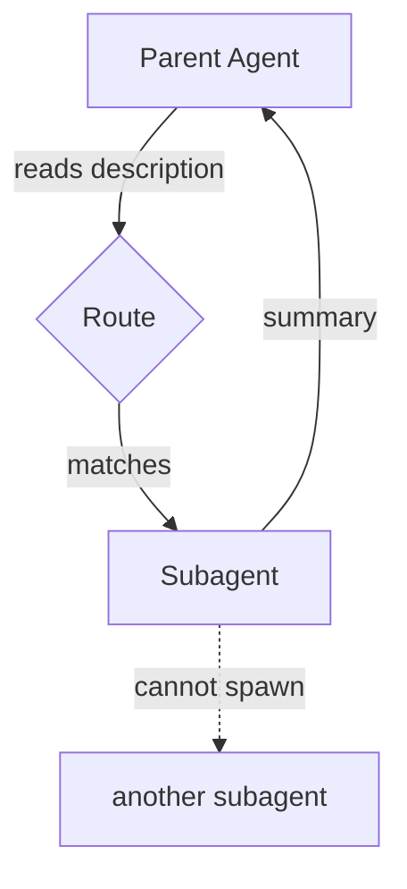

# Cross-Tool Subagent Comparison

> Three terminal agents now ship subagents as a first-class primitive. The definition format converges on Markdown plus YAML frontmatter; the isolation model, tool scoping, and composition semantics diverge in ways that matter when moving agents between tools.

[Gemini CLI v0.38.1 shipped subagents](https://github.com/google-gemini/gemini-cli/blob/main/docs/core/subagents.md) in April 2026, joining [Claude Code](https://code.claude.com/docs/en/sub-agents) and [GitHub Copilot CLI](https://github.blog/changelog/2025-10-28-github-copilot-cli-use-custom-agents-and-delegate-to-copilot-coding-agent/). All three use Markdown plus YAML frontmatter, route delegation through `description`, and cap recursion at one level. The deltas in isolation, tool scoping, and composition determine portability.

## The Shared Model

| | Claude Code | Gemini CLI | Copilot CLI |
|---|---|---|---|
| Project path | `.claude/agents/*.md` | `.gemini/agents/*.md` | `.github/agents/*.agent.md` |
| User path | `~/.claude/agents/*.md` | `~/.gemini/agents/*.md` | `~/.copilot/agents/*.agent.md` |
| Required frontmatter | `name`, `description` | `name`, `description` | `description` (name = filename) |
| Delegation signal | `description` match | `description` match | `description` + tool-surfaced |
| Explicit invocation | by name in prompt | `@agent-name` | `/agent <name>` |
| Recursion depth | 1 | 1 (guard even with wildcard tools) | 1 |

Sources: [Claude Code sub-agents](https://code.claude.com/docs/en/sub-agents), [Gemini CLI subagents](https://github.com/google-gemini/gemini-cli/blob/main/docs/core/subagents.md), [Copilot CLI changelog](https://github.blog/changelog/2025-10-28-github-copilot-cli-use-custom-agents-and-delegate-to-copilot-coding-agent/).

No tool lets a subagent spawn another subagent. Gemini CLI enforces this even when `tools: ['*']` is granted. Claude Code's Plan subagent exists because the guard forces single-layer delegation and plan mode needed an in-session researcher.

## Context Isolation

Every subagent runs in its own context window; the parent receives only a summary.

- **Claude Code** — subagent starts in the parent's working directory and `cd` does not leak back ([docs](https://code.claude.com/docs/en/sub-agents)). `isolation: worktree` gives the subagent a disposable git worktree, auto-cleaned if no changes land.
- **Gemini CLI** — separate context loop, separate system prompt, persona, tools, and MCP servers; the subagent "reports back to the main agent with its findings" ([docs](https://github.com/google-gemini/gemini-cli/blob/main/docs/core/subagents.md)).
- **Copilot CLI** — temporary subagent per invocation, torn down after it returns ([docs](https://github.blog/changelog/2025-10-28-github-copilot-cli-use-custom-agents-and-delegate-to-copilot-coding-agent/)).

Only Claude Code offers file-level isolation beyond context isolation.

## Tool Scoping

Scoping diverges most.

**Claude Code** uses `tools` (allowlist) plus `disallowedTools` (denylist); denylist resolves first, then allowlist ([docs](https://code.claude.com/docs/en/sub-agents)). Omitting both inherits all parent tools.

```yaml
tools: Read, Grep, Glob, Bash     # allowlist
disallowedTools: Write, Edit      # denylist (inherits everything else)
```

**Gemini CLI** uses a single `tools` array with wildcard syntax ([docs](https://github.com/google-gemini/gemini-cli/blob/main/docs/core/subagents.md)):

```yaml
tools:
  - "*"                          # all built-in and discovered tools
  - "mcp_*"                      # all tools from all MCP servers
  - "mcp_my-server_*"            # all tools from one server
  - read_file                    # explicit named tool
```

Omitting `tools` inherits every tool from the parent session.

**Copilot CLI** uses a single `tools` array — `["*"]` for all, or explicit tool names and MCP tool paths ([docs](https://github.com/github/copilot-cli-for-beginners/blob/main/04-agents-custom-instructions/README.md)). MCP servers declare inline with command, args, env, and secret bindings.

```yaml
tools: ['read', 'edit', 'search', 'custom-mcp/tool-1']
mcp-servers:
  custom-mcp:
    type: local
    command: some-command
    env:
      API_KEY: ${{ secrets.COPILOT_MCP_ENV_VAR_VALUE }}
```

All three allow scoping MCP servers to a single subagent, keeping server tool descriptions out of the parent context. Claude Code alone supports `skills:` preloading ([docs](https://code.claude.com/docs/en/sub-agents)) — the field injects full skill content into the subagent at startup, and subagents do not inherit skills from the parent.

## Composition and Delegation

Delegation is description-driven in all three tools — the parent reads each subagent's `description` and routes matching tasks.



Each tool adds a distinct primitive for deeper composition past the recursion cap: Claude Code [agent teams](https://code.claude.com/docs/en/agent-teams) (persistent coordinated agents across sessions), Copilot CLI `/fleet` (same task fanned across parallel subagents with convergence), Gemini CLI [remote subagents over A2A](https://github.com/google-gemini/gemini-cli/blob/main/docs/core/subagents.md) (delegation to processes outside the local CLI).

## Portability Implications

The common surface — `name`, `description`, `tools`, body-as-system-prompt — is large enough that a straight file copy between tools mostly works for simple research subagents. It breaks on tool-specific fields:

- Claude: `isolation`, `permissionMode`, `hooks`, `memory`, `skills`, `disallowedTools`, `effort`
- Gemini: `kind: remote`, `temperature`, `max_turns`, `timeout_mins`, and wildcard tool syntax
- Copilot: inline `mcp-servers` with GitHub secrets binding

Standardising on one tool makes this moot. The comparison matters when the same repo is accessed by Copilot in the IDE, Claude Code or Gemini CLI in the terminal, and a coding agent in CI. Portable: body, `description`, a shared-vocabulary tool list. Tool-specific: everything else.

Per-tool detail: [Claude Code Sub-Agents](../tools/claude/sub-agents.md), [Copilot Custom Agents](../tools/copilot/custom-agents-skills.md), [Gemini CLI Subagents](https://github.com/google-gemini/gemini-cli/blob/main/docs/core/subagents.md).

## When Not to Reach for a Subagent

Skip the subagent when:

- **Task is small and low-context** — spawning adds more latency than it saves when exploration would not have polluted the parent
- **Subtasks are interdependent** — when B needs A's output, fan-out collapses into two sequential phases and boundary cost dominates
- **Descriptions are vague** — all three tools route on `description` matching; unclear descriptions produce unused or misrouted subagents

A single-threaded main agent with disciplined [context engineering](../context-engineering/context-engineering.md) is often the better default. [Cognition's "Don't Build Multi-Agents"](https://cognition.ai/blog/dont-build-multi-agents) argues every handoff is lossy and synthesis across subagents confidently reconciles inconsistent views. The converged primitive is useful when isolation is the binding constraint — not by default.

## Key Takeaways

- All three terminal agents ship Markdown + YAML frontmatter subagents with `name`/`description` delegation and one-level recursion caps
- Isolation semantics are shared (separate context window, summary return); only Claude Code offers file-level isolation via `isolation: worktree`
- Tool scoping diverges: Claude uses allowlist+denylist, Gemini uses wildcards, Copilot uses explicit lists with inline MCP
- Composition beyond one level requires distinct primitives in each tool: Claude agent teams, Copilot `/fleet`, Gemini A2A remote subagents
- Body, description, and a shared tool list are portable across tools; `isolation`, `permissionMode`, `temperature`, `timeout_mins`, and MCP binding are not

## Related

- [Sub-Agents for Fan-Out Research and Context Isolation](sub-agents-fan-out.md)
- [Orchestrator-Worker Pattern](orchestrator-worker.md)
- [Subagent Schema-Level Tool Filtering](subagent-schema-level-tool-filtering.md)
- [Claude Code Sub-Agents](../tools/claude/sub-agents.md)
- [Claude Code Agent Teams](../tools/claude/agent-teams.md)
- [Copilot Custom Agents and Skills](../tools/copilot/custom-agents-skills.md)
- [Cross-Tool Translation](../human/cross-tool-translation.md)
