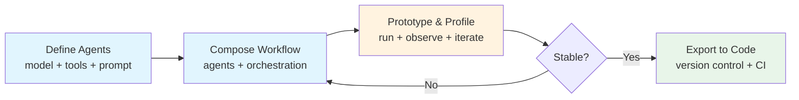

# Declarative Multi-Agent Composition

> Define agents and their coordination as structured data — models, tools, memory, and orchestration rules — then compose them into workflows through explicit wiring rather than imperative code.

## Why Declarative

Imperative multi-agent code tangles three concerns: agent capabilities, coordination logic, and runtime behavior. When a workflow fails, the developer must trace through code to determine whether the problem is a misconfigured agent, a wrong handoff, or a runtime error. Declarative specs separate these layers.

A declarative agent definition captures the **what** (which model, which tools, which memory) without encoding the **how** (framework internals, API call sequences, retry logic). This separation makes agent configurations:

- **Inspectable** — the full agent spec is readable without running anything
- **Diffable** — changes between workflow versions show up as structured data changes, not code refactors
- **Portable** — the same spec can drive a visual builder, a CLI, or a CI pipeline

## The Define-and-Compose Pattern

The [AutoGen Studio research](https://arxiv.org/abs/2408.15247) (EMNLP 2024), drawing on 200,000+ installations and 135+ user-reported issues, identified **define-and-compose** as the dominant workflow authoring pattern across multi-agent developer tooling.

The pattern has two phases:

**Define** — create each component independently with explicit parameters:

```json
{
  "agent": {
    "name": "code-reviewer",
    "model": "claude-sonnet-4-20250514",
    "tools": ["read_file", "grep", "git_diff"],
    "system_prompt": "You review code changes for correctness and style.",
    "max_tokens": 4096
  }
}
```

**Compose** — wire agents into a workflow by specifying coordination, not implementation:

```json
{
  "workflow": {
    "name": "review-pipeline",
    "agents": ["code-reviewer", "security-auditor", "test-verifier"],
    "orchestration": "sequential",
    "handoff": { "format": "structured-json", "fields": ["verdict", "issues", "notes"] }
  }
}
```

This mirrors how production teams already think about agent systems — roles first, then coordination — but makes the structure machine-readable.

## Built-In Profiling Changes the Debugging Model

Multi-agent workflows fail in ways that single-agent systems do not: coordination failures, context loss at handoffs, and cascading errors across agents. The AutoGen Studio research found that **debugging and sensemaking tools** were the second most requested capability, confirming that multi-agent systems need observability built into the composition layer, not bolted on after.

Effective multi-agent profiling surfaces:

- **Token cost per agent** — identifies which agents consume disproportionate context
- **Tool invocation frequency and success rate** — reveals agents that call tools repeatedly without progress (see [Loop Detection](../observability/loop-detection.md))
- **Message flow between agents** — traces the actual coordination path versus the intended one
- **Per-agent timing** — exposes bottleneck agents in sequential workflows

When agent definitions are declarative, the runtime can instrument every agent boundary automatically. Imperative code requires manual instrumentation at each handoff point.

## The Export-to-Code Path

A recurring lesson from the AutoGen Studio user base: visual/declarative tools are useful for prototyping, but production deployments need code. The pattern that works is **declarative-first, code-second**:

1. **Prototype** in declarative format — fast iteration, visual feedback
2. **Validate** with built-in profiling — catch coordination issues early
3. **Export** to code when the workflow is stable — full control, version-controlled, testable

This avoids the [Framework-First anti-pattern](../anti-patterns/framework-first.md) by starting with explicit specifications rather than opaque abstractions. The declarative layer forces every design decision to be visible before any framework code runs.

## When Declarative Composition Breaks Down

Declarative specs work well for **static workflows** — fixed agent sets with known coordination patterns. They struggle with:

- **Dynamic agent creation** — workflows that spawn agents based on runtime conditions need imperative escape hatches
- **Complex conditional routing** — "if the reviewer finds security issues, spawn a security specialist" is awkward in pure JSON
- **Shared mutable state** — agents that need to read and write shared context during execution require runtime coordination beyond what a static spec captures

The practical boundary: use declarative composition for the workflow skeleton, imperative code for runtime adaptation.



## Key Takeaways

- Define agents as structured data (model, tools, memory, prompt) before writing coordination code
- Compose workflows by wiring agent definitions, not by coding agent interactions
- Build profiling into the composition layer — multi-agent debugging requires per-agent observability from the start
- Use declarative specs for prototyping and validation; export to code for production
- Cross-reference coordination issues with [Agent Handoff Protocols](agent-handoff-protocols.md) — declarative composition defines the workflow structure, handoff protocols define what flows between stages

## Related

- [Agent Handoff Protocols](agent-handoff-protocols.md) — structured contracts between pipeline stages
- [Multi-Agent Topology Taxonomy](multi-agent-topology-taxonomy.md) — choosing the right coordination structure
- [Framework-First Development](../anti-patterns/framework-first.md) — why starting with frameworks before understanding the raw API is risky
- [Agent Debugging](../observability/agent-debugging.md) — diagnosing bad output in single-agent systems
- [Loop Detection](../observability/loop-detection.md) — detecting agents stuck in unproductive cycles
- [OpenTelemetry for Agent Observability](../standards/opentelemetry-agent-observability.md) — standardized observability for agent systems

## Unverified Claims

- The claim that 200,000+ AutoGen Studio installations validate the define-and-compose pattern assumes download count correlates with successful workflow authoring — adoption data alone does not confirm the pattern produces better outcomes than code-first approaches
- Whether declarative agent specs meaningfully reduce debugging time compared to well-structured imperative code has not been measured in controlled studies
