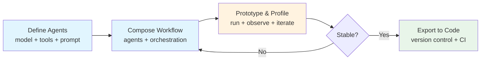

# Declarative Multi-Agent Composition

> Declarative composition defines agents and their coordination as structured data, then wires them into workflows explicitly rather than through imperative code.

## Why declarative

Imperative multi-agent code tangles three things together: agent capabilities, coordination logic, and runtime behavior. When a workflow fails, you have to trace through code to tell a misconfigured agent from a wrong [handoff](agent-handoff-protocols.md) or a runtime error. Declarative specs separate these layers.

A declarative definition captures what an agent is (model, tools, memory) without encoding how it runs (framework internals, API call sequences, retry logic). This makes agent configurations:

- inspectable — you can read the full agent spec without running anything
- diffable — changes between workflow versions show up as structured data changes, not code refactors
- portable — the same spec can drive a visual builder, a CLI, or a CI pipeline

## The define-and-compose pattern

The [AutoGen Studio research](https://arxiv.org/abs/2408.15247) (EMNLP 2024) drew on more than 200,000 installations and 135 user-reported issues. It identified define-and-compose as the most common way developers author workflows across multi-agent tooling.

The pattern has two phases.

Define each component on its own, with explicit parameters:

```json
{
  "agent": {
    "name": "code-reviewer",
    "model": "claude-sonnet-4-20250514",
    "tools": ["read_file", "grep", "git_diff"],
    "system_prompt": "You review code changes for correctness and style.",
    "max_tokens": 4096
  }
}
```

Compose the agents into a workflow by stating coordination, not implementation:

```json
{
  "workflow": {
    "name": "review-pipeline",
    "agents": ["code-reviewer", "security-auditor", "test-verifier"],
    "orchestration": "sequential",
    "handoff": { "format": "structured-json", "fields": ["verdict", "issues", "notes"] }
  }
}
```

This mirrors how production teams already think — roles first, then coordination — but makes the structure machine-readable.

## Built-in profiling changes the debugging model

Multi-agent workflows fail in ways single-agent systems do not: coordination failures, context loss at handoffs, and cascading errors across agents. The AutoGen Studio research found that debugging and sensemaking tools were a critical, frequently requested capability. Multi-agent systems need observability built into the composition layer, not bolted on after.

Good multi-agent profiling shows you:

- token cost per agent — which agents consume far more context than the rest
- tool invocation frequency and success rate — agents that call tools repeatedly without progress (see [loop detection](../observability/loop-detection.md))
- message flow between agents — the actual coordination path against the one you intended
- per-agent timing — the bottleneck agents in sequential workflows

These per-agent attributes map directly to the [OpenTelemetry GenAI agent span conventions](https://opentelemetry.io/docs/specs/semconv/gen-ai/gen-ai-agent-spans/), which standardize `invoke_agent` spans with token-usage, tool-call, and timing attributes for each agent invocation. When agent definitions are declarative, the runtime can emit those spans at every agent boundary automatically. Imperative code makes you instrument each handoff point by hand.

## The export-to-code path

Visual and declarative tools work for prototyping, but production deployments need code. The pattern that works is declarative first, code second:

1. Prototype in declarative format. You get fast iteration and visual feedback.
2. Validate with built-in profiling. You catch coordination issues early.
3. Export to code once the workflow is stable. You get full control, version control, and testable artifacts.

This avoids the [framework-first anti-pattern](../anti-patterns/framework-first.md): you start with explicit specifications rather than opaque abstractions.

## When declarative composition breaks down

Declarative specs work well for static workflows — fixed agent sets with known coordination patterns. They struggle with:

- dynamic agent creation — workflows that spawn agents based on runtime conditions need imperative escape hatches
- complex conditional routing — "if the reviewer finds security issues, spawn a security specialist" is awkward in pure JSON
- shared mutable state — agents that read and write shared context during a run need runtime coordination beyond what a static spec captures

The practical boundary: use declarative composition for the workflow skeleton, imperative code for runtime adaptation.


```mermaid
graph LR
    A[Define Agents<br/>model + tools + prompt] --> B[Compose Workflow<br/>agents + orchestration]
    B --> C[Prototype & Profile<br/>run + observe + iterate]
    C --> D{Stable?}
    D -- No --> B
    D -- Yes --> E[Export to Code<br/>version control + CI]

    style A fill:#e1f5fe
    style B fill:#e1f5fe
    style C fill:#fff3e0
    style E fill:#e8f5e9
```

## Example

A CI pipeline that reviews pull requests using three agents defined declaratively and composed into a sequential workflow:

```yaml
agents:
  code-reviewer:
    model: claude-sonnet-4-20250514
    tools: [read_file, git_diff]
    prompt: "Review code changes for correctness and style violations."
    max_tokens: 4096

  security-scanner:
    model: claude-sonnet-4-20250514
    tools: [read_file, grep, semgrep_run]
    prompt: "Scan changed files for security vulnerabilities."
    max_tokens: 4096

  test-verifier:
    model: claude-sonnet-4-20250514
    tools: [run_tests, read_file]
    prompt: "Verify that existing tests pass and new code has coverage."
    max_tokens: 2048

workflow:
  name: pr-review-pipeline
  orchestration: sequential
  stages:
    - agent: code-reviewer
      output: { verdict: string, issues: list }
    - agent: security-scanner
      output: { vulnerabilities: list, severity: string }
    - agent: test-verifier
      output: { passed: bool, coverage_delta: number }
  final_gate:
    approve_if: "all(stage.verdict != 'reject' for stage in stages)"
```

Adding a fourth agent requires one new block under `agents:` and one new entry under `stages:` — no coordination code changes. The runtime instruments each stage boundary automatically, producing per-agent token counts and timing without manual instrumentation.

## Key Takeaways

- Define agents as structured data (model, tools, memory, prompt) before writing coordination code
- Compose workflows by wiring agent definitions, not by coding agent interactions
- Build profiling into the composition layer — multi-agent debugging requires per-agent observability from the start
- Use declarative specs for prototyping and validation; export to code for production
- Cross-reference coordination issues with [Agent Handoff Protocols](agent-handoff-protocols.md) — handoff protocols define what flows between declarative stages

## Related

- [Agent Handoff Protocols](agent-handoff-protocols.md) — structured contracts between pipeline stages
- [Declarative Multi-Agent Topology: Topology-as-Code](declarative-multi-agent-topology.md) — the broader topology-as-code variant covering the whole agent graph
- [Multi-Agent Topology Taxonomy](multi-agent-topology-taxonomy.md) — choosing the right coordination structure
- [Framework-First Development](../anti-patterns/framework-first.md) — why starting with frameworks before understanding the raw API is risky
- [Loop Detection](../observability/loop-detection.md) — detecting agents stuck in unproductive cycles
- [OpenTelemetry for Agent Observability](../standards/opentelemetry-agent-observability.md) — standardized observability for agent systems
- [Orchestrator-Worker](orchestrator-worker.md) — the most common multi-agent coordination topology
- [Subagent Schema-Level Tool Filtering](subagent-schema-level-tool-filtering.md) — declarative specs for constraining subagent tool access

