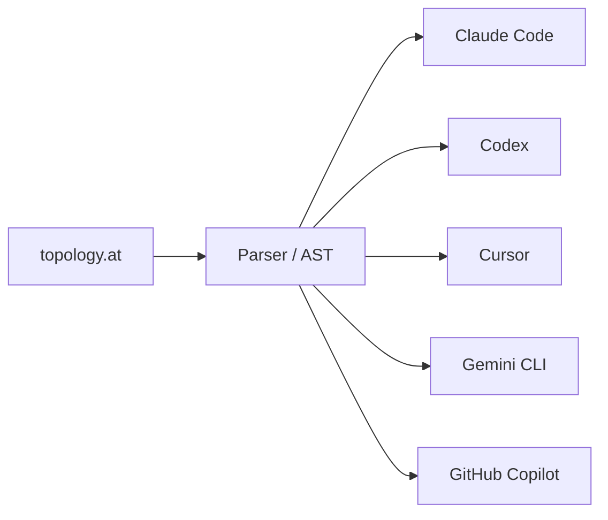

<!-- source: nibzard/awesome-agentic-patterns (Apache 2.0, https://github.com/nibzard/awesome-agentic-patterns) — retain attribution per license -->

# Declarative Multi-Agent Topology: Topology-as-Code

> Encode an entire agent graph — agents, flows, gates, hooks, and group chats — in a single declarative file that a compiler targets to any underlying framework, making the topology auditable, portable, and reusable.

## The Problem

Multi-agent systems built imperatively scatter orchestration logic across framework-specific code. Relationships between agents are implicit. Switching frameworks means rewriting coordination logic, not just adapting configs. The topology is not a reviewable artifact — it is an emergent property of the code.

Topology-as-code addresses this by separating graph structure from runtime implementation. The topology file is the single source of truth; a compiler emits the framework-specific code or configuration.

## Five Core Primitives

The pattern builds on five building blocks, documented in the [nibzard/awesome-agentic-patterns catalog](https://github.com/nibzard/awesome-agentic-patterns/blob/main/patterns/declarative-multi-agent-topology-definition.md):

| Primitive | What it defines |
|-----------|----------------|
| **Agents** | Name, model, role, tools, operational constraints |
| **Flows** | Directed connections — pipelines, fan-out, fan-in, cycles |
| **Gates** | Approval checkpoints — human, automated, or conditional |
| **Hooks** | Lifecycle callbacks — pre-run, post-run, on-error |
| **Group chats** | Multi-agent conversation protocols with turn-taking rules |

Together these five elements describe the full graph: who the agents are, how work moves between them, where it stops for review, what fires on lifecycle events, and how agents converse.

## Compilation Model

A compiler reads the topology file, parses it into an abstract syntax tree, and emits platform-specific outputs:



Each emitted output is a native config or scaffold for the target runtime. Translation is lossy — not every platform exposes all five primitives, so the declarative file represents the intended topology and the compiler approximates it per target.

## Reference Implementation

[AgenTopology](https://github.com/agentopology/agentopology) (Apache 2.0) implements this pattern with:

- `.at` file syntax for declaring topology
- Multi-platform scaffolding targeting Claude Code, Codex, Cursor, Gemini CLI, Copilot, and Kiro
- Interactive visualizer rendering the graph
- Validation engine with 82+ built-in rules
- Claude Code skill interface for natural-language topology design

At time of writing: 75 GitHub stars, 84 commits. The project is early-stage; the ecosystem is emerging. Adapter fidelity across target platforms has not been independently verified — the project states adapters are "ground-truth validated against real-world configs" but does not enumerate per-platform feature gaps; evaluate against your target runtime before adopting.

## How This Differs from Related Patterns

This pattern is distinct from three related pages on this site:

| Pattern | Scope | Unit |
|---------|-------|------|
| [Declarative Multi-Agent Composition](declarative-multi-agent-composition.md) | Define agents and workflows as structured data within a framework | Single workflow spec |
| [Portable Agent Definitions](../standards/portable-agent-definitions.md) | Package a single agent's identity, tools, and compliance as a portable artifact | Individual agent |
| [Multi-Agent Topology Taxonomy](multi-agent-topology-taxonomy.md) | Which topology (centralised, decentralised, hybrid) to choose | Decision guide |
| **Topology-as-code** | Encode the entire graph — agents + relationships + gates — as a portable, compilable artifact | Whole system |

## Trade-offs

| Benefit | Cost |
|---------|------|
| One topology definition targets multiple frameworks | New syntax to learn — DSL on top of existing frameworks |
| Graph is visible and reviewable in one file | Abstraction ceiling — platform-specific features may not map cleanly |
| Gates and permissions are explicit and version-controlled | Compiler quality varies; adapter fidelity depends on maintenance |
| Common patterns (pipeline, fan-out, supervisor) become reusable templates | Ecosystem immaturity — limited tooling and community support as of 2025–2026 |
| Topology file is documentation — readable without running anything | Mismatch risk — emitted code can diverge from topology intent when adapters lag framework updates |

## Example

A two-agent code-review topology with a human approval gate, illustrating the five-primitive structure. The schema below is representative of the pattern — exact `.at` syntax varies by implementation:

```yaml
agents:
  reviewer:
    model: claude-sonnet-4
    role: "Review code changes for correctness and style."
    tools: [read_file, git_diff]

  security-scanner:
    model: claude-sonnet-4
    role: "Scan changed files for security vulnerabilities."
    tools: [read_file, grep, semgrep_run]

flows:
  - from: reviewer
    to: security-scanner
    type: parallel

  - from: [reviewer, security-scanner]
    to: gate:human-approval
    type: fan-in

gates:
  human-approval:
    type: human
    message: "Review both agents' findings before merging."
```

Running the compiler against this file emits platform-specific configs for each target. Adding a third agent requires one new block under `agents:` and one new entry under `flows:` — no coordination code changes.

## Key Takeaways

- Topology-as-code separates graph structure from runtime implementation — the topology file is the reviewable artifact, not the emitted code
- Five primitives cover the full graph: agents, flows, gates, hooks, group chats
- A compiler targets the same topology at multiple frameworks, but translation is lossy — adapters approximate the intent
- Gates encoded in the topology file keep approval checkpoints explicit and version-controlled
- The pattern is sound; the ecosystem is early-stage — evaluate implementations against your target platforms before committing

## Related

- [Declarative Multi-Agent Composition](declarative-multi-agent-composition.md) — define agents and workflows as structured data within a single framework
- [Multi-Agent Topology Taxonomy](multi-agent-topology-taxonomy.md) — choosing between centralised, decentralised, and hybrid topologies
- [Portable Agent Definitions](../standards/portable-agent-definitions.md) — packaging individual agent identity as a portable, version-controlled artifact
- [Agent Handoff Protocols](agent-handoff-protocols.md) — typed contracts between pipeline stages that flows enforce
- [Subagent Schema-Level Tool Filtering](subagent-schema-level-tool-filtering.md) — declarative constraints on subagent tool access
- [Fan-Out Synthesis Pattern](fan-out-synthesis.md) — parallel agent execution that flows can encode
