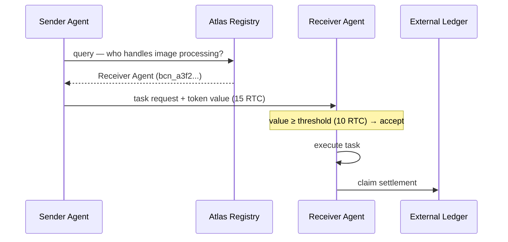

# Economic Value Signaling in Multi-Agent Networks

> Attach economic signals to inter-agent messages so agents self-sort by task priority without a central scheduler.

## The Problem

Standard message queues treat all requests equally. In a large multi-agent network running many concurrent tasks, this causes priority inversion: low-value work blocks high-value work, and agents have no signal for where to focus capacity. A central scheduler solves this but adds infrastructure complexity and a coordination bottleneck.

Economic value signaling addresses the problem by encoding priority directly in the message.

## Mechanism

Each inter-agent request carries an optional token value alongside its payload. Receiving agents sort incoming work by value level; application logic can implement a minimum value threshold below which work is queued or declined. Higher-value requests float to the top of each agent's work queue without any coordinator managing the ordering.

The pattern has three components:

**Value-bearing messages** — The sender attaches a token amount to the request. The value signals urgency or importance, functioning as a scheduling hint. Agents receiving multiple concurrent requests process higher-value ones first. Threshold-based filtering (accepting only work above a floor value) is implemented at the application layer by each receiving agent.

**Peer registry (Atlas)** — A self-hostable discovery service where agents register their capabilities at startup and refresh every 10 minutes. Agents query it to find peers with the capabilities they need. Liveness is tracked: agents silent for 15+ minutes are flagged as concerning; 1+ hour silence marks them presumed dead. The registry handles discovery, not message routing.

**External ledger settlement** — Actual value transfer occurs on a shared external ledger. This eliminates bilateral trust: agents do not need prior relationships or shared accounts. Only task completion triggers settlement.



## Priority Thresholds

Each agent can be configured with a minimum value threshold. Requests below the threshold are either queued at low priority or declined outright. This gives agents market-based backpressure: when overloaded, raising the threshold sheds low-value work automatically. Threshold logic is implemented by the receiving agent; the Beacon protocol transmits the value but does not enforce a floor.

The threshold doubles as a routing mechanism. A sender can target only high-capability agents by offering a value above general thresholds, knowing lower-capability peers will pass on the request. This mirrors reserve-price mechanisms in multi-agent auction literature, where agents reject bids below a configurable floor — a well-studied pattern in market-based task allocation (Quinton et al., [2023](https://link.springer.com/article/10.1007/s10846-022-01803-0)).

## Trade-offs

| Aspect | Detail |
|--------|--------|
| No central scheduler | Priority emerges from values; no coordinator process required |
| Cross-org capable | External ledger settlement works between agents from different organizations |
| Incentive-compatible | Agents are economically motivated to complete high-value work |
| Pricing calibration required | If values don't reflect actual task priority, the signal degrades into noise |
| Registry dependency | Atlas is a soft dependency — agents still function if registry is stale, but peer discovery degrades |
| Early-stage maturity | The [Beacon framework](https://github.com/Scottcjn/beacon-skill) is the primary reference implementation; production adoption is limited |

## Contrast with Orchestrator-Worker

The [orchestrator-worker pattern](orchestrator-worker.md) assigns work through hierarchical control: a lead agent decomposes tasks and dispatches them to workers it manages directly. Economic value signaling is fully decentralized — no agent has authority over another. Agents advertise capabilities, senders choose peers based on registry data, and values determine execution priority. There is no decomposition step and no synthesis step; each value-bearing request is a complete unit of work.

Use orchestrator-worker when you control all agents in the system and need structured task decomposition. Use economic value signaling when agents are autonomous, potentially from different organizations, and priority ordering needs to emerge from business value rather than developer-assigned queue positions.

## Calibration

The signal is only useful when values reflect real priority. Two failure modes:

- **Inflation** — senders attach high values to all requests to guarantee fast service, collapsing the priority signal
- **Underpricing** — senders undervalue work to conserve tokens, causing genuinely important tasks to queue behind low-priority work

Effective deployments establish shared pricing conventions: a pricing table or organizational standard that maps task categories to value ranges. Without this, agents in the same network will use incompatible value scales.

## Example

A platform runs agents for data ingestion, analysis, and reporting. Ingestion tasks are cheap and frequent; report generation is rare but time-sensitive. Without value signaling, ingestion tasks fill agent queues and delay reports.

With value signaling:

```json
// Low-priority ingestion request
{
  "task": "ingest_batch",
  "payload": { "source": "s3://logs/2026-04-10" },
  "value_rtc": 2
}

// High-priority report request
{
  "task": "generate_report",
  "payload": { "report_id": "q1-exec-summary" },
  "value_rtc": 20
}
```

Analysis agents set a threshold of 5 RTC. Ingestion tasks (2 RTC) are queued or declined; report generation (20 RTC) is accepted immediately. No coordinator assigns priorities — the values do it.

## Key Takeaways

- Token values on messages create priority ordering without a central scheduler
- Minimum value thresholds give agents market-based backpressure against low-value load
- Atlas peer registry handles capability discovery; external ledger settlement removes bilateral trust requirements
- Pricing calibration is the critical operational concern — inflation or underpricing destroys the signal
- Pattern is best suited for large networks with heterogeneous agents and genuinely variable task priority

## Related

- [Orchestrator-Worker Pattern](orchestrator-worker.md)
- [Multi-Agent Topology Taxonomy](multi-agent-topology-taxonomy.md)
- [Staggered Agent Launch](staggered-agent-launch.md)
- [Agent Handoff Protocols](agent-handoff-protocols.md)
- [File-Based Agent Coordination](file-based-agent-coordination.md)
- [Bounded Batch Dispatch](bounded-batch-dispatch.md)
