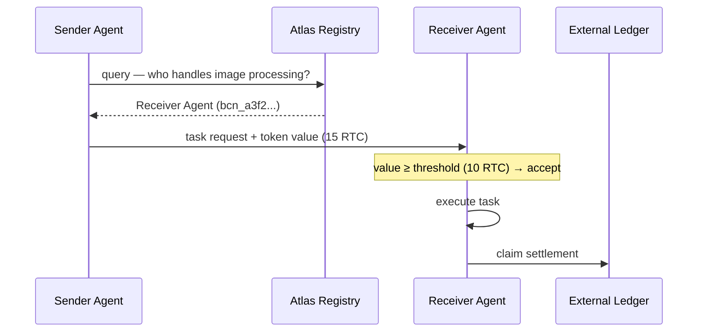

# Economic Value Signaling in Multi-Agent Networks

> Attach economic signals to inter-agent messages so agents self-sort by task priority without a central scheduler.

## The problem

Standard message queues treat all requests equally. In a large multi-agent network running many concurrent tasks, this causes priority inversion: low-value work blocks high-value work, and agents have no signal for where to focus capacity. A central scheduler (the [orchestrator-worker](orchestrator-worker.md) model) solves this but adds infrastructure complexity and a coordination bottleneck.

Economic value signaling fixes this by encoding priority directly in the message.

## Mechanism

Each inter-agent request carries an optional token value alongside its payload. Receiving agents sort incoming work by value. Each agent can set a minimum threshold, below which it queues or declines the work. Higher-value requests rise to the top of each agent's work queue, with no coordinator managing the order.

The pattern has three components:

Value-bearing messages carry a token amount that the sender attaches to the request, as defined by the [Beacon framework](https://github.com/Scottcjn/beacon-skill). The value signals urgency or importance and works as a scheduling hint. An agent that receives several requests at once processes the higher-value ones first. Each receiving agent filters at the application layer, accepting only work above a floor value.

The peer registry (Atlas) is a self-hostable discovery service. Agents register their capabilities at startup and refresh every 10 minutes. They query the registry to find peers with the capabilities they need. The registry tracks liveness: an agent silent for 15 or more minutes is flagged as concerning, and an hour or more of silence marks it presumed dead. The registry handles discovery, not message routing.

An external ledger settles the actual value transfer, as provided by the [Beacon framework](https://github.com/Scottcjn/beacon-skill). This removes the need for bilateral trust: agents need no prior relationship or shared account. Settlement happens only when a task completes.


```mermaid
sequenceDiagram
    participant S as Sender Agent
    participant A as Atlas Registry
    participant R as Receiver Agent
    participant L as External Ledger

    S->>A: query — who handles image processing?
    A-->>S: Receiver Agent (bcn_a3f2...)
    S->>R: task request + token value (15 RTC)
    Note over R: value ≥ threshold (10 RTC) → accept
    R->>R: execute task
    R->>L: claim settlement
```

## Priority thresholds

You can give each agent a minimum value threshold. The agent queues requests below the threshold at low priority, or declines them outright. This gives agents market-based [backpressure](../agent-design/agent-backpressure.md): when an agent is overloaded, raising the threshold sheds low-value work automatically. The receiving agent implements the threshold logic. The Beacon protocol transmits the value but does not enforce a floor.

The threshold doubles as a routing mechanism. A sender can target only high-capability agents by offering a value above general thresholds, knowing lower-capability peers will pass on the request. This mirrors reserve-price mechanisms in multi-agent auction literature, where agents reject bids below a configurable floor — a well-studied pattern in market-based task allocation (Quinton et al., [2023](https://link.springer.com/article/10.1007/s10846-022-01803-0)).

## Trade-offs

| Aspect | Detail |
|--------|--------|
| No central scheduler | Priority emerges from values; no coordinator process required |
| Cross-org capable | External ledger settlement works between agents from different organizations |
| Incentive-compatible | Agents are economically motivated to complete high-value work |
| Pricing calibration required | If values do not reflect actual task priority, the signal degrades into noise |
| Registry dependency | Atlas is a soft dependency — agents still function if registry is stale, but peer discovery degrades |
| Early-stage maturity | The [Beacon framework](https://github.com/Scottcjn/beacon-skill) is the primary reference implementation; production adoption is limited |

## Contrast with orchestrator-worker

The [orchestrator-worker pattern](orchestrator-worker.md) assigns work through hierarchical control: a lead agent decomposes tasks and dispatches them to workers it manages directly. Economic value signaling is fully decentralized — no agent has authority over another. Agents advertise capabilities, senders choose peers based on registry data, and values determine execution priority. There is no decomposition step and no [synthesis step](fan-out-synthesis.md). Each value-bearing request is a complete unit of work.

Use orchestrator-worker when you control all agents in the system and need structured task decomposition. Use economic value signaling when agents are autonomous, potentially from different organizations, and priority ordering needs to emerge from business value rather than developer-assigned queue positions.

## Calibration

The signal is only useful when values reflect real priority. Two failure modes:

- Inflation: senders attach high values to every request to guarantee fast service, which collapses the priority signal
- Underpricing: senders undervalue work to conserve tokens, so genuinely important tasks queue behind low-priority work

Effective deployments establish shared pricing conventions: a pricing table or organizational standard that maps task categories to value ranges. Without this, agents in the same network will use incompatible value scales.

## Example

A platform runs agents for data ingestion, analysis, and reporting. Ingestion tasks are cheap and frequent. Report generation is rare but time-sensitive. Without value signaling, ingestion tasks fill agent queues and delay reports.

With value signaling:

```json
// Low-priority ingestion request
{
  "task": "ingest_batch",
  "payload": { "source": "s3://logs/2026-04-10" },
  "value_rtc": 2
}

// High-priority report request
{
  "task": "generate_report",
  "payload": { "report_id": "q1-exec-summary" },
  "value_rtc": 20
}
```

Analysis agents set a threshold of 5 RTC. Ingestion tasks (2 RTC) are queued or declined. Report generation (20 RTC) is accepted immediately. No coordinator assigns priorities — the values do it.

## Key Takeaways

- Token values on messages create priority ordering without a central scheduler
- Minimum value thresholds give agents market-based backpressure against low-value load
- Atlas peer registry handles capability discovery; external ledger settlement removes bilateral trust requirements
- Pricing calibration is the critical operational concern — inflation or underpricing destroys the signal
- Pattern is best suited for large networks with heterogeneous agents and genuinely variable task priority

## Related

- [Orchestrator-Worker Pattern](orchestrator-worker.md)
- [Multi-Agent Topology Taxonomy](multi-agent-topology-taxonomy.md)
- [Staggered Agent Launch](staggered-agent-launch.md)
- [Agent Handoff Protocols](agent-handoff-protocols.md)
- [File-Based Agent Coordination](file-based-agent-coordination.md)
- [Bounded Batch Dispatch](bounded-batch-dispatch.md)
