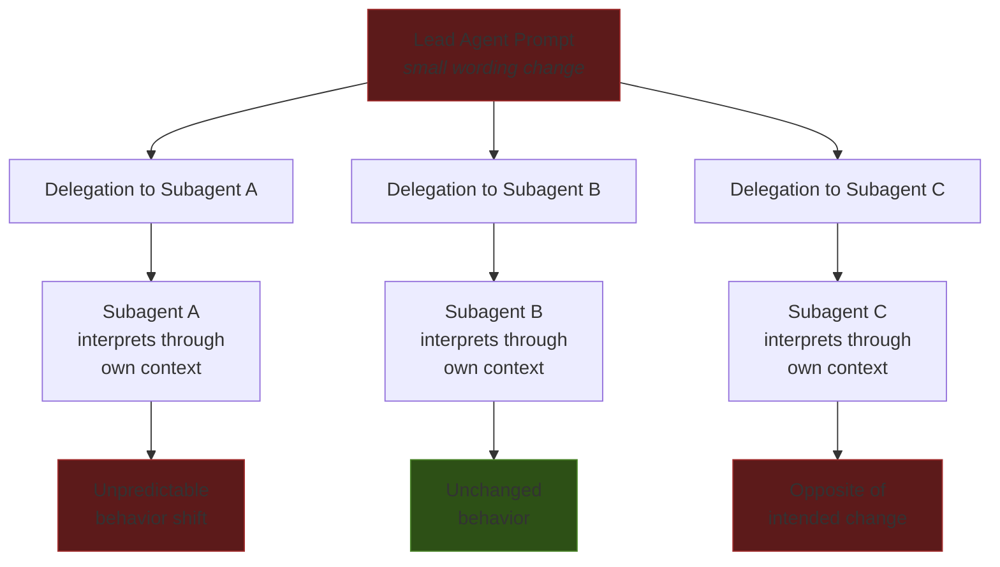

# Emergent Behavior Sensitivity

> Small changes to a lead agent's prompt unpredictably alter subagent behavior. Multi-agent prompts must be frameworks for collaboration, not rigid instructions.

## The Problem

Subagents receive only their own system prompt and the delegation message -- not the lead's full context. Minor wording changes in the lead's prompt cascade unpredictably. Anthropic observed this directly: "small changes to the lead agent can unpredictably change how subagents behave."

This is not a bug -- it is a property of systems where agents interpret instructions rather than execute them deterministically [unverified].

## Why Prescriptive Prompts Break

Rigid, step-by-step instructions create brittle multi-agent systems:

**Interpretation drift.** Each subagent filters delegation through its own context. A phrasing shift changes what the subagent infers about scope or priority -- without any explicit instruction changing.

**Cascade convergence.** In Anthropic's parallel C compiler project, agents on a monolithic task would "hit the same bug, fix that bug, and then overwrite each other's changes."

**Emergent over-scaling.** Without effort boundaries, Anthropic's research system "spawned 50 subagents for simple queries, scouring the web endlessly for nonexistent sources."

## Framework Prompts Over Prescriptive Prompts

Effective multi-agent prompts encode "heuristics rather than rigid rules" -- striking "a balance: specific enough to guide behavior effectively, yet flexible enough to provide the model with strong heuristics."

| Prompt Style | Characteristic | Cascade Behavior |
|---|---|---|
| **Prescriptive** | Step-by-step instructions, exact formats | Brittle -- small changes break downstream agents |
| **Framework** | Principles, effort budgets, heuristics | Resilient -- subagents adapt within boundaries |

A framework prompt defines division of labor, problem-solving heuristics, effort budgets, and quality criteria -- what "done" looks like, not how to get there.

## Mitigation Strategies

### Task granularity as isolation

Decompose monolithic tasks so each agent operates independently. Shared file or state dependencies let one agent's behavior change cascade to all others. The [oracle pattern](oracle-task-decomposition.md) preserves isolation.

### Explicit effort scaling

Embed resource budgets directly into prompts -- subagent count, search duration, and stopping conditions. Without them, agents infer scope from context and over- or under-invest. See [Heuristic-Based Effort Scaling](../agent-design/heuristic-effort-scaling.md).

### Cascade-aware testing

Measure end-to-end behavior when prompts change. Harness-level changes -- [loop detection](../observability/loop-detection.md), [pre-completion checklists](../verification/pre-completion-checklists.md), and prompt adjustments -- collectively produced a 13.7-point improvement [unverified].

### Distinguish prompt sensitivity from environmental noise

Infrastructure configuration alone can swing performance by 6+ percentage points [unverified]. Resource limits, network latency, and time-of-day effects mimic prompt sensitivity -- control for these before attributing behavior changes to a prompt edit.

## Example

A research agent system uses a lead agent that delegates search tasks to three subagents. The original prompt says: "Search for recent papers on transformer architectures."

A developer edits it to: "Thoroughly search for recent and comprehensive papers on transformer architectures and their applications."

**Prescriptive result:** Subagent A interprets "thoroughly" as exhaustive coverage and spawns 12 sub-searches. Subagent B treats "comprehensive" as a quality filter and narrows results to surveys only. Subagent C combines both signals and searches indefinitely. The lead receives three incompatible result sets.

**Framework result:** The lead prompt instead encodes: "Search for papers published in the last two years; return the 10 most-cited results; stop after 3 search iterations." Adding "thorough" language has no effect -- the effort budget caps behavior regardless of adjective choice.

The framework version is cascade-resistant: the same behavioral outcome emerges whether the prompt says "search" or "thoroughly search."

## Key Takeaways

- Small input changes produce disproportionate, unpredictable output changes [unverified]
- Subagents interpret delegation through their own context -- wording matters more than intent
- Framework prompts outperform prescriptive prompts for cascade resilience
- Task granularity is the primary isolation mechanism
- Evaluate changes end-to-end; individual agent correctness does not predict system behavior

## Unverified Claims

- The complex adaptive systems analogy is implied by sources but not explicitly drawn in any of them [unverified]
- Framework prompt resilience is supported by Anthropic's experience but not tested in controlled isolation [unverified]
- "Emergent behavior sensitivity" is a synthesis term, not established in the literature [unverified]

## Related

- [Instruction Compliance Ceiling](../instructions/instruction-compliance-ceiling.md)
- [Process Amplification](../human/process-amplification.md)
- [Orchestrator-Worker](orchestrator-worker.md)
- [Fan-Out Synthesis](fan-out-synthesis.md)
- [Harness Engineering](../agent-design/harness-engineering.md)
- [The Ralph Wiggum Loop](../agent-design/ralph-wiggum-loop.md)
- [Staggered Agent Launch](staggered-agent-launch.md)
- [Subagent Schema-Level Tool Filtering](subagent-schema-level-tool-filtering.md)
- [Multi-Agent Topology Taxonomy](multi-agent-topology-taxonomy.md)
- [Sub-Agents for Fan-Out](sub-agents-fan-out.md)
