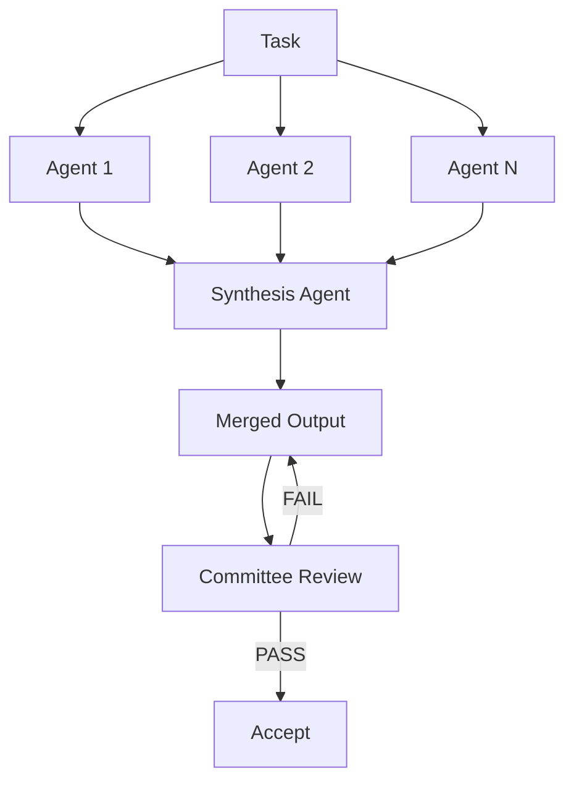

# Fan-Out Synthesis Pattern

> Spawn N independent agents to solve the same problem in parallel, then use a synthesis agent to merge the strongest elements from each attempt into a single output.

!!! note "Also known as"
    Fan-Out Pattern, Parallel Dispatch, Scatter-Gather. The fan-out-then-synthesize variant adds a dedicated merge step after parallel execution. See [Agent Composition Patterns](../agent-design/agent-composition-patterns.md), [Orchestrator-Worker](orchestrator-worker.md), and [Sub-Agents Fan-Out](sub-agents-fan-out.md).

## Structure

1. **Fan-out** — spawn N agents with identical instructions but independent contexts; each produces a distinct solution
2. **Synthesis** — a synthesis agent critiques all N outputs, scores them against defined criteria, and assembles a merged solution from the strongest parts
3. **Validation** — pass the merged output through a committee review loop before accepting

## Why Parallel Diversity Helps

A single agent commits to one set of decisions. Parallel agents with identical instructions but independent contexts explore different trade-offs, edge cases, and risks. Synthesis extracts the strongest element from each attempt and assembles a composite no single agent would have reached. Unlike majority voting, which picks the most popular answer, synthesis combines complementary strengths deliberately.

## Why It Works

The mechanism is ensemble variance reduction applied to generative outputs. A single LLM call samples the output distribution once; N independent calls sample N times with different starting conditions, covering more of the solution space. Synthesis selects the highest-quality elements from each sample — exploiting variance rather than averaging it away, analogous to ensemble methods in classical ML where combining diverse weak learners outperforms any individual learner ([Dietterich, 2000 — Ensemble Methods in Machine Learning](https://link.springer.com/chapter/10.1007/3-540-45014-9_1)). The key condition is genuine diversity: if agents converge, there is nothing to exploit.

## Diversity Mechanisms

Identical instructions do not guarantee identical outputs. To maximize spread:

- Vary **model temperature** between agent instances
- Vary **seed context** — give each agent a different starting reference
- Vary **system prompt emphasis** — one optimizes for brevity, another for robustness, a third for edge-case coverage

The goal is enough diversity for synthesis to find genuinely different approaches, not surface-level rephrasing.

## Synthesis Agent Responsibilities

The synthesis agent receives all N outputs and must:

- Score each against the evaluation criteria
- Identify which elements are strongest
- Produce a merged output that draws on those elements explicitly
- Document which source contributed each major decision

Synthesis is deliberate assembly, not summarization — the synthesizer must justify its choices.

## Cost Trade-Off

N parallel attempts cost N× compute. Worthwhile when:

- The task is high-stakes and errors are expensive to fix downstream
- Diversity of approach is genuinely valuable (design, architecture, creative output)
- Reducing iteration rounds justifies the upfront parallel cost

For routine, well-defined tasks, a single attempt usually suffices. [Anthropic's Building Effective Agents](https://www.anthropic.com/engineering/building-effective-agents) documents voting and the orchestrator-workers pattern as core parallelization strategies. Best-of-N research shows diminishing returns as N grows — quality gains compress while compute grows linearly, making N=3–5 the efficient range ([CarBoN: Calibrated Best-of-N Sampling](https://arxiv.org/abs/2510.15674)).

## When This Backfires

Fan-out synthesis adds cost and coordination overhead that becomes counterproductive in several conditions:

- **Conformity bias collapses diversity** — agents given the same prompt converge on the same confident-sounding approach rather than genuinely independent solutions. Multi-agent LLM failure research identifies this as a dominant failure mode: agents reward linguistic confidence over factual accuracy, producing a high-confidence answer that can be wrong ([Cemri et al., 2025](https://arxiv.org/abs/2503.13657)). Constrained solution spaces amplify it.
- **Weak synthesis agent** — if the synthesizer cannot judge which elements are strongest, the merge step introduces errors rather than removing them and can be worse than the best individual attempt. This is the highest-risk component.
- **Diminishing returns at high N** — quality gains compress as N grows while compute grows linearly ([CarBoN, 2025](https://arxiv.org/abs/2510.15674)); N=10 rarely justifies 10× cost over N=3.
- **Cascading errors downstream** — passing all N outputs to one synthesizer can exceed context limits, and when the merged output feeds a subsequent agent as authoritative, synthesis errors compound rather than self-correct.

## Integration with Committee Review

After synthesis, the merged output runs through committee review before acceptance. This catches cases where the synthesizer combined conflicting elements or misidentified the strongest approach. Fan-out generates diversity; committee review validates the merged result.

## Key Takeaways

- Fan-out generates solution diversity by running N agents independently on the same task
- Synthesis is deliberate assembly of the strongest parts, not a vote or a summary
- Maximize diversity by varying temperature, seed context, or system prompt emphasis between agents
- N× compute cost is justified for high-stakes or creative tasks; not warranted for routine well-defined tasks
- Chain into committee review to validate the merged output before accepting

## Example

A team needs a high-stakes API design for a payment service. Rather than iterating on a single draft, they fan out to three agents:

- **Agent 1** — temperature 0.3, instructed to optimise for simplicity and minimal surface area
- **Agent 2** — temperature 0.7, instructed to optimise for extensibility and future-proofing
- **Agent 3** — temperature 0.9, instructed to maximise edge-case coverage and error handling

Each agent produces an independent API specification. A synthesis agent then:

1. Scores all three on the team's evaluation criteria (simplicity, extensibility, robustness)
2. Selects Agent 1's endpoint naming conventions (simplest), Agent 2's versioning strategy (most extensible), and Agent 3's error codes (most comprehensive)
3. Assembles a merged specification documenting which source contributed each decision
4. Passes the merged spec to a committee review loop before the team accepts it

The result is a specification no single agent would have produced — combining simplicity, extensibility, and robustness — validated by committee review before acceptance.

## Related

- [Agent Composition Patterns](../agent-design/agent-composition-patterns.md)
- [Committee Review Pattern](../code-review/committee-review-pattern.md)
- [Task-Specific vs Role-Based Agents](../agent-design/task-specific-vs-role-based-agents.md)
- [Orchestrator-Worker Pattern](orchestrator-worker.md)
- [Sub-Agents Fan-Out](sub-agents-fan-out.md)
- [Voting Ensemble Pattern](voting-ensemble-pattern.md)
- [LLM Map-Reduce](llm-map-reduce.md)
- [Multi-Model Plan Synthesis](multi-model-plan-synthesis.md)
- [Multi-Agent Topology Taxonomy](multi-agent-topology-taxonomy.md)
- [Oracle Task Decomposition](oracle-task-decomposition.md)
- [Adversarial Multi-Model Pipeline](adversarial-multi-model-pipeline.md)
- [Bounded Batch Dispatch](bounded-batch-dispatch.md)
- [Multi-Agent SE Design Patterns](multi-agent-se-design-patterns.md)
- [Staggered Agent Launch](staggered-agent-launch.md)
- [Observation-Driven Coordination](crdt-observation-driven-coordination.md)
- [Developer Attention Management with Parallel Agents](../human/attention-management-parallel-agents.md)
- [Adaptive Sandbox Fan-Out Controller](adaptive-sandbox-fanout-controller.md)
- [Recursive Best-of-N Delegation](recursive-best-of-n-delegation.md)
- [Independent Test Generation in Multi-Agent Systems](independent-test-generation-multi-agent.md)
