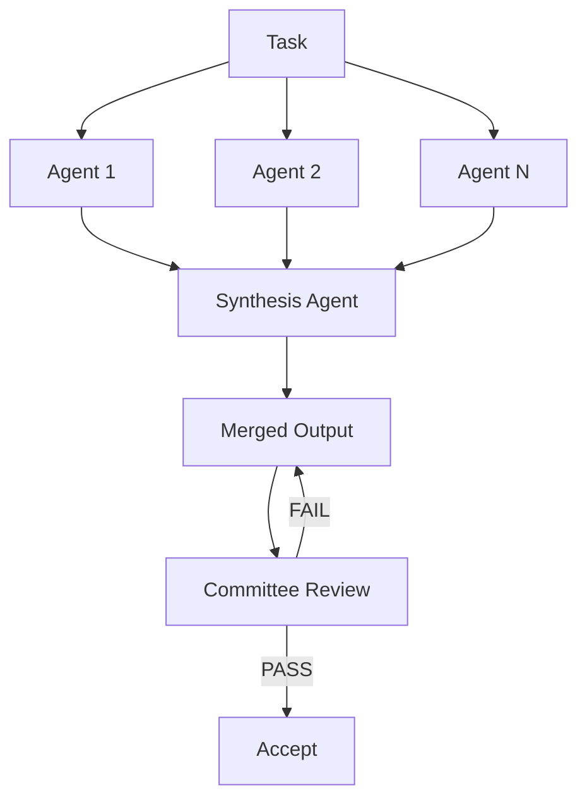

# Fan-Out Synthesis Pattern

> Spawn N independent agents to solve the same problem in parallel, then use a synthesis agent to merge the strongest elements from each attempt into a single output.

!!! note "Also known as"
    Fan-Out Pattern, Parallel Dispatch, Scatter-Gather. The fan-out-then-synthesize variant adds a dedicated merge step after parallel execution. For the broader pattern survey, see [Agent Composition Patterns](../agent-design/agent-composition-patterns.md). For the delegation variant, see [Orchestrator-Worker](orchestrator-worker.md). For implementation guidance, see [Sub-Agents Fan-Out](sub-agents-fan-out.md).

## Structure

The pattern has three stages:

1. **Fan-out** — spawn N agents with identical instructions but independent contexts; each produces a distinct solution
2. **Synthesis** — a synthesis agent critiques all N outputs, scores them against defined criteria, and assembles a merged solution from the strongest parts
3. **Validation** — pass the merged output through a committee review loop before accepting

## Why Parallel Diversity Helps

A single agent makes one set of decisions and commits to them. Parallel agents, given identical instructions but independent contexts, make different decisions — they explore different trade-offs, surface different edge cases, and identify different risks. The synthesis pass converts this diversity into value: rather than picking a winner, it extracts the strongest element from each attempt and assembles a composite solution no single agent would have reached alone [unverified].

This is distinct from a simple majority vote. A vote picks the most popular answer. Synthesis identifies complementary strengths across outputs and combines them deliberately [unverified].

## Diversity Mechanisms

Identical instructions do not guarantee identical outputs. To maximize output spread:

- Vary **model temperature** between agent instances
- Vary **seed context** — provide each agent a different starting reference or example
- Vary **system prompt emphasis** — one agent optimizes for brevity, another for robustness, a third for edge-case coverage

The goal is enough diversity for the synthesis agent to find genuinely different approaches, not just surface-level rephrasing.

## Synthesis Agent Responsibilities

The synthesis agent receives all N outputs and must:

- Score each on the defined evaluation criteria
- Identify which elements from each output are strongest
- Produce a merged output that draws on those elements explicitly
- Document which source output contributed each major decision (for auditability)

The synthesis step is deliberate assembly, not summarization. The synthesizer should justify its choices.

## Cost Trade-Off

N parallel attempts costs N× compute compared to a single attempt. This is worthwhile when:

- The task is high-stakes and errors are expensive to fix downstream
- Diversity of approach is genuinely valuable (design decisions, architecture choices, creative output)
- Reducing total iteration rounds justifies the upfront parallel cost

For routine, well-defined tasks with strong baseline performance, a single attempt is usually sufficient. [Anthropic's Building Effective Agents](https://www.anthropic.com/engineering/building-effective-agents) describes voting — running the same task multiple times to get diverse outputs — and the orchestrator-workers pattern as core parallelization strategies.

## Integration with Committee Review

After synthesis, the merged output goes through committee review before acceptance. This catches synthesis errors — cases where the synthesizer incorrectly combined elements that conflict or misidentified the strongest approach. The two patterns are complementary: fan-out generates solution diversity, committee review validates the merged result.

## Key Takeaways

- Fan-out generates solution diversity by running N agents independently on the same task
- Synthesis is deliberate assembly of the strongest parts, not a vote or a summary
- Maximize diversity by varying temperature, seed context, or system prompt emphasis between agents
- N× compute cost is justified for high-stakes or creative tasks; not warranted for routine well-defined tasks
- Chain into committee review to validate the merged output before accepting

## Example

A team needs a high-stakes API design for a payment service. Rather than iterating on a single draft, they fan out to three agents:

- **Agent 1** — temperature 0.3, instructed to optimise for simplicity and minimal surface area
- **Agent 2** — temperature 0.7, instructed to optimise for extensibility and future-proofing
- **Agent 3** — temperature 0.9, instructed to maximise edge-case coverage and error handling

Each agent produces an independent API specification. A synthesis agent then:

1. Scores all three on the team's evaluation criteria (simplicity, extensibility, robustness)
2. Selects Agent 1's endpoint naming conventions (simplest), Agent 2's versioning strategy (most extensible), and Agent 3's error codes (most comprehensive)
3. Assembles a merged specification documenting which source contributed each decision
4. Passes the merged spec to a committee review loop before the team accepts it

The result is a specification no single agent would have produced — combining simplicity, extensibility, and robustness — validated by committee review before acceptance.

## Unverified Claims

- Synthesis assembles a composite solution no single agent would have reached alone [unverified]
- Synthesis identifies complementary strengths across outputs and combines them deliberately [unverified]

## Related

- [Agent Composition Patterns](../agent-design/agent-composition-patterns.md)
- [Committee Review Pattern](../code-review/committee-review-pattern.md)
- [Task-Specific vs Role-Based Agents](../agent-design/task-specific-vs-role-based-agents.md)
- [Orchestrator-Worker Pattern](orchestrator-worker.md)
- [Sub-Agents Fan-Out](sub-agents-fan-out.md)
- [Voting Ensemble Pattern](voting-ensemble-pattern.md)
- [LLM Map-Reduce](llm-map-reduce.md)
- [Multi-Model Plan Synthesis](multi-model-plan-synthesis.md)
- [Multi-Agent Topology Taxonomy](multi-agent-topology-taxonomy.md)
- [Oracle Task Decomposition](oracle-task-decomposition.md)
- [Adversarial Multi-Model Pipeline](adversarial-multi-model-pipeline.md)
- [Bounded Batch Dispatch](bounded-batch-dispatch.md)
- [Multi-Agent SE Design Patterns](multi-agent-se-design-patterns.md)
- [Staggered Agent Launch](staggered-agent-launch.md)
- [Observation-Driven Coordination](crdt-observation-driven-coordination.md)
- [Developer Attention Management with Parallel Agents](../human/attention-management-parallel-agents.md)
