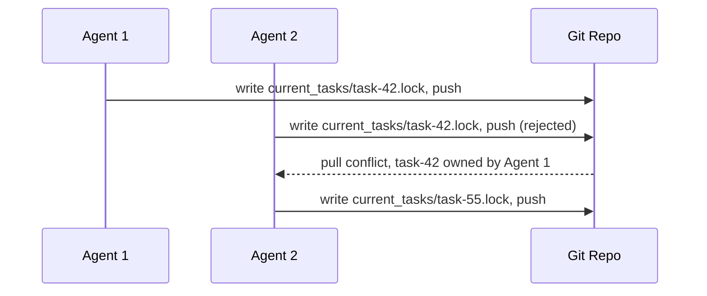

# File-Based Agent Coordination

> Coordinate parallel agents using lightweight file locks in a shared repository — git's merge mechanics enforce task exclusivity without requiring a central orchestrator.

## The Problem with Orchestrator-First Design

The common assumption when running parallel agents is that a scheduler or controller process is required to assign tasks, detect conflicts, and prevent duplicate work. This adds infrastructure complexity, creates a coordination bottleneck, and introduces another failure point. For many multi-agent setups, the coordination mechanism is already available: git.

Per [Anthropic's C compiler case study](https://www.anthropic.com/engineering/building-c-compiler), parallel agents can self-coordinate using file-based locks and git's sync behavior, with no dedicated orchestration service.

## Mechanism

Each agent runs in its own container with a mounted shared repository. To claim a task:

1. Agent reads the task queue (a directory or file listing available work)
2. Agent writes a lock file to `current_tasks/` (e.g., `current_tasks/task-42.lock`) identifying itself as the owner
3. Agent pushes the lock file to the shared repository
4. If two agents claim the same task simultaneously, git's push will reject the second — the losing agent fetches the updated state and selects a different task

The lock file contents can be minimal: agent ID, timestamp, task identifier. The filesystem write is the claim; the git push is the enforcement mechanism.



## Git Log as Audit Trail

Every lock write and task completion is a git commit. The commit history becomes a human-readable record of:

- Which agent claimed which task
- When each task was started and completed
- The sequence of decisions across the parallel team

This audit trail is available without any additional logging infrastructure — it is a side effect of the coordination mechanism itself.

## What This Pattern Does Not Cover

File-based coordination handles task exclusivity. It does not handle:

- **Dependency ordering** — if task B requires task A's output, you need explicit dependency tracking or a sequencing step
- **Agent failure recovery** — a crashed agent leaves a stale lock file; the harness needs a timeout or cleanup mechanism
- **Load balancing** — agents self-select tasks based on queue order; skewed task complexity can leave some agents idle

For projects where these concerns are significant, a dedicated orchestrator is warranted. The file-based pattern works best when tasks are genuinely independent and roughly uniform in complexity. Anthropic's [multi-agent research system](https://www.anthropic.com/engineering/multi-agent-research-system) illustrates the alternative: when tasks are interdependent or require shared context, explicit task boundaries in agent instructions become necessary to prevent duplication.

## Scaling Properties

The pattern scales horizontally: adding more agents requires no changes to the coordination mechanism. Each new agent reads the same task queue and participates in the same lock contention protocol. Contention surfaces at the git push step rather than at a central coordinator process.

## Key Takeaways

- File locks in `current_tasks/` combined with git push rejection are sufficient to prevent duplicate work
- No dedicated orchestration service is required when tasks are independent and uniform
- Each agent runs in its own container with access to the shared repository
- Git commit history doubles as an audit trail of agent decisions at no additional cost
- The pattern does not handle dependency ordering or stale lock recovery — those require additional design

## Example

A CI pipeline spawns three agents to process a backlog of lint-fix tasks stored in `tasks/pending/`. Each agent runs the same claim script on startup:

```bash
#!/usr/bin/env bash
# claim-task.sh — run inside each agent container
set -euo pipefail

AGENT_ID="${AGENT_ID:?must set AGENT_ID}"
REPO="/workspace/shared-repo"
cd "$REPO"

for task_file in tasks/pending/*.yml; do
  TASK_SLUG=$(basename "$task_file" .yml)
  LOCK="current_tasks/${TASK_SLUG}.lock"

  # Skip if already claimed
  git pull --rebase --quiet
  [ -f "$LOCK" ] && continue

  # Write the lock file
  cat > "$LOCK" <<EOF
agent: $AGENT_ID
claimed: $(date -u +%Y-%m-%dT%H:%M:%SZ)
task: $TASK_SLUG
EOF

  git add "$LOCK"
  git commit -m "claim: $TASK_SLUG by $AGENT_ID"

  # Push — if rejected, another agent won the race
  if git push; then
    echo "Claimed $TASK_SLUG"
    # ... execute the task ...
    exit 0
  else
    # Lost the race — reset and try the next task
    git reset --hard origin/main
  fi
done
```

Lock file created at `current_tasks/fix-header-lint.lock`:

```yaml
agent: agent-02
claimed: 2025-06-14T08:31:12Z
task: fix-header-lint
```

When agent-03 attempts to push a lock for the same task, git rejects the push with a non-fast-forward error. Agent-03 pulls, sees the lock owned by agent-02, and moves to the next unclaimed task.

## Related

- [Worktree Isolation](../workflows/worktree-isolation.md)
- [Agent Harness](../agent-design/agent-harness.md)
- [Orchestrator-Worker Pattern](orchestrator-worker.md)
- [Specialized Agent Roles](../agent-design/specialized-agent-roles.md)
- [Staggered Agent Launch](staggered-agent-launch.md)
- [Observation-Driven Coordination: CRDT-Based Parallel Agent Code Generation](crdt-observation-driven-coordination.md)
- [Oracle-Based Task Decomposition](oracle-task-decomposition.md)
- [Multi-Agent Topology Taxonomy: Centralised, Decentralised, and Hybrid](multi-agent-topology-taxonomy.md)
- [Sub-Agents for Fan-Out Research and Context Isolation](sub-agents-fan-out.md)
- [Fan-Out Synthesis](fan-out-synthesis.md)
- [Single-Branch Git Agent Swarms](../workflows/single-branch-git-agent-swarms.md)
- [Developer Attention Management with Parallel Agents](../human/attention-management-parallel-agents.md)
