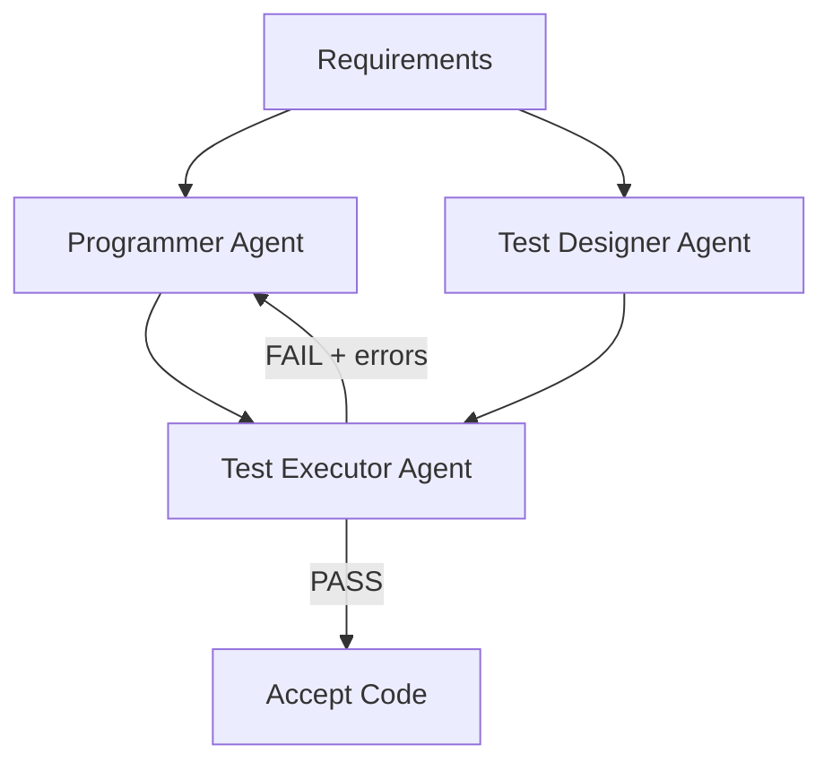

# Independent Test Generation in Multi-Agent Code Systems

> Separate code generation and test generation into independent agents so the test writer never sees the generated code. When a single agent writes both, test accuracy drops from 87.8% to 61.0% — the test writer inherits the code writer's blind spots.

!!! note "Also known as"
    Blind Test Generation, Code-Test Separation Pattern. For the general evaluator-generator loop, see [Evaluator-Optimizer Pattern](../agent-design/evaluator-optimizer.md). For human-written tests as agent spec, see [TDD Agent Development](../verification/tdd-agent-development.md). For role specialization in parallel agents, see [Specialized Agent Roles](../agent-design/specialized-agent-roles.md).

## The Problem: Shared-Context Bias

When a single agent generates code and then writes tests for it, the tests tend to confirm the code's logic rather than challenge it. The agent has already committed to an implementation approach — its tests follow the same reasoning path, missing edge cases the code also misses.

[AgentCoder](https://arxiv.org/abs/2312.13010) (Huang et al., 2023) quantified this: separating test generation into an independent agent raised test accuracy from 61.0% to 87.8% on HumanEval benchmarks. Line coverage jumped from 81.7% to 91.7% compared to MetaGPT's coupled approach.

The mechanism is the same reason code review works better when the reviewer didn't write the code.

## Three-Agent Architecture

The pattern uses three agents with distinct responsibilities and no shared context between the code and test paths:

| Agent | Input | Output | Key constraint |
|-------|-------|--------|---------------|
| **Programmer** | Requirements + error feedback | Code implementation | Generates via chain-of-thought: clarify → algorithm → pseudocode → implement |
| **Test Designer** | Requirements only | Test cases (basic + edge + stress) | Never sees the generated code |
| **Test Executor** | Code + tests | Pass/fail + error messages | Deterministic execution, routes failures back to Programmer |

The test designer operates on the **specification**, not the implementation. This is the critical design decision — it prevents the test writer from accommodating implementation quirks.

## Fewer Specialized Agents Beat More Generalist Agents

| Framework | Agents | HumanEval pass@1 (GPT-4) | Token overhead |
|-----------|--------|--------------------------|----------------|
| AgentCoder | 3 | 96.3% | 56.9K |
| MetaGPT | 5+ | 85.9% | 138.2K |
| ChatDev | 4+ | 84.1% | 183.7K |
| AgentVerse | 4+ | 89.0% | 149.2K |

Each handoff is a compression point where information degrades. Three tightly-scoped agents with clear contracts outperform larger teams with diffuse responsibilities — at 59% lower token cost.

## Ablation: Each Agent Pulls Its Weight

Removing any component degrades the system (GPT-3.5 on HumanEval):

| Configuration | pass@1 | Delta |
|---------------|--------|-------|
| Programmer only | 61.0% | — |
| + Test Designer | 64.0% | +3.0 |
| + Test Executor | 64.6% | +3.6 |
| Full system (all three) | 79.9% | +18.9 |

The non-linear jump when all three collaborate shows the feedback loop is what makes role separation effective. Tests alone help modestly — closing the loop with execution and error routing is where compounding occurs.

## Iteration Budget

Each refinement iteration yields ~1-2% improvement, with diminishing returns by iteration 4. Cap at 3-5 rounds — beyond that, failures indicate a fundamental approach problem that iteration won't solve. See also [agent self-review loops](../agent-design/agent-self-review-loop.md).

## Applying the Pattern

- **Multi-agent frameworks**: Assign distinct system prompts. The test designer's prompt explicitly excludes code context. The programmer receives only execution errors, not test source.
- **CI/CD pipelines**: Run code and test generation as separate agent invocations with isolated contexts. Route failures back with error context only.
- **Single-agent tools**: Approximate by running test generation in a separate session with fresh context, using only requirements as input.

## Key Takeaways

- Separate code and test generation into agents that never share implementation context
- The test designer works from the specification, not the code — this prevents shared-context bias
- The feedback loop (execute → route errors → refine) is what makes role separation compound — without it, separation provides only modest gains
- Cap refinement iterations at 3-5 rounds; diminishing returns set in quickly

## Related

- [Evaluator-Optimizer Pattern](../agent-design/evaluator-optimizer.md) — the general generator-critic loop that this pattern specializes for code+test separation
- [Specialized Agent Roles](../agent-design/specialized-agent-roles.md) — parallel role specialization for code quality dimensions
- [TDD Agent Development](../verification/tdd-agent-development.md) — human-written tests as spec for agents, complementary to agent-generated tests
- [Closed-Loop Role-Based Refinement](closed-loop-role-based-refinement.md) — five-role decomposition for self-improving agent systems
- [Multi-Agent SE Design Patterns](multi-agent-se-design-patterns.md) — taxonomy classifying this as Role-Based Cooperation + Sequential Execution

## Sources

- [AgentCoder: Multi-Agent Code Generation with Effective Testing and Self-optimisation](https://arxiv.org/abs/2312.13010) — Huang et al., 2023. Primary source for all quantitative claims on this page.

## Unverified Claims

- The pattern's effectiveness for multi-file, real-world codebases (paper benchmarks test single-function generation only)
- Whether shared-context bias affects reasoning-focused models (o1, o3) to the same degree as chat-optimized models
- The specific iteration-budget sweet spot of 3-5 rounds as a general recommendation (derived from AgentCoder's 5-iteration experiments, may vary by task complexity)
