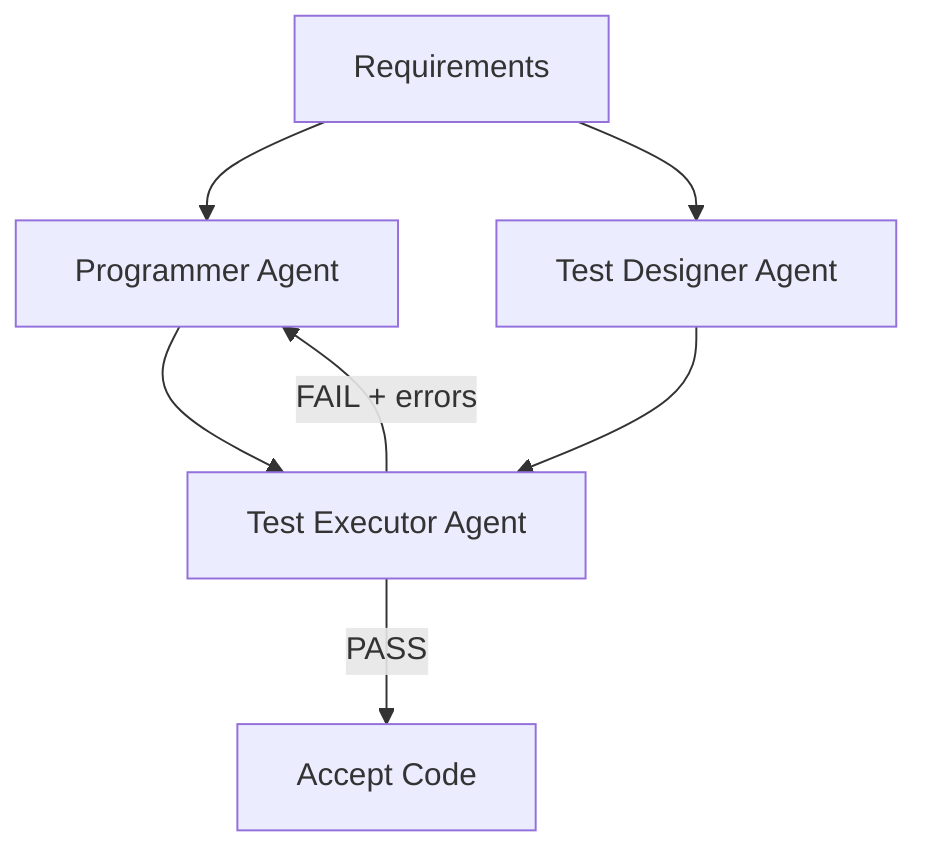

# Independent Test Generation in Multi-Agent Code Systems

> Separate code generation and test generation into independent agents so the test writer never sees the generated code. When a single agent writes both, test accuracy drops from 87.8% to 61.0% — the test writer inherits the code writer's blind spots.

!!! note "Also known as"
    Blind Test Generation, Code-Test Separation Pattern. For the general evaluator-generator loop, see [Evaluator-Optimizer Pattern](../agent-design/evaluator-optimizer.md). For human-written tests as agent spec, see [TDD Agent Development](../verification/tdd-agent-development.md). For role specialization in parallel agents, see [Specialized Agent Roles](../agent-design/specialized-agent-roles.md).

## The Problem: Shared-Context Bias

When a single agent generates code and then writes tests for it, the tests confirm the code's logic rather than challenge it — following the same reasoning path and missing the same edge cases.

[AgentCoder](https://arxiv.org/abs/2312.13010) (Huang et al., 2023) quantified this: separating test generation into an independent agent raised test accuracy from 61.0% to 87.8% on HumanEval benchmarks.

## Three-Agent Architecture

The pattern uses three agents with no shared context between code and test paths:



| Agent | Input | Output | Key constraint |
|-------|-------|--------|---------------|
| **Programmer** | Requirements + error feedback | Code implementation | Chain-of-thought: clarify → algorithm → pseudocode → implement |
| **Test Designer** | Requirements only | Test cases (basic + edge + stress) | Never sees the generated code |
| **Test Executor** | Code + tests | Pass/fail + error messages | Deterministic execution, routes failures back to Programmer |

The test designer operates on the **specification**, not the implementation — preventing the test writer from accommodating implementation quirks.

## Fewer Specialized Agents Beat More Generalist Agents

| Framework | Agents | HumanEval pass@1 (GPT-4) | Token overhead |
|-----------|--------|--------------------------|----------------|
| AgentCoder | 3 | 96.3% | 56.9K |
| MetaGPT | 5+ | 85.9% | 138.2K |
| ChatDev | 4+ | 84.1% | 183.7K |
| AgentVerse | 4+ | 89.0% | 149.2K |

Three tightly-scoped agents with clear contracts outperform larger teams with diffuse responsibilities at 59% lower token cost.

## Ablation: Each Agent Pulls Its Weight

Removing any component degrades the system (GPT-3.5 on HumanEval):

| Configuration | pass@1 | Delta |
|---------------|--------|-------|
| Programmer only | 61.0% | — |
| + Test Designer | 64.0% | +3.0 |
| + Test Executor | 64.6% | +3.6 |
| Full system (all three) | 79.9% | +18.9 |

The non-linear jump when all three collaborate shows that closing the loop with execution and error routing — not role separation alone — drives the gains.

## Iteration Budget

Each refinement iteration yields ~1-2% improvement with diminishing returns by iteration 4. Cap at 3-5 rounds — beyond that, failures indicate a fundamental approach problem. See also [agent self-review loops](../agent-design/agent-self-review-loop.md).

## When This Backfires

- **Test designer inherits spec errors**: both agents receive the same requirements document, so ambiguities, underspecifications, or outright errors propagate to both. The pattern eliminates code-context bias but cannot compensate for a flawed or incomplete specification.
- **Generated tests can be wrong themselves**: independent generation does not guarantee test correctness. [BACE (arXiv:2603.28653)](https://arxiv.org/abs/2603.28653) documents how "incorrect code frequently passes faulty or trivial tests, while valid solutions are often degraded to satisfy incorrect assertions" — treating agent-generated tests as ground truth is fragile. Use public reference tests or a human-reviewed test suite as an anchor when correctness guarantees matter.
- **Benchmark gap**: AgentCoder's results were measured on single-function HumanEval tasks. Multi-file codebases introduce cross-module dependencies and integration constraints that a spec-only test designer cannot fully anticipate — test accuracy improvements may be smaller in practice.
- **Token overhead is real**: running three agents uses ~57K tokens per task versus a single-agent approach, roughly doubling cost. For high-volume, low-complexity tasks (e.g., boilerplate generation), the accuracy gain may not justify the overhead.

## Applying the Pattern

- **Multi-agent frameworks**: Assign distinct system prompts. The test designer's prompt excludes code context; the programmer receives only execution errors, not test source.
- **CI/CD pipelines**: Run code and test generation as separate agent invocations with isolated contexts. Route failures back with error context only.
- **Single-agent tools**: Approximate by running test generation in a separate session with fresh context, using only requirements as input.

## Example

A team building a Python utility library applies the three-agent pattern to generate and validate a `merge_sorted_lists` function.

**Programmer agent system prompt:**

```
You are a Python programmer. Given a function specification,
produce a correct implementation. If you receive test failure
output, fix the code based on the error messages only.
Do not request or reference any test code.
```

**Test designer agent system prompt:**

```
You are a test engineer. Given a function specification,
produce pytest test cases covering: basic behavior, edge cases
(empty lists, duplicates, single-element), and stress cases
(10k elements). You will never see the implementation.
Write tests based solely on the specification.
```

**Specification (shared input):**

```
merge_sorted_lists(a: list[int], b: list[int]) -> list[int]
Merge two sorted integer lists into a single sorted list.
Time complexity: O(n + m).
```

The test designer generates tests from the spec alone — including edge cases like `merge_sorted_lists([], [])` and `merge_sorted_lists([1,1,1], [1,1])` that a programmer-coupled test writer typically omits. The test executor runs both artifacts, routes any `FAILED` output back to the programmer with error messages only, and the loop repeats until all tests pass or the iteration cap is reached.

## Related

- [Evaluator-Optimizer Pattern](../agent-design/evaluator-optimizer.md) — the general generator-critic loop that this pattern specializes for code+test separation
- [Specialized Agent Roles](../agent-design/specialized-agent-roles.md) — parallel role specialization for code quality dimensions
- [TDD Agent Development](../verification/tdd-agent-development.md) — human-written tests as spec for agents, complementary to agent-generated tests
- [Closed-Loop Role-Based Refinement](closed-loop-role-based-refinement.md) — five-role decomposition for self-improving agent systems
- [Multi-Agent SE Design Patterns](multi-agent-se-design-patterns.md) — taxonomy classifying this as Role-Based Cooperation + Sequential Execution

## Sources

- [AgentCoder: Multi-Agent Code Generation with Effective Testing and Self-optimisation](https://arxiv.org/abs/2312.13010) — Huang et al., 2023. Primary source for all quantitative claims on this page.
- [BACE: Bayesian Anchored Co-Evolution for Code Generation](https://arxiv.org/abs/2603.28653) — 2026. Critiques treating agent-generated tests as ground truth; proposes modeling them as noisy sensors with Bayesian updates anchored to reference examples.

## Unverified Claims

- The pattern's effectiveness for multi-file, real-world codebases (paper benchmarks test single-function generation only)
- Whether shared-context bias affects reasoning-focused models (o1, o3) to the same degree as chat-optimized models
- The specific iteration-budget sweet spot of 3-5 rounds as a general recommendation (derived from AgentCoder's 5-iteration experiments, may vary by task complexity)
