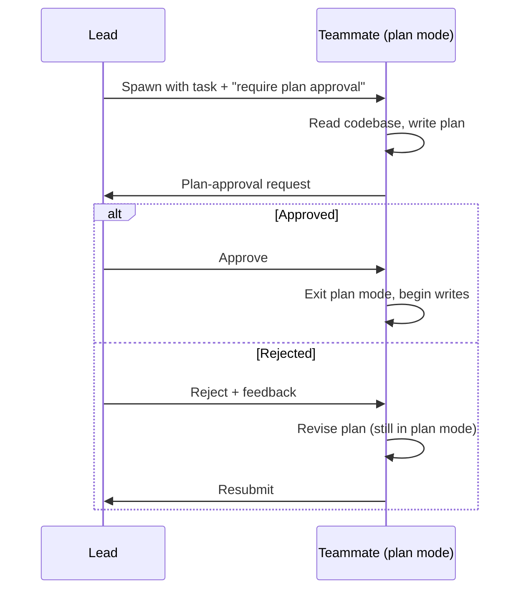

# Lead-to-Teammate Plan-Approval Handshake

> The handshake holds a teammate in read-only plan mode until the lead approves its plan; rejections round-trip with feedback before any writes happen.

## The Handshake

In a lead-and-teammates [topology](multi-agent-topology-taxonomy.md), each teammate works in its own context window and self-claims tasks from a shared list. A plan-approval handshake gates the first write: the teammate produces a plan in read-only mode, sends it to the lead as a structured approval request, and only begins editing after the lead approves.



The Claude Code agent-teams documentation describes the loop verbatim: "When a teammate finishes planning, it sends a plan approval request to the lead. The lead reviews the plan and either approves it or rejects it with feedback. If rejected, the teammate stays in plan mode, revises based on the feedback, and resubmits. Once approved, the teammate exits plan mode and begins implementation" ([Claude Code: agent teams](https://code.claude.com/docs/en/agent-teams#require-plan-approval-for-teammates)).

## What Makes It a Gate, Not a Suggestion

The teammate cannot start writing until approval lands because plan mode is enforced by the permission model itself, not by prompt discipline. In plan mode, "Claude reads files, runs shell commands to explore, and writes a plan, but does not edit your source" ([Claude Code: permission modes](https://code.claude.com/docs/en/permission-modes#analyze-before-you-edit-with-plan-mode)). The edit tools are structurally unavailable until the mode changes, and only the lead's approval changes it. This distinguishes the pattern from a prompt-level "please get approval before editing" — those instructions are routinely violated under load.

## Criteria Live in the Lead's Prompt

The lead approves autonomously. The mechanism for steering its judgment is the prompt itself — not a separate rules file or hook. The Claude Code docs give the canonical examples: "give it criteria in your prompt, such as 'only approve plans that include test coverage' or 'reject plans that modify the database schema'" ([Claude Code: agent teams](https://code.claude.com/docs/en/agent-teams#require-plan-approval-for-teammates)). Criteria scope to the team and disappear when the team disbands — no global rule registry to drift.

## Pairing with Critic-Agent Plan Review

The [critic-agent pattern](../agent-design/critic-agent-plan-review.md) and the lead-teammate handshake apply review at the same stage — the plan — but differ in *who* reviews and *why*:

| Dimension | Critic Agent | Lead-Teammate Handshake |
|-----------|--------------|-------------------------|
| Reviewer context | Fresh, scoped to the single plan | Team-wide, sees other teammates' work and the shared task list |
| Reviewer identity | Often a different model class | Same model class as the team; cross-task visibility is the unique signal |
| Trigger | Every plan from one planner | Only teammates configured with the requirement |
| Failure surface | Critic misses model-shared blind spots | Lead rubber-stamps under queue pressure |

The two compose: a team can require plan approval *and* route those plans through a critic agent before the lead sees them, putting a fresh-context grader and a cross-task coordinator on the same artifact.

## Why It Works

The handshake relocates the cheapest moment to fix agent error. A plan-stage mistake caught by the lead costs one extra model call; caught mid-execution it requires rollback, re-planning, and re-execution — each re-incurring the token cost of consumed steps (the same economic argument grounding the [critic-agent pattern](../agent-design/critic-agent-plan-review.md)).

What this adds over a generic critic is *cross-task coherence*. Each teammate plans in isolation — "the lead's conversation history does not carry over" ([Claude Code: agent teams](https://code.claude.com/docs/en/agent-teams#context-and-communication)) — so without a gate, two teammates can produce plans that collide on the same file or solve overlapping problems with diverging approaches. The lead sees both plans against the shared task list, which is the only vantage point in the team with that view. The Multi-Agent System Failure Taxonomy ([Cemri et al., 2025](https://arxiv.org/abs/2503.13657)) annotates 1,600+ production traces and identifies inter-agent misalignment as one of three primary failure categories — the lead's plan-time veto is the cheapest intervention point against it.

Read-only enforcement matters because it removes the ability for a teammate to act on its blind spots before review. Prompt-discipline alternatives share an architecture with same-model self-correction, which exhibits a 64.5% average blind-spot rate across 14 tested LLMs ([Chen et al., 2025: Self-Correction Bench](https://arxiv.org/abs/2507.02778)).

## When This Backfires

- **Trivial or solo-shaped tasks.** When each teammate's first write is a one-file edit with obvious scope, the handshake doubles round-trips to prevent errors a post-write diff review would catch in one round. Anthropic's own guidance warns teams "add coordination overhead" and "work best when teammates can operate independently" ([Claude Code: agent teams](https://code.claude.com/docs/en/agent-teams#when-to-use-agent-teams)).
- **Same-model lead with no rubric.** When the lead is the same model as the teammate and approves without external criteria, the 64.5% self-correction blind spot applies to the gate itself ([Chen et al., 2025](https://arxiv.org/abs/2507.02778)). The handshake becomes ceremony.
- **Lead-as-bottleneck team sizes.** With 5+ teammates requesting approval on staggered timelines, the lead's queue becomes the critical path. Either the lead rubber-stamps to clear depth or teammates idle waiting.
- **Rapidly evolving plans.** When discoveries force the plan to change mid-execution, the gate becomes a re-approval treadmill. For exploratory work the gate's cost rises while its benefit drops.
- **Autonomous-lead rubber-stamping.** "The lead makes approval decisions autonomously" ([Claude Code: agent teams](https://code.claude.com/docs/en/agent-teams#require-plan-approval-for-teammates)) — a same-architecture LLM judging the plan. For high-stakes work, escalate to user-as-lead or wire a `TeammateIdle` / `TaskCompleted` hook ([Claude Code: agent teams — hooks](https://code.claude.com/docs/en/agent-teams#enforce-quality-gates-with-hooks)) to require human sign-off.

## Example

A team is spawned to refactor an authentication module with a plan-approval requirement:

```text
Spawn an architect teammate to refactor the authentication module.
Require plan approval before they make any changes. Only approve plans that:
- preserve the existing JWT contract for issued tokens
- include a backward-compatibility shim for callers on the old API
- list which test files will be updated
```

The architect explores the codebase in plan mode, then submits a plan-approval request describing a rewrite of the session store. The lead reads the plan, notices it omits the backward-compatibility shim, and rejects with the feedback: "Plan must include a shim for the existing `/auth/session` endpoint — current callers cannot break in this release." The teammate, still in plan mode, revises and resubmits. The lead approves. The teammate exits plan mode and begins editing.

No code was written during the rejection round. The cost of catching the missing shim was one extra model round-trip, not a revert.

## Key Takeaways

- The handshake gates writes on peer review: a teammate stays in read-only plan mode until the lead approves its plan.
- The gate is enforced by the permission model, not by prompt discipline — a teammate in plan mode is structurally incapable of editing.
- Approval criteria live in the lead's spawn prompt, keeping policy scoped to the team rather than a global rule surface.
- The pattern composes with the critic-agent pattern — same review stage, different reviewer purpose (cross-task coherence vs fresh-context grading).
- Failure modes are predictable: solo-shaped tasks, same-model lead without rubric, lead-as-bottleneck queue depths, and exploratory work where plans must change mid-execution.

## Related

- [Critic Agent Pattern: Dual-Model Plan Review](../agent-design/critic-agent-plan-review.md)
- [Multi-Model Plan Synthesis](multi-model-plan-synthesis.md)
- [Agent Handoff Protocols: Passing Work Between Agents](agent-handoff-protocols.md)
- [Closed-Loop Role-Based Refinement](closed-loop-role-based-refinement.md)
- [Multi-Agent Topology Taxonomy](multi-agent-topology-taxonomy.md)
