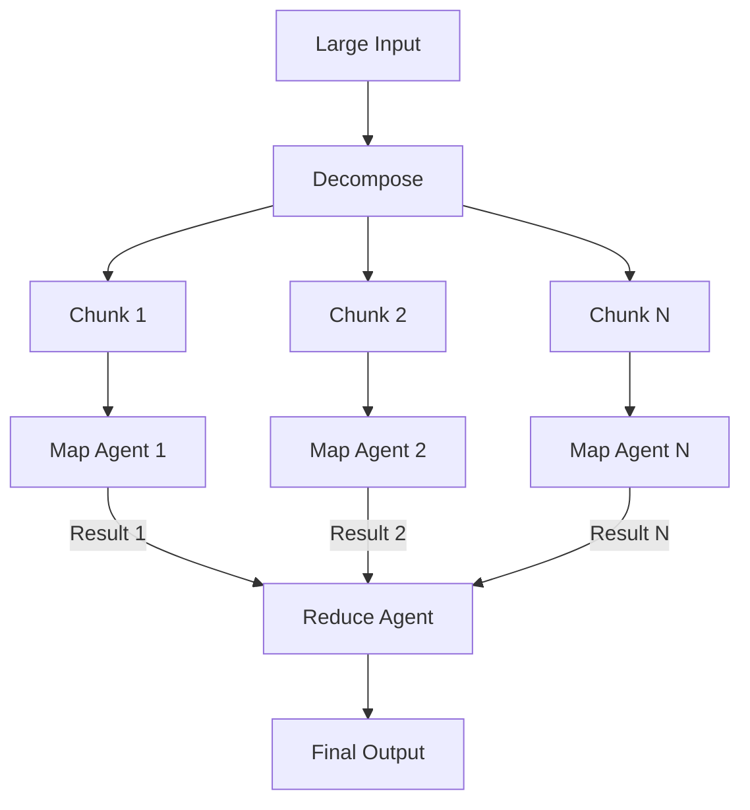
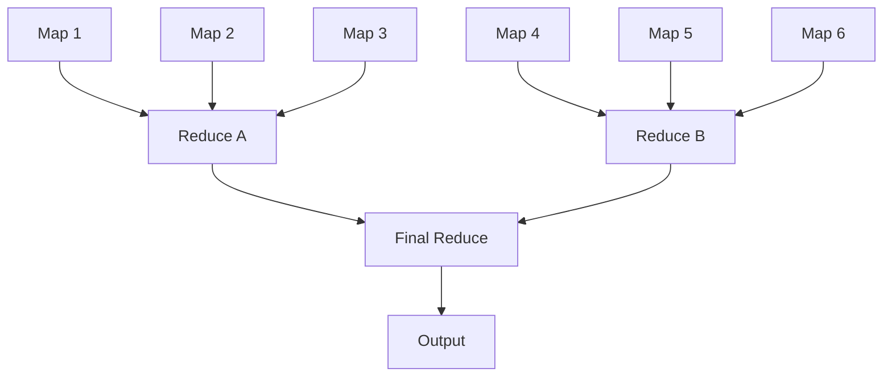

# LLM Map-Reduce Pattern

> Split a large input into context-window-sized chunks, process each chunk independently (map), then combine chunk-level results into a coherent output (reduce).

!!! note "Also known as"
    Chunk-Process-Merge, Parallel Summarization, Input-Partitioned Fan-Out. For the task-level delegation variant, see [Orchestrator-Worker](orchestrator-worker.md). For same-task parallel diversity, see [Fan-Out Synthesis](fan-out-synthesis.md). For implementation, see [Sub-Agents Fan-Out](sub-agents-fan-out.md).

## How It Differs from Adjacent Patterns

| Pattern | Splits by | Map phase | Reduce phase |
|---------|-----------|-----------|--------------|
| **Map-Reduce** | Input partition (pages, files, modules) | Same operation on each chunk | Merge chunk results into unified output |
| [Orchestrator-Worker](orchestrator-worker.md) | Subtask type (research, test, implement) | Different operation per worker | Synthesize heterogeneous outputs |
| [Fan-Out Synthesis](fan-out-synthesis.md) | Nothing — same input N times | Same task, independent attempts | Select/merge best-of-N |

Map-reduce is **data-parallel**: the same operation applied to different slices of input.

## Structure



1. **Decompose** — split input into chunks sized for individual context windows
2. **Map** — process each chunk independently with the same instructions
3. **Reduce** — combine chunk-level results into a single output

## Context Window Arithmetic

Each map agent's context must hold:

```
instructions + input_chunk + output_budget <= context_window_limit
```

| Component | Typical allocation |
|-----------|-------------------|
| System prompt + instructions | 1,000–3,000 tokens |
| Input chunk | 60–75% of remaining budget |
| Output headroom | 25–40% of remaining budget |

Err toward smaller chunks — context degradation is [non-linear](../context-engineering/context-window-dumb-zone.md), so 50% capacity outperforms 80%.

## Decomposition Strategies

| Strategy | Works for | Risk |
|----------|-----------|------|
| **Fixed-size** (every N tokens/lines) | Logs, homogeneous data | Splits semantic units mid-thought |
| **Boundary-aware** (by file, section, chapter) | Codebases, documents | Uneven chunk sizes |
| **Overlap** (sliding window with N-token overlap) | Narrative text | Duplicate findings in reduce |

## Reduce Strategies

| Reduce strategy | When to use | Method |
|-----------------|-------------|--------|
| **Single-pass** | Few chunks (3–8) | All map results fit in one reduce context |
| **Hierarchical** | Many chunks (10+) | Reduce in groups, then reduce the reductions |
| **Merge** | Structured outputs (lists, tables) | Deterministic concatenation + deduplication |
| **Vote/filter** | Classification tasks | Majority vote or threshold across chunks |

Hierarchical reduce groups map results into intermediate reduce nodes, compressing outputs at each level until a single final reduce agent synthesizes the tree.



## Implementation with Sub-Agents

Claude Code sub-agents are a native map-reduce primitive. Each sub-agent runs in its own context window, explores independently, and returns condensed results — [tens of thousands of tokens internally compressed to 1,000–2,000 tokens returned to the lead](https://www.anthropic.com/engineering/effective-context-engineering-for-ai-agents).

```yaml
# .claude/agents/chunk-analyzer.md
---
name: chunk-analyzer
description: Analyzes a single code module and returns a structured summary.
tools:
  - Read
  - Glob
  - Grep
model: claude-haiku-3-5
---

Analyze the module at the provided path. Return:
- Purpose (one sentence)
- Public API surface (function signatures only)
- Dependencies (external packages)
- Potential issues found

Do not return source code. Return only the structured summary.
```

The lead agent decomposes by module, fans out a chunk-analyzer per module, and reduces summaries into a unified review.

For file-system isolation during map phases that write files, use `isolation: worktree` to give each sub-agent its own [git worktree](../workflows/worktree-isolation.md).

## When to Use Map-Reduce vs. Alternatives

**Use map-reduce when:** input exceeds a single context window; the same operation applies to every partition; chunk-level results are independently meaningful.

**Use orchestrator-worker instead when:** subtasks require different operations or tool sets; decomposition is by task type, not input partition.

**Use sequential processing when:** chunks depend on prior results; total input fits one context window; or [Anthropic’s long-running agent guide](https://www.anthropic.com/engineering/effective-harnesses-for-long-running-agents) applies.

## When This Backfires

Map-reduce underperforms or fails entirely in several conditions:

- **Cross-chunk dependencies** — if answering the query requires synthesizing evidence spread across multiple chunks (e.g., a refactoring that changes an interface used across 10 files), each map agent sees only its slice and cannot surface the cross-chunk pattern. The reduce agent receives outputs that individually look clean but miss the systemic issue.
- **Boundary mismatch** — fixed-size chunking splits semantic units mid-sentence or mid-function, causing map agents to misinterpret partial context. The reduce agent then reconciles contradictory or truncated findings without knowing they are artifacts of the split.
- **Hierarchical reduce error propagation** — at each reduce level, summaries lose information. A two-level hierarchy that reduces 50 map outputs to 5 intermediate summaries, then to 1 final output, compounds extraction errors at every stage. The final output can be coherent but wrong in ways that are invisible without comparison to the raw inputs.
- **Thin map outputs** — when chunks are small or homogeneous, each map result adds marginal information. The reduce agent must process N near-identical outputs; cost scales linearly while output quality plateaus.

## Failure Handling

Partial map failures are the norm at scale:

- **Retry failed chunks** independently without re-running successful ones
- **Degrade gracefully** — 8/10 successful map results beats no result
- **Cap parallelism** to rate limits; [Anthropic’s research system](https://www.anthropic.com/engineering/multi-agent-research-system) uses 3–5 subagents, not 50

## Example: Codebase Architecture Review

A 200-file codebase with 15 modules, each too large for casual review in a single context:

1. **Decompose** — split by module boundary (15 chunks)
2. **Map** — each sub-agent reads one module, returns purpose + API surface + issues (15 parallel calls)
3. **Reduce** — lead agent receives 15 summaries (~20,000 tokens total), identifies cross-module patterns, dependency issues, and architectural concerns
4. **Output** — unified architecture review covering the full codebase, based on summaries no single context window could have held raw

## Key Takeaways

- Map-reduce splits by **input partition** — same operation on different data slices
- Size chunks conservatively: 50% capacity outperforms 80% because context degradation is non-linear
- Choose reduce strategy (single-pass, hierarchical, merge, vote) by chunk count and output type
- Design for partial failure — retry individual chunks, degrade gracefully on incomplete results

## Related

- [Orchestrator-Worker](orchestrator-worker.md) — subtask-type decomposition variant
- [Fan-Out Synthesis](fan-out-synthesis.md) — same-input diversity variant
- [Sub-Agents Fan-Out](sub-agents-fan-out.md) — implementation guidance
- [Context Window Dumb Zone](../context-engineering/context-window-dumb-zone.md) — why chunk sizing matters
- [Context Budget Allocation](../context-engineering/context-budget-allocation.md) — context partitioning across agents
- [Distributed Computing Parallels](../human/distributed-computing-parallels.md) — MapReduce in the pattern mapping table
- [Bounded Batch Dispatch](bounded-batch-dispatch.md) — rate-limited parallel dispatch
- [Voting / Ensemble Pattern](voting-ensemble-pattern.md) — vote/filter reduce strategy for classification
- [Multi-Agent Topology Taxonomy](multi-agent-topology-taxonomy.md) — coordination topology reference
- [Staggered Agent Launch](staggered-agent-launch.md) — de-synchronizing parallel agent starts
- [Semantic Caching in Multi-Agent Systems](semantic-caching-multi-agent.md) — reducing token cost across parallel agents
- [Oracle Task Decomposition](oracle-task-decomposition.md) — reference-oracle approach for interconnected decomposition
- [Multi-Agent SE Design Patterns](multi-agent-se-design-patterns.md) — systematic pattern catalog including map-reduce variants
